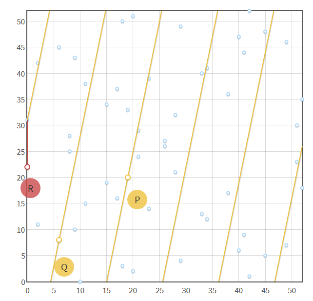

# Introduction

I had the occasion to be exposed to [Chinese cryptography standards](https://en.wikipedia.org/wiki/SM9_(cryptography_standard)) published by the Chinese Commercial Cryptography Administration Office: SM2, SM3, and SM4. SM stands for [ShangMi](https://datatracker.ietf.org/doc/html/rfc8998).

- [SM2](https://datatracker.ietf.org/doc/html/draft-shen-sm2-ecdsa-02) provides signature and verification based on [Elliptic Curve Cryptography (ECC)](https://en.wikipedia.org/wiki/Elliptic-curve_cryptography) and was the interesting point of research,
- [SM3](https://datatracker.ietf.org/doc/html/draft-oscca-cfrg-sm3-02) is a hashing algorithm
- [SM4](https://datatracker.ietf.org/doc/html/draft-ribose-cfrg-sm4-10) is a set of encryption/decryption block-cipher algorithms

This article aims to guide any further usage of such cryptography standards. It is a bit long to cover everything: jump directly to the part you are interested in.

* TOC
{:toc}

# Elliptic Curve Cryptography (ECC)
ECC is one of the approaches to [public-key cryptography](https://en.wikipedia.org/wiki/Public-key_cryptography).

## Public-key cryptography
Public-key cryptography relies on the generation of 2 keys:

- one private key which **must remain private**
- one public key which can be shared to the world

From a public key, it is not possible (i.e. it takes more than centuries to compute) to know its private key. It is possible to prove the possession of a private key without disclosing it. This proof can be verified by using its corresponding public key. This proof is called a digital signature.

## High level functions
ECC can perform signature and verification of messages (authenticity). ECC can also perform encryption and decryption (confidentiality), however, not directly. For encryption/decryption it needs the help of a shared secret, namely a key.

ECC delivers the same protection as [RSA](https://en.wikipedia.org/wiki/RSA_(cryptosystem)) (Rivest-Shamir-Adleman) with a smaller key size. Smaller keys means less operations and less storage. For instance an ECC 256bits key should provide the same level of security as an RSA key of 3072bits.

## Theory summary

Following the very well explained guides from [Hans Knutson on Hacker Noon](https://hackernoon.com/what-is-the-math-behind-elliptic-curve-cryptography-f61b25253da3) and [CryptoBook from Svetlin Nakov](https://cryptobook.nakov.com/asymmetric-key-ciphers/elliptic-curve-cryptography-ecc), this section aims to provide a sense of different parameters which will be found in SM2 libraries, and what they correspond to.

### Key generation
As a comparison, RSA is based on [prime number](https://en.wikipedia.org/wiki/Prime_number) [factorization](https://en.wikipedia.org/wiki/Integer_factorization) and its private key is composed of 2 long prime numbers (called `p` and `q`). The modulus `m` is the product `pq=m` which constitutes the public key. The size of `m` in bits is the key size of RSA. From the knowledge of `m`, it is hard to decompose it back into the 2 prime numbers `p` and `q`.

ECC is based on the [discrete logarithm](https://en.wikipedia.org/wiki/Discrete_logarithm) of [elliptic curve](https://en.wikipedia.org/wiki/Elliptic_curve) elements. An elliptic curve consists of all the points of coordinates `(x,y)` verifying `y² = x³+ax+b`. For instance [Bitcoin](https://en.bitcoin.it/wiki/Secp256k1) uses the curve called secp256k1 which verifies `y² = x³+7`. It is possible to add 2 points of that curve together:

|  |
| *From [https://iis-projects.ee.ethz.ch/images/d/de/Elliptic_curve_addition.png](https://iis-projects.ee.ethz.ch/images/d/de/Elliptic_curve_addition.png)* |

Or to add a point to itself:

|  |
| *From [http://www.herongyang.com/EC-Cryptography/Elliptic-Curve-with-Same-Point-Addition.png](http://www.herongyang.com/EC-Cryptography/Elliptic-Curve-with-Same-Point-Addition.png)* |

Moreover to make sure that points stay within reasonable coordinates, the curve `y² = x³+ax+b` is wrapped around itself using a modulus `p`: `y² mod p = (x³ + ax + b) mod p`

|  |
| *From [https://hackernoon.com/what-is-the-math-behind-elliptic-curve-cryptography-f61b25253da3](https://hackernoon.com/what-is-the-math-behind-elliptic-curve-cryptography-f61b25253da3)* |

The ECC private key is given by choosing a base point `P` (also called Generator point `G`) on the wrapped curve, and adding itself `x` times (which defines the operation `•` as `x•P = P + ... + P`, `x` times), with `x` a random 256bits integer. The resulting point from `x•P` will be called `X`, and is fast to compute thanks to [exponentiation by squaring](https://en.wikipedia.org/wiki/Exponentiation_by_squaring).
The coordinates of the base point `P` are known for a type of curve and the coordinates of `X` are the public key. The private key is `x` which by definition has a size of 256bits. From the end point `X` it is hard to find the number of iterations `x`.

### Digital Signature
The signature algorithm for ECC is called [Elliptic Curve Digital Signature Algorithm](https://en.wikipedia.org/wiki/Elliptic_Curve_Digital_Signature_Algorithm), or ECDSA. Without going into the details, signing a message `m` is done by first hashing it. A random integer `k` is chosen and used to multiply the base point `P`. The result of that signature consists in 2 elements: `r` and `s`.

- `r` is the horizontal coordinate of `k•P`
- `s` is computed from the hash of the message `m`, `r`, and the private key `x`

An important note is that since there is a random number `k` in the signature, 2 signatures of the same message `m` will not look the same.

# Back to SM2/SM3/SM4

One of the main open source implementation of SM2/SM3/SM4 algorithms is [GmSSL](http://gmssl.org/) (Gm stands for Guomi). Other implementations exist, such as [gmsm in Golang](https://github.com/tjfoc/gmsm), [gmssl in Python](https://github.com/duanhongyi/gmssl), or [Chinese Financial Certification Authority (CFCA) SADK in Java](https://mvnrepository.com/artifact/com.cfca/sadk/3.3.1.0).

My goal was to port Java code to Golang: reverse engineering the usage of [CFCA](https://www.cfca.com.cn/) SADK in this use case, and adapt gmsm to it. The hashing algorithm SM3 and the encryption algorithm SM4 were used as-is and could be ported from one language to another using the equivalent functions.

From a classic REST API POST, with several parameters, few additional security operations are taking place:

- the original parameters are concatenated in alphabetical order, then concatenated to an API key, and hashed using SM3. The resulting hash is later added as an additional POST parameter
- the original parameters are concatenated in alphabetical order and signed using SM2. That signature using a [PKCS7](https://en.wikipedia.org/wiki/PKCS_7)-like format is attached to the request as additional POST parameter
- the response body is encrypted using SM4 with a key derived from the API key
- the response body also contains both an SM3 hash and SM2 signature for verification

The second step was the most interesting as the Golang library was not implementing the PKCS7 formatting of the signature: only American standards were supported.

## How to get keys

For testing purposes, the private key used for SM2 signing was provided to us, along with a passphrase. Of course, in production systems the private key is generated and kept private.
The file extension is `.sm2`, the first step was to make use of it.

It can be parsed with:

```
$ openssl asn1parse -in file.sm2

    0:d=0  hl=4 l= 802 cons: SEQUENCE
    4:d=1  hl=2 l=   1 prim: INTEGER           :01
    7:d=1  hl=2 l=  71 cons: SEQUENCE
    9:d=2  hl=2 l=  10 prim: OBJECT            :1.2.156.10197.6.1.4.2.1
   21:d=2  hl=2 l=   7 prim: OBJECT            :1.2.156.10197.1.104
   30:d=2  hl=2 l=  48 prim: OCTET STRING      [HEX DUMP]:8[redacted]7
   80:d=1  hl=4 l= 722 cons: SEQUENCE
   84:d=2  hl=2 l=  10 prim: OBJECT            :1.2.156.10197.6.1.4.2.1
   96:d=2  hl=4 l= 706 prim: OCTET STRING      [HEX DUMP]:308[redacted]249
```

The OID `1.2.156.10197.1.104` means [SM4 Block Cipher](http://gmssl.org/docs/oid.html). The OID `1.2.156.10197.6.1.4.2.1` simply means [data](https://blog.csdn.net/u012107052/article/details/53082530).

`.sm2` files are an `ASN.1` structure encoded in [DER](https://en.wikipedia.org/wiki/X.690#DER_encoding) and [base64](https://en.wikipedia.org/wiki/Base64)-ed. The `ASN.1` structure contains (int, seq1, seq2). Seq1 contains the SM4-encrypted SM2 private key `x`. Seq2 contains the x509 cert of the corresponding SM2 public key (ECC coordinates (x,y) of the point X). From the private key `x`, it is also possible to get `X=x•P`.

The x509 certificate is [signed by CFCA](https://www.cfca.com.cn/upload/CFCACPS20171117.pdf), and the signature algorithm `1.2.156.10197.1.501` means [SM2 Signing with SM3](http://gmssl.org/docs/oid.html).

```
$ openssl x509 -inform der -text -noout -in publickey-test.cer
Certificate:
    Data:
        Version: 3 (0x2)
        Serial Number: 275466457874 (0x4023149312)
        Signature Algorithm: 1.2.156.10197.1.501
        Issuer: C = CN, O = China Financial Certification Authority, CN = CFCA ACS TEST SM2 OCA31
        Validity
            Not Before: Mar 25 08:39:36 2020 GMT
            Not After : Mar 25 08:39:36 2025 GMT
        Subject: C = CN, O = OCA31SM2, OU = [redacted], OU = Organizational-1, CN = [redacted]
        Subject Public Key Info:
            Public Key Algorithm: id-ecPublicKey
                Public-Key: (256 bit)
                pub:
                    04:[redacted]:7a
                ASN1 OID: SM2
        X509v3 extensions:
            Authority Information Access:
                OCSP - URI:http://ocsptest.cfca.com.cn:80/ocsp

            X509v3 Authority Key Identifier:
                keyid:04:C7:BC:F9:59:01:69:3E:8C:34:36:20:62:18:3C:DE:BC:B5:BB:0C

            X509v3 Basic Constraints: critical
                CA:FALSE
            X509v3 CRL Distribution Points:

                Full Name:
                  URI:http://210.74.42.3/OCA31/SM2/crl32.crl

            X509v3 Key Usage: critical
                Digital Signature, Non Repudiation
            X509v3 Subject Key Identifier:
                D3:08:18:06:3F:44:20:B4:33:9C:D0:86:90:50:52:FB:D2:69:8C:B3
            X509v3 Extended Key Usage:
                TLS Web Client Authentication, E-mail Protection
    Signature Algorithm: 1.2.156.10197.1.501
         30:45:02:21:00:91:21:53:91:02:07:34:17:70:bd:fb:6a:c8:
         51:8a:07:68:c5:12:54:0c:78:e1:d6:e4:6b:3e:8a:3b:14:fc:
         57:02:20:61:73:a0:e0:9e:db:90:68:fc:d2:43:c7:fc:0a:6c:
         43:1c:3d:2d:4e:57:65:f4:82:bd:52:03:c1:66:fc:04:d8
```

The equivalent Java code to read the private key `x` from a `.sm2` file is:

 ```
import cfca.sadk.util.KeyUtil;
import cfca.sadk.algorithm.sm2.SM2PrivateKey;

[...]

SM2PrivateKey privKey = KeyUtil.getPrivateKeyFromSM2("file.sm2", "passphrase");
System.out.println(privKey.toString());
 ```

A utility to generate a random private key is also provided and can be used for production key generation. In there the SM2 elliptic curve parameters `y² mod p = (x³ + ax + b) mod p` can be found:

- `a = FFFFFFFE FFFFFFFF FFFFFFFF FFFFFFFF FFFFFFFF 00000000 FFFFFFFF FFFFFFFC`
- `b = 28E9FA9E 9D9F5E34 4D5A9E4B CF6509A7 F39789F5 15AB8F92 DDBCBD41 4D940E93`
- `p = FFFFFFFE FFFFFFFF FFFFFFFF FFFFFFFF FFFFFFFF 00000000 FFFFFFFF FFFFFFFF`
- the base point x coordinate `Gx = 32C4AE2C 1F198119 5F990446 6A39C994 8FE30BBF F2660BE1 715A4589 334C74C7`
- the base point y coordinate `Gy = BC3736A2 F4F6779C 59BDCEE3 6B692153 D0A9877C C62A4740 02DF32E5 2139F0A0`

## How to sign with SM2

Now that the private key `x` is known, it is possible to use it to sign the concatenation of parameters and return the `PKCS7` format expected.

As a reminder, ECC Digital Signature Algorithm takes a random number `k`. This is why it is important to add a random generator to the signing function. This is also why it is difficult to troubleshoot: signing 2 times the same message will provide different outputs.

The signature will return 2 integers, `r` and `s`, as defined previously.

The format returned is `PKCS7`, which is structured with `ASN.1`. The [asn1js](https://github.com/lapo-luchini/asn1js) tool is perfect to read and compare ASN.1 structures. For maximum privacy, it should be cloned and used locally.

The `ASN.1` structure of the signature will follow:

- the algorithm used as hash, namely `1.2.156.10197.1.401` (sm3Hash)
- the data that is signed, with OID `1.2.156.10197.6.1.4.2.1` (data)
- a sequence the x509 certificates corresponding to the private keys used to sign (we can sign with multiple keys)
- a set of the digital signatures for all the keys/certificates signing. Each signature is a sequence of the corresponding certificate informations (countryName, organizationName, commonName) and finally the 2 integer `r` and `s`, in hexadecimal representation (the last 2 elements in the figure below)

|  |
| *Screenshot from asn1js* |

To generate such signature, the Golang equivalent is:

```
import (
	"math/big"
	"encoding/hex"
	"encoding/base64"
	"crypto/rand"
	"github.com/tjfoc/gmsm/sm2"
	"github.com/pgaulon/gmsm/x509" // modified PKCS7
)

[...]

	PRIVATE, _ := hex.DecodeString("somehexhere")
	PUBLICX, _ := hex.DecodeString("6de24a97f67c0c8424d993f42854f9003bde6997ed8726335f8d300c34be8321")
	PUBLICY, _ := hex.DecodeString("b177aeb12930141f02aed9f97b70b5a7c82a63d294787a15a6944b591ae74469")

	priv := new(sm2.PrivateKey)
	priv.D = new(big.Int).SetBytes(PRIVATE)
	priv.PublicKey.X = new(big.Int).SetBytes(PUBLICX)
	priv.PublicKey.Y = new(big.Int).SetBytes(PUBLICY)
	priv.PublicKey.Curve = sm2.P256Sm2()

	cert := getCertFromSM2(sm2CertPath) // utility to provision a x509 object from the .sm2 file data
	sign, _ := priv.Sign(rand.Reader, []byte(toSign), nil)
	signedData, _ := x509.NewSignedData([]byte(toSign))
	signerInfoConf := x509.SignerInfoConfig{}
	signedData.AddSigner(cert, priv, signerInfoConf, sign)
	pkcs7SignedBytes, _ := signedData.Finish()
	return base64.StdEncoding.EncodeToString(pkcs7SignedBytes)
```

## Modifications to tjfoc implementation

[tjfoc](https://github.com/tjfoc/gmsm/blob/master/x509/pkcs7.go) PKCS7 utility was missing few things to fit the expected format. As such a [fork](https://github.com/pgaulon/gmsm) has been created to accomodate it.

Disclaimer time. The resulting code is very specific and by no mean perfect nor reusable: it just works, and doesn't do anything more than that.

- the OIDs were changed to [use SM2/SM3](https://github.com/pgaulon/gmsm/commit/e2eea6dfeb5dfa7488337b1989acb1febd4b8ade) [OIDs](https://github.com/pgaulon/gmsm/commit/8e947097f1c1d857ba4e5b244d24d5db3a9a8e91)
- an extra parameter to AddSigner [was created](https://github.com/pgaulon/gmsm/commit/6501331aa8417204aa5ec4ff5d33fd1c759c9f99), to append the signature (`r` and `s`) to the `x509` signer info. This also removes extra attributes which mangle the shape of the resulting `PKCS7`
- extra fields were removed, and using SM3 hash with SM2 signature [was allowed](https://github.com/pgaulon/gmsm/commit/e0cab8db0631a57d2c5d654d98e755e1d5085231). From there Chinese standard is accepted, along the American ones

## How to reverse engineer Java functions

To debug Java, it is better to have a clean environment to start with:

- a [Vagrant](https://www.vagrantup.com/) config, to run a VM with `vagrant up`

```
Vagrant.configure("2") do |config|
  config.vm.box = "ubuntu/bionic64"
  config.vm.synced_folder ".", "/vagrant_data"
end
```

- a java class with the high-level code to inspect

```
import java.nio.file.Files;
import java.nio.file.Paths;
import java.io.IOException;
import com.[redacted].sdk.service.impl.OpenApiSecurityService;

class HelloWorld {
    public static void main(String[] args) throws Exception {
        try {
            byte[] sm2Cert = Files.readAllBytes(Paths.get("certs-test/test.sm2"));
            OpenApiSecurityService securityService = new OpenApiSecurityService();
            String cfcaSign = securityService.cfcaSignature(signResource, "somepassowrd", sm2Cert);
        }
        catch(IOException e) {
            e.printStackTrace();
        }
    }
```

- a compilation script to compile any change from the code

```
#!/bin/sh

javac -Xlint:deprecation -cp "JAR/*" HelloWorld.java
java -cp "JAR/*:." HelloWorld
```

- all the .jar to run the code
- [decompiled](https://github.com/java-decompiler/jd-gui) .java sources from the .jar files (only the one to inspect are needed)
- the `.sm2` file provided

Once the Java code is running in the VM, [jdb](https://docs.oracle.com/javase/7/docs/technotes/tools/windows/jdb.html) is used:

```
vagrant@ubuntu-bionic:/vagrant_data$ jdb -classpath "JAR/*:." -sourcepath sources/ HelloWorld
Initializing jdb ...
> stop in com.[redacted].commons.cfca.SignVerUtils.signature
Deferring breakpoint com.[redacted].commons.cfca.SignVerUtils.signature.
It will be set after the class is loaded.
> run
run HelloWorld
Set uncaught java.lang.Throwable
Set deferred uncaught java.lang.Throwable
>
VM Started: Set deferred breakpoint com.[redacted].commons.cfca.SignVerUtils.signature

Breakpoint hit: "thread=main", com.[redacted].commons.cfca.SignVerUtils.signature(), line=28 bci=0
28    /* 28 */     X509Cert x509Cert = SM2CertUtils.getX509CertFromSm2(sm2CertData);

main[1] where
  [1] com.[redacted].commons.cfca.SignVerUtils.signature (SignVerUtils.java:28)
  [2] com.[redacted].sdk.service.impl.OpenApiSecurityService.cfcaSignature (OpenApiSecurityService.java:122)
  [3] HelloWorld.main (HelloWorld.java:52)
main[1] list
24    /*    */
25    /*    */
26    /*    */
27    /*    */   public static byte[] signature(byte[] sm2CertData, String sm2FilePass, byte[] sourceData, Session session) throws PKIException, UnsupportedEncodingException {
28 => /* 28 */     X509Cert x509Cert = SM2CertUtils.getX509CertFromSm2(sm2CertData);
29    /*    */
30    /* 30 */     PrivateKey privateKey = SM2CertUtils.getPrivateKeyFromSm2(sm2CertData, sm2FilePass);
31    /*    */
32    /* 32 */     Signature signKit = new Signature();
33    /* 33 */     String signAlg = "sm3WithSM2Encryption";
main[1] step
>
Step completed: "thread=main", com.[redacted].commons.cfca.SM2CertUtils.getX509CertFromSm2(), line=67 bci=0
67    /* 67 */     return CertUtil.getCertFromSM2(certBytes);
```

The commands `where`, `list`, `step` or `next` can be repeated until the code is understood. Keeping [jd-gui](https://github.com/java-decompiler/jd-gui) open beside it to follow classes is also very helpful.

|  |
| *Screenshot from jd-gui on the signature method* |

# Key takeaways
- Chinese standard SM2 uses Elliptic Curve Cryptography
- ECC public key is a point `X` reached by adding `x` times the base point `P` to itself. `x` is the private key
- ECC signatures use a random number as input, thus vary even with the same message. A signature is composed of 2 numbers, `r` and `s`
- To troubleshoot `ASN.1` use [asn1js](https://github.com/lapo-luchini/asn1js)
- To troubleshoot Java use [jdb](https://docs.oracle.com/javase/7/docs/technotes/tools/windows/jdb.html) and [jd-gui](https://github.com/java-decompiler/jd-gui)
- Cryptography is hard
