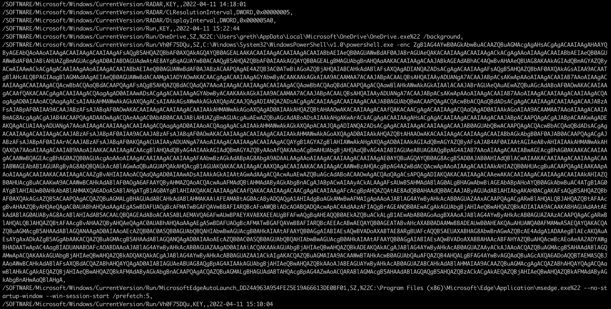
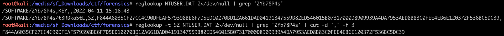
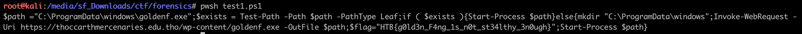

# [Forensics] Golden Persistence

Golden Persistence contains a `NTUSER.dat` file. This file is a registry hive that contains all the key/values from a user registry.

On Linux, we can parse it with `reglookup`. After a few iterations of skimming through it, we notice a powershell script:



`powershell.exe -enc` is a way to run a base64 encoded powershell script. Very convenient to avoid the script being mangled!

Here is the payload:

```
ZgB1AG4AYwB0AGkAbwBuACAAZQBuAGMAcgAgAHsACgAgACAAIAAgAHAAYQ
ByAGEAbQAoAAoAIAAgACAAIAAgACAAIAAgAFsAQgB5AHQAZQBbAF0AXQAkAGQAYQB0AGEALAAKACAAIAAgACAAIAAgACAAIABbAEIAeQB0AGUAWwBdAF0AJABrAGUAeQAKACAAIAAgACAAIAAgACkACgAgAAoAIAAgACAAIABbAEIAeQB0AGU
AWwBdAF0AJABiAHUAZgBmAGUAcgAgAD0AIABOAGUAdwAtAE8AYgBqAGUAYwB0ACAAQgB5AHQAZQBbAF0AIAAkAGQAYQB0AGEALgBMAGUAbgBnAHQAaAAKACAAIAAgACAAJABkAGEAdABhAC4AQwBvAHAAeQBUAG8AKAAkAGIAdQBmAGYAZQBy
ACwAIAAwACkACgAgACAAIAAgAAoAIAAgACAAIABbAEIAeQB0AGUAWwBdAF0AJABzACAAPQAgAE4AZQB3AC0ATwBiAGoAZQBjAHQAIABCAHkAdABlAFsAXQAgADIANQA2ADsACgAgACAAIAAgAFsAQgB5AHQAZQBbAF0AXQAkAGsAIAA9ACAAT
gBlAHcALQBPAGIAagBlAGMAdAAgAEIAeQB0AGUAWwBdACAAMgA1ADYAOwAKACAACgAgACAAIAAgAGYAbwByACAAKAAkAGkAIAA9ACAAMAA7ACAAJABpACAALQBsAHQAIAAyADUANgA7ACAAJABpACsAKwApAAoAIAAgACAAIAB7AAoAIAAgAC
AAIAAgACAAIAAgACQAcwBbACQAaQBdACAAPQAgAFsAQgB5AHQAZQBdACQAaQA7AAoAIAAgACAAIAAgACAAIAAgACQAawBbACQAaQBdACAAPQAgACQAawBlAHkAWwAkAGkAIAAlACAAJABrAGUAeQAuAEwAZQBuAGcAdABoAF0AOwAKACAAIAA
gACAAfQAKACAACgAgACAAIAAgACQAagAgAD0AIAAwADsACgAgACAAIAAgAGYAbwByACAAKAAkAGkAIAA9ACAAMAA7ACAAJABpACAALQBsAHQAIAAyADUANgA7ACAAJABpACsAKwApAAoAIAAgACAAIAB7AAoAIAAgACAAIAAgACAAIAAgACQA
agAgAD0AIAAoACQAagAgACsAIAAkAHMAWwAkAGkAXQAgACsAIAAkAGsAWwAkAGkAXQApACAAJQAgADIANQA2ADsACgAgACAAIAAgACAAIAAgACAAJAB0AGUAbQBwACAAPQAgACQAcwBbACQAaQBdADsACgAgACAAIAAgACAAIAAgACAAJABzA
FsAJABpAF0AIAA9ACAAJABzAFsAJABqAF0AOwAKACAAIAAgACAAIAAgACAAIAAkAHMAWwAkAGoAXQAgAD0AIAAkAHQAZQBtAHAAOwAKACAAIAAgACAAfQAKACAACgAgACAAIAAgACQAaQAgAD0AIAAkAGoAIAA9ACAAMAA7AAoAIAAgACAAIA
BmAG8AcgAgACgAJAB4ACAAPQAgADAAOwAgACQAeAAgAC0AbAB0ACAAJABiAHUAZgBmAGUAcgAuAEwAZQBuAGcAdABoADsAIAAkAHgAKwArACkACgAgACAAIAAgAHsACgAgACAAIAAgACAAIAAgACAAJABpACAAPQAgACgAJABpACAAKwAgADE
AKQAgACUAIAAyADUANgA7AAoAIAAgACAAIAAgACAAIAAgACQAagAgAD0AIAAoACQAagAgACsAIAAkAHMAWwAkAGkAXQApACAAJQAgADIANQA2ADsACgAgACAAIAAgACAAIAAgACAAJAB0AGUAbQBwACAAPQAgACQAcwBbACQAaQBdADsACgAg
ACAAIAAgACAAIAAgACAAJABzAFsAJABpAF0AIAA9ACAAJABzAFsAJABqAF0AOwAKACAAIAAgACAAIAAgACAAIAAkAHMAWwAkAGoAXQAgAD0AIAAkAHQAZQBtAHAAOwAKACAAIAAgACAAIAAgACAAIABbAGkAbgB0AF0AJAB0ACAAPQAgACgAJ
ABzAFsAJABpAF0AIAArACAAJABzAFsAJABqAF0AKQAgACUAIAAyADUANgA7AAoAIAAgACAAIAAgACAAIAAgACQAYgB1AGYAZgBlAHIAWwAkAHgAXQAgAD0AIAAkAGIAdQBmAGYAZQByAFsAJAB4AF0AIAAtAGIAeABvAHIAIAAkAHMAWwAkAH
QAXQA7AAoAIAAgACAAIAB9AAoAIAAKACAAIAAgACAAcgBlAHQAdQByAG4AIAAkAGIAdQBmAGYAZQByAAoAfQAKAAoACgBmAHUAbgBjAHQAaQBvAG4AIABIAGUAeABUAG8AQgBpAG4AIAB7AAoAIAAgACAAIABwAGEAcgBhAG0AKAAKACAAIAA
gACAAWwBQAGEAcgBhAG0AZQB0AGUAcgAoAAoAIAAgACAAIAAgACAAIAAgAFAAbwBzAGkAdABpAG8AbgA9ADAALAAgAAoAIAAgACAAIAAgACAAIAAgAE0AYQBuAGQAYQB0AG8AcgB5AD0AJAB0AHIAdQBlACwAIAAKACAAIAAgACAAIAAgACAA
IABWAGEAbAB1AGUARgByAG8AbQBQAGkAcABlAGwAaQBuAGUAPQAkAHQAcgB1AGUAKQAKACAAIAAgACAAXQAgACAAIAAKACAAIAAgACAAWwBzAHQAcgBpAG4AZwBdACQAcwApAAoAIAAgACAAIAAkAHIAZQB0AHUAcgBuACAAPQAgAEAAKAApA
AoAIAAgACAAIAAKACAAIAAgACAAZgBvAHIAIAAoACQAaQAgAD0AIAAwADsAIAAkAGkAIAAtAGwAdAAgACQAcwAuAEwAZQBuAGcAdABoACAAOwAgACQAaQAgACsAPQAgADIAKQAKACAAIAAgACAAewAKACAAIAAgACAAIAAgACAAIAAkAHIAZQ
B0AHUAcgBuACAAKwA9ACAAWwBCAHkAdABlAF0AOgA6AFAAYQByAHMAZQAoACQAcwAuAFMAdQBiAHMAdAByAGkAbgBnACgAJABpACwAIAAyACkALAAgAFsAUwB5AHMAdABlAG0ALgBHAGwAbwBiAGEAbABpAHoAYQB0AGkAbwBuAC4ATgB1AG0
AYgBlAHIAUwB0AHkAbABlAHMAXQA6ADoASABlAHgATgB1AG0AYgBlAHIAKQAKACAAIAAgACAAfQAKACAAIAAgACAACgAgACAAIAAgAFcAcgBpAHQAZQAtAE8AdQB0AHAAdQB0ACAAJAByAGUAdAB1AHIAbgAKAH0ACgAKAFsAQgB5AHQAZQBb
AF0AXQAkAGsAZQB5ACAAPQAgACQAZQBuAGMALgBHAGUAdABCAHkAdABlAHMAKAAiAFEAMABtAG0AcAByADQAQgA1AHIAdgBaAGkAMwBwAFMAIgApAAoAJABlAG4AYwByAHkAcAB0AGUAZAAxACAAPQAgACgARwBlAHQALQBJAHQAZQBtAFAAc
gBvAHAAZQByAHQAeQAgAC0AUABhAHQAaAAgAEgASwBDAFUAOgBcAFMATwBGAFQAVwBBAFIARQBcAFoAWQBiADcAOABQADQAcwApAC4AdAAzAFIAQgBrAGEANQB0AEwACgAkAGUAbgBjAHIAeQBwAHQAZQBkADIAIAA9ACAAKABHAGUAdAAtAE
kAdABlAG0AUAByAG8AcABlAHIAdAB5ACAALQBQAGEAdABoACAASABLAEMAVQA6AFwAUwBPAEYAVABXAEEAUgBFAFwAQgBqAHEAQQB0AEkAZQBuACkALgB1AEwAbAB0AGoAagBXAAoAJABlAG4AYwByAHkAcAB0AGUAZAAzACAAPQAgACgARwB
lAHQALQBJAHQAZQBtAFAAcgBvAHAAZQByAHQAeQAgAC0AUABhAHQAaAAgAEgASwBDAFUAOgBcAFMATwBGAFQAVwBBAFIARQBcAEEAcABwAEQAYQB0AGEATABvAHcAXAB0ADAAMwBBADEAUwB0AHEAKQAuAHUAWQA0AFMAMwA5AEQAYQAKACQA
ZQBuAGMAcgB5AHAAdABlAGQANAAgAD0AIAAoAEcAZQB0AC0ASQB0AGUAbQBQAHIAbwBwAGUAcgB0AHkAIAAtAFAAYQB0AGgAIABIAEsAQwBVADoAXABTAE8ARgBUAFcAQQBSAEUAXABHAG8AbwBnAGwAZQBcAE4AdgA1ADAAegBlAEcAKQAuA
EsAYgAxADkAZgB5AGgAbAAKACQAZQBuAGMAcgB5AHAAdABlAGQANQAgAD0AIAAoAEcAZQB0AC0ASQB0AGUAbQBQAHIAbwBwAGUAcgB0AHkAIAAtAFAAYQB0AGgAIABIAEsAQwBVADoAXABBAHAAcABFAHYAZQBuAHQAcwBcAEoAeAA2ADYAWg
BHADAATwApAC4AagBIADUANABOAFcAOABDAAoAJABlAG4AYwByAHkAcAB0AGUAZAAgAD0AIAAiACQAKAAkAGUAbgBjAHIAeQBwAHQAZQBkADEAKQAkACgAJABlAG4AYwByAHkAcAB0AGUAZAAyACkAJAAoACQAZQBuAGMAcgB5AHAAdABlAGQ
AMwApACQAKAAkAGUAbgBjAHIAeQBwAHQAZQBkADQAKQAkACgAJABlAG4AYwByAHkAcAB0AGUAZAA1ACkAIgAKACQAZQBuAGMAIAA9ACAAWwBTAHkAcwB0AGUAbQAuAFQAZQB4AHQALgBFAG4AYwBvAGQAaQBuAGcAXQA6ADoAQQBTAEMASQBJ
AAoAWwBCAHkAdABlAFsAXQBdACQAZABhAHQAYQAgAD0AIABIAGUAeABUAG8AQgBpAG4AIAAkAGUAbgBjAHIAeQBwAHQAZQBkAAoAJABEAGUAYwByAHkAcAB0AGUAZABCAHkAdABlAHMAIAA9ACAAZQBuAGMAcgAgACQAZABhAHQAYQAgACQAa
wBlAHkACgAkAEQAZQBjAHIAeQBwAHQAZQBkAFMAdAByAGkAbgBnACAAPQAgACQAZQBuAGMALgBHAGUAdABTAHQAcgBpAG4AZwAoACQARABlAGMAcgB5AHAAdABlAGQAQgB5AHQAZQBzACkACgAkAEQAZQBjAHIAeQBwAHQAZQBkAFMAdAByAG
kAbgBnAHwAaQBlAHgA
```

By decoding the base64, we get:

```
$ base64 -d < pwsh.b64
function encr {
    param(
        [Byte[]]$data,
        [Byte[]]$key
      )

    [Byte[]]$buffer = New-Object Byte[] $data.Length
    $data.CopyTo($buffer, 0)

    [Byte[]]$s = New-Object Byte[] 256;
    [Byte[]]$k = New-Object Byte[] 256;

    for ($i = 0; $i -lt 256; $i++)
    {
        $s[$i] = [Byte]$i;
        $k[$i] = $key[$i % $key.Length];
    }

    $j = 0;
    for ($i = 0; $i -lt 256; $i++)
    {
        $j = ($j + $s[$i] + $k[$i]) % 256;
        $temp = $s[$i];
        $s[$i] = $s[$j];
        $s[$j] = $temp;
    }

    $i = $j = 0;
    for ($x = 0; $x -lt $buffer.Length; $x++)
    {
        $i = ($i + 1) % 256;
        $j = ($j + $s[$i]) % 256;
        $temp = $s[$i];
        $s[$i] = $s[$j];
        $s[$j] = $temp;
        [int]$t = ($s[$i] + $s[$j]) % 256;
        $buffer[$x] = $buffer[$x] -bxor $s[$t];
    }

    return $buffer
}


function HexToBin {
    param(
    [Parameter(
        Position=0,
        Mandatory=$true,
        ValueFromPipeline=$true)
    ]
    [string]$s)
    $return = @()

    for ($i = 0; $i -lt $s.Length ; $i += 2)
    {
        $return += [Byte]::Parse($s.Substring($i, 2), [System.Globalization.NumberStyles]::HexNumber)
    }

    Write-Output $return
}

[Byte[]]$key = $enc.GetBytes("Q0mmpr4B5rvZi3pS")
$encrypted1 = (Get-ItemProperty -Path HKCU:\SOFTWARE\ZYb78P4s).t3RBka5tL
$encrypted2 = (Get-ItemProperty -Path HKCU:\SOFTWARE\BjqAtIen).uLltjjW
$encrypted3 = (Get-ItemProperty -Path HKCU:\SOFTWARE\AppDataLow\t03A1Stq).uY4S39Da
$encrypted4 = (Get-ItemProperty -Path HKCU:\SOFTWARE\Google\Nv50zeG).Kb19fyhl
$encrypted5 = (Get-ItemProperty -Path HKCU:\AppEvents\Jx66ZG0O).jH54NW8C
$encrypted = "$($encrypted1)$($encrypted2)$($encrypted3)$($encrypted4)$($encrypted5)"
$enc = [System.Text.Encoding]::ASCII
[Byte[]]$data = HexToBin $encrypted
$DecryptedBytes = encr $data $key
$DecryptedString = $enc.GetString($DecryptedBytes)
$DecryptedString|iex
```

This script has an encryption key, and relies on values taken from the `NTUSER.dat` registry. Let’s get to `reglookup` again.



Doing that for the 5 variables in the script, we end up with:

```
$ cat test1.ps1
function encr {
    param(
        [Byte[]]$data,
        [Byte[]]$key
      )

    [Byte[]]$buffer = New-Object Byte[] $data.Length
    $data.CopyTo($buffer, 0)

    [Byte[]]$s = New-Object Byte[] 256;
    [Byte[]]$k = New-Object Byte[] 256;

    for ($i = 0; $i -lt 256; $i++)
    {
        $s[$i] = [Byte]$i;
        $k[$i] = $key[$i % $key.Length];
    }

    $j = 0;
    for ($i = 0; $i -lt 256; $i++)
    {
        $j = ($j + $s[$i] + $k[$i]) % 256;
        $temp = $s[$i];
        $s[$i] = $s[$j];
        $s[$j] = $temp;
    }

    $i = $j = 0;
    for ($x = 0; $x -lt $buffer.Length; $x++)
    {
        $i = ($i + 1) % 256;
        $j = ($j + $s[$i]) % 256;
        $temp = $s[$i];
        $s[$i] = $s[$j];
        $s[$j] = $temp;
        [int]$t = ($s[$i] + $s[$j]) % 256;
        $buffer[$x] = $buffer[$x] -bxor $s[$t];
    }

    return $buffer
}


function HexToBin {
    param(
    [Parameter(
        Position=0,
        Mandatory=$true,
        ValueFromPipeline=$true)
    ]
    [string]$s)
    $return = @()

    for ($i = 0; $i -lt $s.Length ; $i += 2)
    {
        $return += [Byte]::Parse($s.Substring($i, 2), [System.Globalization.NumberStyles]::HexNumber)
    }

    Write-Output $return
}

# $encrypted1 = (Get-ItemProperty -Path HKCU:\SOFTWARE\ZYb78P4s).t3RBka5tL
# $encrypted2 = (Get-ItemProperty -Path HKCU:\SOFTWARE\BjqAtIen).uLltjjW
# $encrypted3 = (Get-ItemProperty -Path HKCU:\SOFTWARE\AppDataLow\t03A1Stq).uY4S39Da
# $encrypted4 = (Get-ItemProperty -Path HKCU:\SOFTWARE\Google\Nv50zeG).Kb19fyhl
# $encrypted5 = (Get-ItemProperty -Path HKCU:\AppEvents\Jx66ZG0O).jH54NW8C
$encrypted1 = "F844A6035CF27CC4C90DFEAF579398BE6F7D5ED10270BD12A661DAD04191347559B82ED546015B07317000D8909939A4DA7953AED8B83C0FEE4EB6E120372F536BC5DC39"
$encrypted2 = "CC19F66A5F3B2E36C9B810FE7CC4D9CE342E8E00138A4F7F5CDD9EED9E09299DD7C6933CF4734E12A906FD9CE1CA57D445DB9CABF850529F5845083F34BA1"
$encrypted3 = "C08114AA67EB979D36DC3EFA0F62086B947F672BD8F966305A98EF93AA39076C3726B0EDEBFA10811A15F1CF1BEFC78AFC5E08AD8CACDB323F44B4D"
$encrypted4 = "D814EB4E244A153AF8FAA1121A5CCFD0FEAC8DD96A9B31CCF6C3E3E03C1E93626DF5B3E0B141467116CC08F92147F7A0BE0D95B0172A7F34922D6C236BC7DE54D8ACBFA70D1"
$encrypted5 = "84AB553E67C743BE696A0AC80C16E2B354C2AE7918EE08A0A3887875C83E44ACA7393F1C579EE41BCB7D336CAF8695266839907F47775F89C1F170562A6B0A01C0F3BC4CB"
$encrypted = "$($encrypted1)$($encrypted2)$($encrypted3)$($encrypted4)$($encrypted5)"

$enc = [System.Text.Encoding]::ASCII
[Byte[]]$key = $enc.GetBytes("Q0mmpr4B5rvZi3pS")

[Byte[]]$data = HexToBin $encrypted
$DecryptedBytes = encr $data $key
$DecryptedString = $enc.GetString($DecryptedBytes)
$DecryptedString
# $DecryptedString|iex
```

Finally, we get the flag running it with `pwsh`:



The flag is `HTB{g0ld3n_F4ng_1s_n0t_st34lthy_3n0ugh}`
