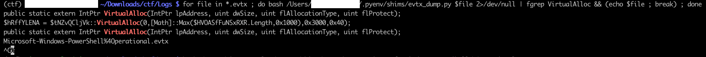
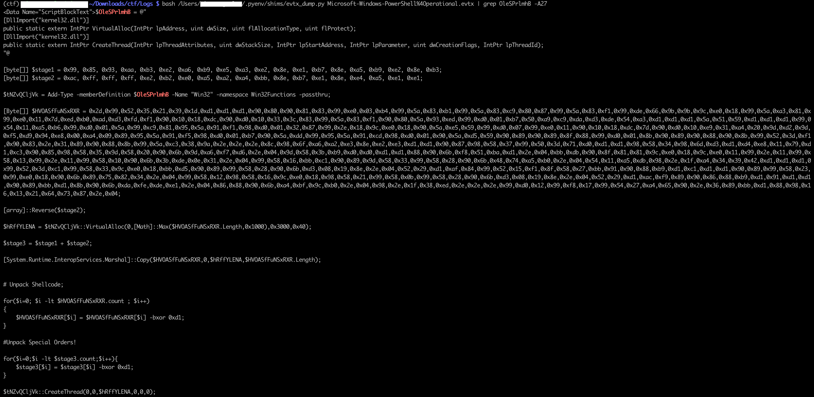
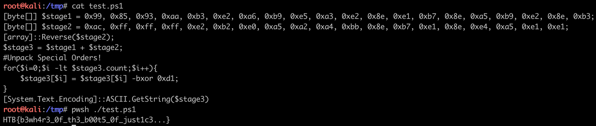

# [Forensics] Puppeteer

Puppeteer is a Windows forensics challenge: we are given Windows event log files `.etvx` to skim through.

We can read such files on MacOS/Linux with [python-evtx](https://github.com/omerbenamram/evtx):

Searching for `VirtualAlloc` (system call is part of a common technique to run malware from memory) yields few results in the `Microsoft-Windows=PowerShell%4Operational.evtx` file.

Digging deeper, we get a `powershell` script containing a `XOR` encrypted shellcode.

In this malware writing method, the shellcode is the payload that needs to run, for instance a stager (piece of code downloading a bigger payload, to reduce on-disk footprint) that will connect back to a Command and Control server ([Metasploit](https://github.com/rapid7/metasploit-framework), [CobaltStrike](https://www.cobaltstrike.com/features/), [Covenant](https://github.com/cobbr/Covenant), [Empire](https://github.com/EmpireProject/Empire), etc).

To run it from memory and void detection:

 - Allocate memory corresponding to the size of the shellcode with `VirtualAlloc`
 - Decrypt (XOR-encrypted here) the shellcode with the `XOR` key (here `0xd1`): this avoids common Meterpreter / Cobaltstrike payloads to be detected with Antivirus static analysis
 - Copy the shellcode in the allocated memory using `Marshal::Copy`
 - Run the shellcode with `CreateThread`

All we need from there is to run the portion of code that decrypts the payload, and print the decrypted string.
The variables `$stage1` and `$stage2` are concatenated into `$stage3` and de-XORed with the `0xd1` key.

Keeping only what we need for this and removing all the rest, and then run it from Linux powershell `pwsh`:

We get the flag `HTB{b3wh4r3_0f_th3_b00t5_0f_just1c3...}`
