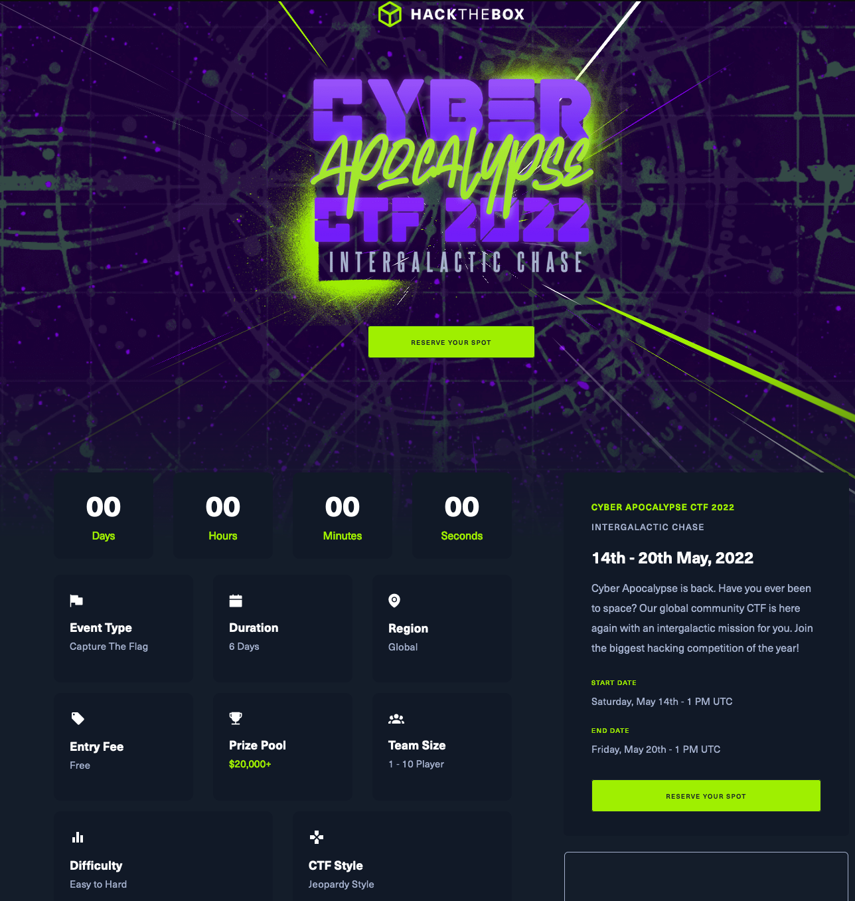

# HTB Cyber Apocalypse 2022 CTF

[Hack The Box](https://www.hackthebox.com/) organized a [Capture The Flag (CTF)](https://cybersecurity.att.com/blogs/security-essentials/capture-the-flag-ctf-what-is-it-for-a-newbie) event to which I participated with few friends: [Cyber Apocalypse 2022](https://www.hackthebox.com/events/cyber-apocalypse-2022)

|  |
| *Screenshot from HTB Event page*|

A CTF is a hacking based game providing different cyber security puzzles. Puzzles are organized in categories, such as web, pwn, reverse, crypto, etc. Solving a puzzle gives a unique (and unguessable) character string that will be exchanged for points. Points are given according to the difficulty of a puzzle, and the number of other teams solving it: to score higher points you must be the first one to solve a challenge!

CTF events can be attended alone or with a team. Depending on the CTF, or prizes can be handed out. This event was great from all perspective, thanks to [Hack The Box](https://www.hackthebox.com/)!

Below are our version of the challenges we could solve.

# Write up

 - [Web] [Kryptos Support](./web_kryptos_support.md)
 - [Web] [Blinker Fuild](./web_blinker_fluid.md)
 - [Web] [Amidst Us](./web_amidst_us.md)
 - [Web] [Intergalactic Post](./web_intergalagtic_post.md)
 - [Web] [Red Island](./web_red_island.md)
 - [Web] [Mutation](./web_mutation.md)
 - [Web] [Acnologia Portal](./web_acnologia_portal.md)
 - [Pwn] [Space Pirate: Entrypoint](./pwn_entrypoint.md)
 - [Misc] [Compressor](./misc_compressor.md)
 - [Misc] [Matrioshka Brain](./misc_matrioshka_brain.md)
 - [Reverse] [Wide](./reverse_wide.md)
 - [Forensics] [Puppeteer](./forensics_puppeteer.md)
 - [Forensics] [Golden Persistence](./forensics_golden_persistence.md)
 - [Forensics] [Automation](./forensics_automation.md)
