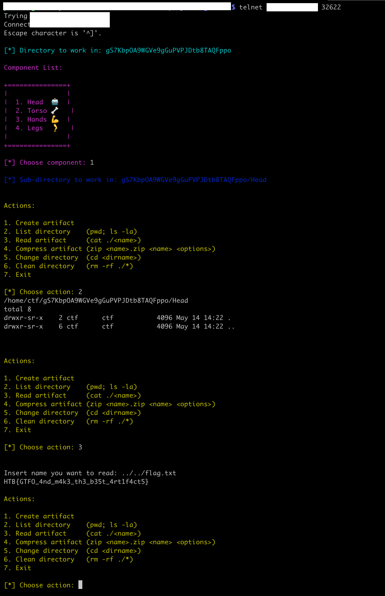

# [Misc] Compressor

Compressor is a binary, that maps a robot to a Linux file system. We can do diverse operations on that robot, to change the size of its body parts. Each operation is mapped to a Linux command and some take arguments. You might see where this is going: bash [command injection](https://owasp.org/www-community/attacks/Command_Injection)

One of them gives an argument to `cat`: say no more!

This could also be solved with a [zip GTFO command](https://gtfobins.github.io/gtfobins/zip/), but well, simpler is better.

We just need to guess where the `flag.txt` file is. After a couple of tries, `../../flag.txt` does the trick.

