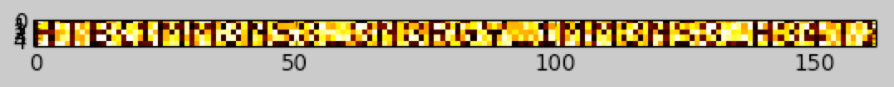

# [Misc] Matrioshka Brain

Matrioshka brain is a challenge about a [Dyson sphere](https://en.wikipedia.org/wiki/Dyson_sphere): a sphere structure around a star to capture and transform the energy from the heat generated.

We are given a `.csv` file containing heat measurements for 5 spheres. Each point is the temperature of sphere `N` at the minute `M`.

```
$ cat matrioshka/heat_measurements.csv
"Sphere no.","1","2","3","4","5","6","7","8","9","10","11","12","13","14","15","16","17","18","19","20","21","22","23","24","25","26","27","28","29","30","31","32","33","34","35","36","37","38","39","40","41","42","43","44","45","46","47","48","49","50","51","52","53","54","55","56","57","58","59","60","61","62","63","64","65","66","67","68","69","70","71","72","73","74","75","76","77","78","79","80","81","82","83","84","85","86","87","88","89","90","91","92","93","94","95","96","97","98","99","100","101","102","103","104","105","106","107","108","109","110","111","112","113","114","115","116","117","118","119","120","121","122","123","124","125","126","127","128","129","130","131","132","133","134","135","136","137","138","139","140","141","142","143","144","145","146","147","148","149","150","151","152","153","154","155","156","157","158","159","160","161","162"
"Sphere 1",28,88,70,21,64,25,20,26,25,24,61,24,22,22,63,60,79,23,20,83,64,22,69,67,27,64,80,72,23,80,28,73,89,86,30,60,84,23,26,62,81,23,75,66,26,74,67,24,23,29,67,70,28,26,66,77,67,71,76,76,80,72,20,20,72,81,30,87,65,21,62,77,29,26,87,73,28,24,30,61,84,70,27,26,70,78,26,79,84,86,20,63,62,68,78,68,84,87,20,80,86,28,71,60,86,22,62,27,83,63,64,22,82,60,30,22,86,62,26,79,89,20,82,64,20,26,26,65,69,28,29,65,67,60,65,84,82,88,29,82,85,25,87,83,21,28,86,64,61,86,25,69,60,26,23,29,29,27,82,24,25,78
"Sphere 2",27,73,71,22,88,72,87,27,84,61,74,27,74,89,26,80,71,21,75,71,26,26,69,88,20,28,78,27,27,83,20,27,73,29,24,65,20,87,79,24,74,25,22,89,26,75,23,63,64,65,63,22,72,86,21,88,63,61,70,78,67,27,90,87,28,64,29,30,86,26,69,26,64,63,28,60,26,89,82,28,70,22,84,66,72,89,25,61,73,60,30,64,63,63,82,70,74,21,30,60,70,29,23,67,20,24,73,22,29,83,30,23,64,21,71,84,24,75,29,26,77,28,78,30,72,63,72,67,29,90,90,27,77,73,88,80,61,88,21,88,61,30,87,26,65,78,26,79,89,28,30,90,62,60,74,24,66,82,64,82,24,86
"Sphere 3",21,28,28,30,61,64,76,25,66,83,62,23,29,24,77,90,28,89,70,85,73,22,88,63,22,64,23,79,22,83,30,81,25,62,28,82,83,80,23,89,67,20,69,21,21,74,90,24,23,86,89,74,63,27,74,80,84,84,76,70,74,61,78,30,61,89,21,78,26,27,69,61,79,21,60,61,22,25,22,82,87,22,67,25,24,72,78,23,21,20,79,64,70,63,63,61,67,90,20,82,69,30,68,26,76,22,60,28,69,23,76,21,74,66,87,27,62,72,24,61,22,23,68,67,26,28,82,88,67,89,24,66,90,86,71,72,64,69,23,22,24,27,70,70,69,22,65,80,23,75,30,65,74,77,61,22,67,88,71,86,69,28
"Sphere 4",25,63,86,21,61,78,82,28,64,61,81,26,90,89,22,69,74,29,90,79,60,22,71,87,24,64,76,71,25,64,28,66,82,70,26,85,23,86,85,24,65,21,79,71,30,61,80,78,61,24,88,25,65,85,26,74,60,73,87,82,86,30,64,85,23,72,20,71,70,30,69,25,87,85,22,70,23,83,30,80,68,29,60,84,21,90,68,77,22,63,87,78,61,76,62,78,61,81,26,86,69,29,61,80,73,23,89,20,76,79,68,26,71,24,77,68,21,65,27,83,83,30,75,88,74,67,24,67,27,69,80,21,86,81,75,77,88,70,22,89,61,27,60,28,71,87,29,85,27,27,23,27,64,85,64,28,82,61,86,65,30,61
"Sphere 5",26,86,90,29,87,89,65,28,88,64,85,20,22,26,88,82,69,26,24,75,25,27,27,90,22,72,80,79,20,73,29,61,89,79,30,71,67,21,22,73,64,24,73,67,23,84,25,24,22,83,70,83,29,20,70,82,23,26,22,25,61,64,30,24,70,64,25,79,66,25,76,79,26,25,86,68,26,63,61,27,73,72,27,21,76,73,79,66,23,74,81,85,20,26,22,28,74,25,21,22,83,29,82,90,62,24,65,30,88,79,84,20,67,61,21,26,70,65,22,84,61,23,75,23,21,21,81,64,90,30,28,75,70,25,30,24,24,81,21,73,76,20,86,72,25,22,69,79,74,68,21,89,78,60,77,30,77,69,85,24,23,70
```

Diverse tries to transform the numerical values into ASCII, convert it to Kelvin or Farhenheit failed. However coming back to the description about **heat** measurements: what if we plot this as a **heatmap**?

It can be done through different tools, for instance Excel, or Python and `matplotlib`. Here is the Python version:

```
import matplotlib.pyplot as plt

minutes = [1,2,3,4,5,6,7,8,9,10,11,12,13,14,15,16,17,18,19,20,21,22,23,24,25,26,27,28,29,30,31,32,33,34,35,36,37,38,39,40,41,42,43,44,45,46,47,48,49,50,51,52,53,54,55,56,57,58,59,60,61,62,63,64,65,66,67,68,69,70,71,72,73,74,75,76,77,78,79,80,81,82,83,84,85,86,87,88,89,90,91,92,93,94,95,96,97,98,99,100,101,102,103,104,105,106,107,108,109,110,111,112,113,114,115,116,117,118,119,120,121,122,123,124,125,126,127,128,129,130,131,132,133,134,135,136,137,138,139,140,141,142,143,144,145,146,147,148,149,150,151,152,153,154,155,156,157,158,159,160,161,162]

s1 = [28,88,70,21,64,25,20,26,25,24,61,24,22,22,63,60,79,23,20,83,64,22,69,67,27,64,80,72,23,80,28,73,89,86,30,60,84,23,26,62,81,23,75,66,26,74,67,24,23,29,67,70,28,26,66,77,67,71,76,76,80,72,20,20,72,81,30,87,65,21,62,77,29,26,87,73,28,24,30,61,84,70,27,26,70,78,26,79,84,86,20,63,62,68,78,68,84,87,20,80,86,28,71,60,86,22,62,27,83,63,64,22,82,60,30,22,86,62,26,79,89,20,82,64,20,26,26,65,69,28,29,65,67,60,65,84,82,88,29,82,85,25,87,83,21,28,86,64,61,86,25,69,60,26,23,29,29,27,82,24,25,78]
s2 = [27,73,71,22,88,72,87,27,84,61,74,27,74,89,26,80,71,21,75,71,26,26,69,88,20,28,78,27,27,83,20,27,73,29,24,65,20,87,79,24,74,25,22,89,26,75,23,63,64,65,63,22,72,86,21,88,63,61,70,78,67,27,90,87,28,64,29,30,86,26,69,26,64,63,28,60,26,89,82,28,70,22,84,66,72,89,25,61,73,60,30,64,63,63,82,70,74,21,30,60,70,29,23,67,20,24,73,22,29,83,30,23,64,21,71,84,24,75,29,26,77,28,78,30,72,63,72,67,29,90,90,27,77,73,88,80,61,88,21,88,61,30,87,26,65,78,26,79,89,28,30,90,62,60,74,24,66,82,64,82,24,86]
s3 = [21,28,28,30,61,64,76,25,66,83,62,23,29,24,77,90,28,89,70,85,73,22,88,63,22,64,23,79,22,83,30,81,25,62,28,82,83,80,23,89,67,20,69,21,21,74,90,24,23,86,89,74,63,27,74,80,84,84,76,70,74,61,78,30,61,89,21,78,26,27,69,61,79,21,60,61,22,25,22,82,87,22,67,25,24,72,78,23,21,20,79,64,70,63,63,61,67,90,20,82,69,30,68,26,76,22,60,28,69,23,76,21,74,66,87,27,62,72,24,61,22,23,68,67,26,28,82,88,67,89,24,66,90,86,71,72,64,69,23,22,24,27,70,70,69,22,65,80,23,75,30,65,74,77,61,22,67,88,71,86,69,28]
s4 = [25,63,86,21,61,78,82,28,64,61,81,26,90,89,22,69,74,29,90,79,60,22,71,87,24,64,76,71,25,64,28,66,82,70,26,85,23,86,85,24,65,21,79,71,30,61,80,78,61,24,88,25,65,85,26,74,60,73,87,82,86,30,64,85,23,72,20,71,70,30,69,25,87,85,22,70,23,83,30,80,68,29,60,84,21,90,68,77,22,63,87,78,61,76,62,78,61,81,26,86,69,29,61,80,73,23,89,20,76,79,68,26,71,24,77,68,21,65,27,83,83,30,75,88,74,67,24,67,27,69,80,21,86,81,75,77,88,70,22,89,61,27,60,28,71,87,29,85,27,27,23,27,64,85,64,28,82,61,86,65,30,61]
s5 = [26,86,90,29,87,89,65,28,88,64,85,20,22,26,88,82,69,26,24,75,25,27,27,90,22,72,80,79,20,73,29,61,89,79,30,71,67,21,22,73,64,24,73,67,23,84,25,24,22,83,70,83,29,20,70,82,23,26,22,25,61,64,30,24,70,64,25,79,66,25,76,79,26,25,86,68,26,63,61,27,73,72,27,21,76,73,79,66,23,74,81,85,20,26,22,28,74,25,21,22,83,29,82,90,62,24,65,30,88,79,84,20,67,61,21,26,70,65,22,84,61,23,75,23,21,21,81,64,90,30,28,75,70,25,30,24,24,81,21,73,76,20,86,72,25,22,69,79,74,68,21,89,78,60,77,30,77,69,85,24,23,70]

plt.imshow((s1, s2, s3, s4, s5), cmap='hot', interpolation='nearest')
plt.show()
```

Here is the result:



The flag is `HTB{1MM3NS3_3N3RGY_1MM3NS3_H3AT}`
