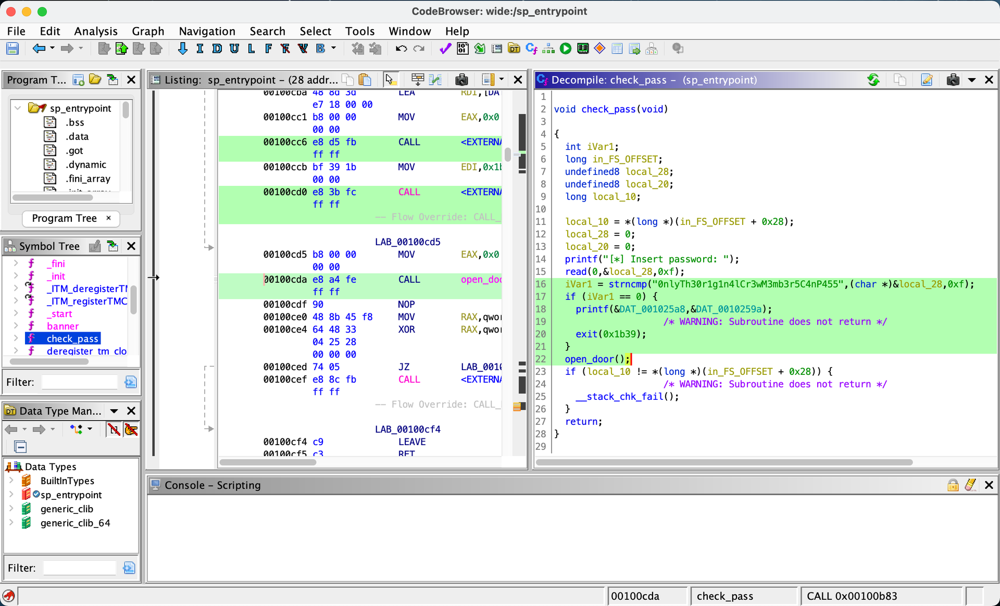
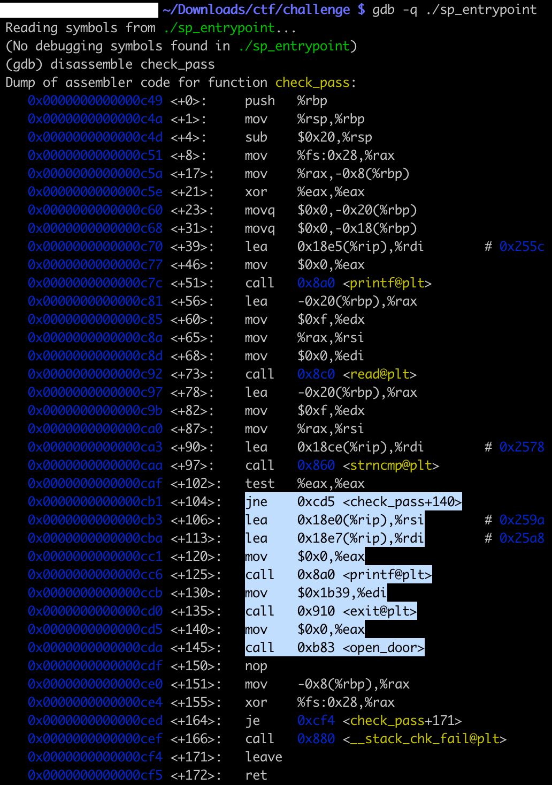
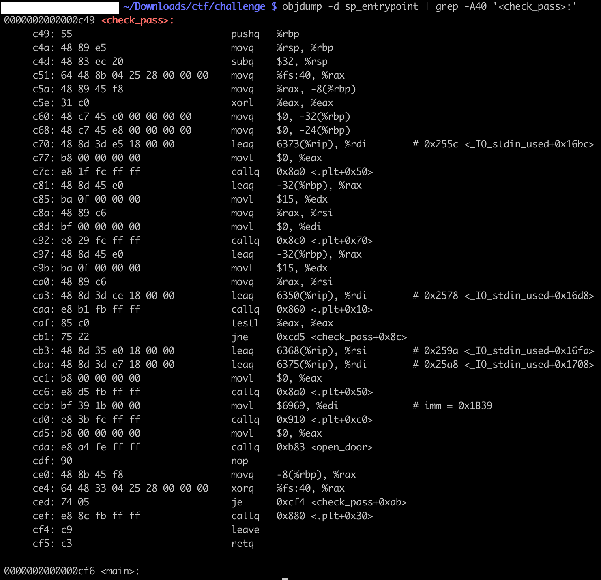
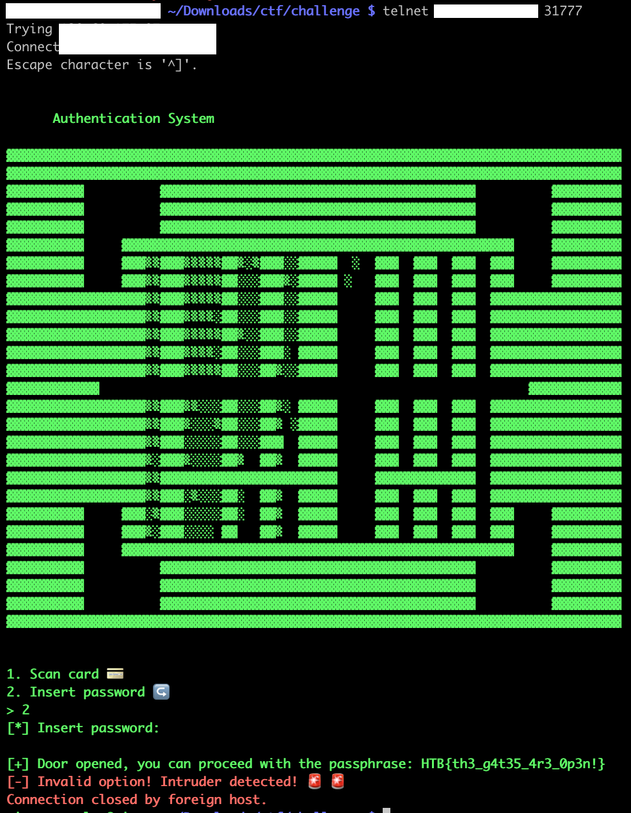

# [Pwn] Entrypoint

We are given a compiled binary. Trying the command `strings` on it reveals:

```
$ strings sp_entrypoint
./glibc/ld-linux-x86-64.so.2
qDcu
libc.so.6
[...]
%s[+] Door opened, you can proceed with the passphrase:
cat flag*
[*] Insert password:
0nlyTh30r1g1n4lCr3wM3mb3r5C4nP455
[1;5;31m
%s[-] Invalid password! Intruder detected!
1. Scan card
2. Insert password
[!] Scanning card.. Something is wrong!
Insert card's serial number:
Your card is:
%s[-] Invalid option! Intruder detected!
%s[-] Invalid ID! Intruder detected!
```

The `0nlyTh30r1g1n4lCr3wM3mb3r5C4nP455` does seem interesting. However after digging deeper, and opening the binary with NSA’s [Ghidra](https://github.com/NationalSecurityAgency/ghidra), we find something odd:



If our input is successfully compared (return value 0) to the password previously found, there will be a warning and the program exits.

With the same logic, we can get this information about the `check_pass` function with command line tools such as `objdump`, or `gdb`:





We can get the manual pages of C functions in the Section 3 of man.

```
$ man 3 strncmp
STRCMP(3)                                                            Library Functions Manual                                                            STRCMP(3)
NAME
     strcmp, strncmp – compare strings
LIBRARY
     Standard C Library (libc, -lc)
[...]
DESCRIPTION
     The strcmp() and strncmp() functions lexicographically compare the null-terminated strings s1 and s2.
     The strncmp() function compares not more than n characters.  Because strncmp() is designed for comparing strings rather than binary data, characters that
     appear after a ‘\0’ character are not compared.
RETURN VALUES
     The strcmp() and strncmp() functions return an integer greater than, equal to, or less than 0, according as the string s1 is greater than, equal to, or less
     than the string s2.  The comparison is done using unsigned characters, so that ‘\200’ is greater than ‘\0’.
```

What it means: in order to reach the `open_door` function call, we need to input anything **different** from `0nlyTh30r1g1n4lCr3wM3mb3r5C4nP455`.

Let’s go!

Connecting to the challenge server, a host with a TCP port on which the input/outputs are redirected to the binary. We simply hit enter (so a null string, which is different from `0nlyTh30r1g1n4lCr3wM3mb3r5C4nP455`). We get the flag `HTB{th3_g4t35_4r3_0p3n!}`


