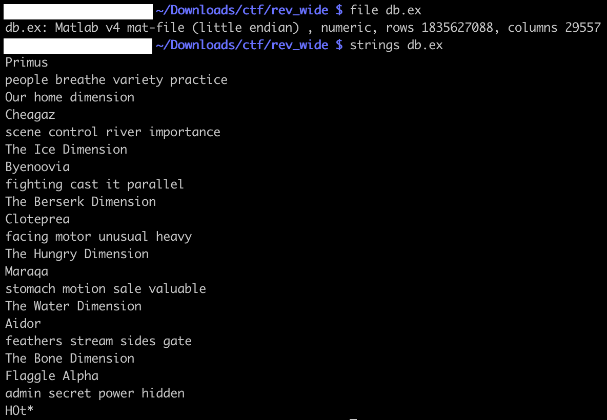
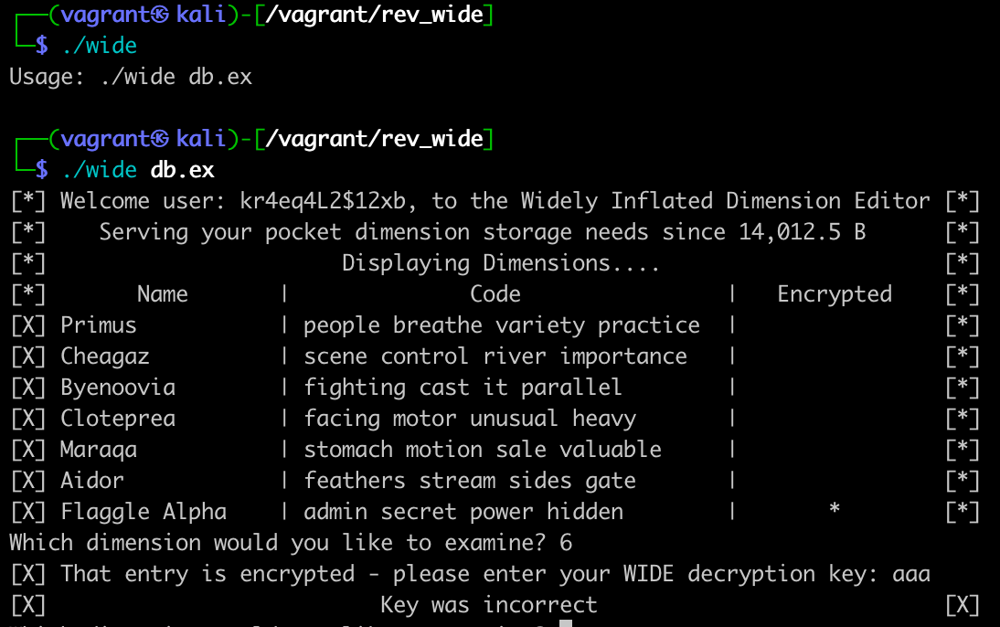
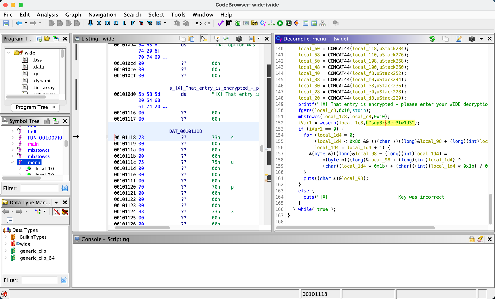
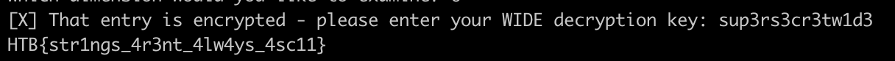

# [Reverse] Wide

WIDE is a challenge presenting one binary, and one database file `db.ex`.

.

Running the binary, it shows the encrypted value, that needs a password for decryption:

.

Reading the binary with NSA’s [Ghidra](https://github.com/NationalSecurityAgency/ghidra), in the `menu` function, we notice the password is compared to: `sup3rs3cr3tw1d3`

Using it to get the decrypted value:

`HTB{str1ngs_4r3nt_4lw4ys_4sc11}`
