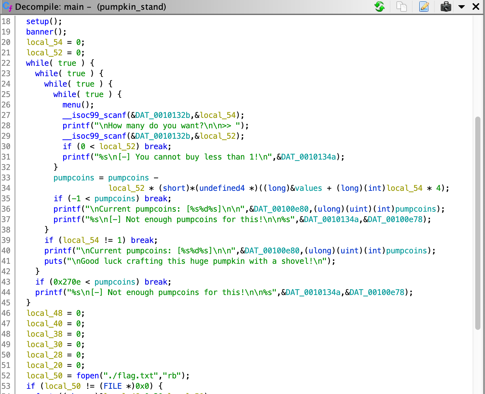

# [Pwn] Pumpkin stand

This challenge consists in a binary. Running the binary, we need to use `pumpcoins` in order to buy a `Laser`.

```bash
$ strings pumpkin_stand
[...]
Current pumpcoins: [%s%d%s]
Items:
1. Shovel  (1337 p.c.)
2. Laser   (9999 p.c.)
[1;32m
                                          ##&
                                        (#&&
                                       ##&&
                                 ,*.  #%%%&  .*,
%s                      .&@@@@#@@@&@@@@@@@@@@@@&@@&@#@@@@@@(
                    /@@@@&@&@@@@@@@@@&&&&&&&@@@@@@@@@@@&@@@@,
                   @@@@@@@@@@@@@&@&&&&&&&&&&&&&@&@@@@@@&@@@@@@
                 #&@@@@@@@@@@@@@@&&&&&&&&&&&&&&&#@@@@@@@@@@@@@@,
                .@@@@@#@@@@@@@@#&&&&&&&&&&&&&&&&&#@@@@@@@@@@@@@&
                &@@@@@@@@@@@@@@&&&&&&&&&&&&&&&&&&&@@@@@@@@@@@@@@@
                @@@@@@@@@@@@@@&&&&&&&&&&&&&&&&&&&&@@@@@@@@@&@@@@@
                @@@@@@@@@@@@@@@&&&&&&&&&&&&&&&&&&&@@@@@@@@@@@@@@@
                .@@@@@@@@@@@@@@&&&&&&&&&&&&&&&&&&&@@@@@@@@@@@@@@
                 (@@@@@@@@@@@@@@&&&&&&&&&&&&&&&&&@@@@@@@@@@@@@@.
                   @@@@@@@@@@@@@@&&&&&&&&&&&&&&&@@@@@@@@@@@@@@
                    ,@@@@@@@@@@@@@&&&&&&&&&&&&&@@@@@@@@@@@@@
                       @@@@@@@@@@@@@&&&&&&&&&@@@@@@@@@@@@/
How many do you want?
[1;31m
[-] You cannot buy less than 1!
[-] Not enough pumpcoins for this!
Good luck crafting this huge pumpkin with a shovel!
./flag.txt
Error opening flag.txt, please contact an Administrator!
Congratulations, here is the code to get your laser:
```

Using Ghidra to decompile it, we find the logic computing the remaining `pumpcoins`. The `local_54` variable (item selection) is not checked, and added to the computation: it can be less than 0. That looks like an underflow.



Let's use `-1` as the item ID


