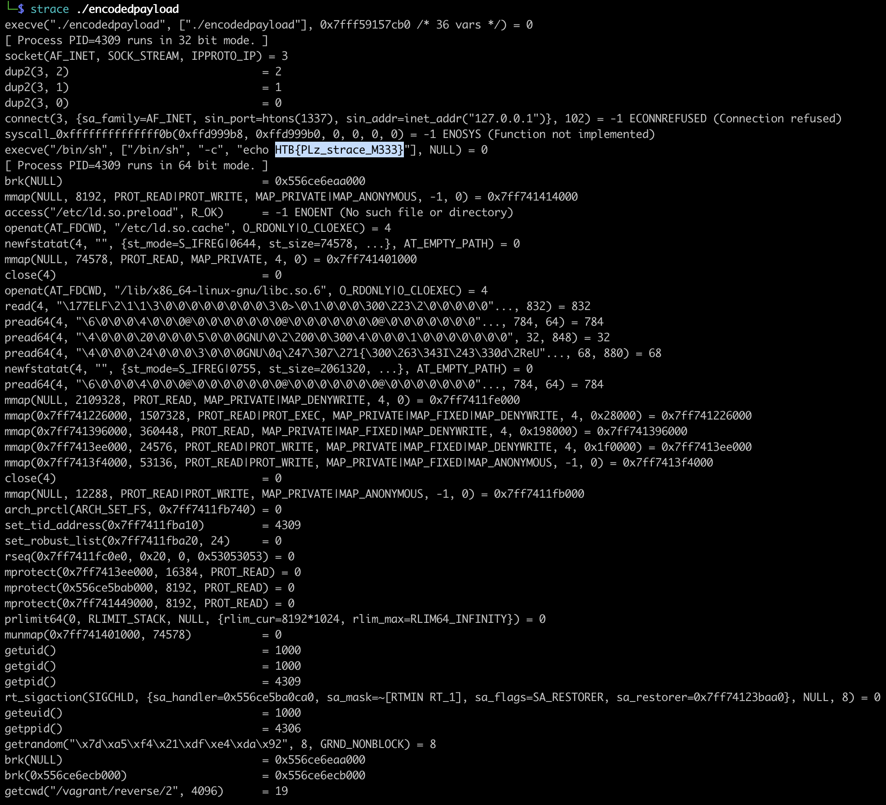

# [Reverse] Encoded payload

We are provided with a binary. This binary is encoded:

```bash
$ file encodedpayload
encodedpayload: ELF 32-bit LSB executable, Intel 80386, version 1 (SYSV), statically linked, no section header

$ cat encodedpayload
ELFT44 �����t$�[SYIIIIIIIIICCCCCCC7QZjAXP0A0AkAAQ2AB2BB0BBABXP8ABuJI01iKzWHcScW3F3Pj6bOyHax0cVZmK0MCpYh0WO8Mk0PIbYYibHsOS0wp7qqxUReP5UfYmYhaLpCVV0PQF3LsfcOyIqZmMPF2ax0ndo1cE8e8fOvORBCYMYHcF2PSOyHaNPFkJmopRJ4KChmI3bU6e8Tme3ni8gCXFO2S1xC0U8VOsR59RNK9KSaByx4ZS0EPUPauPcphrOq0bh0Tg2cK2p0LSJso1ct43B51e31uSormFSGCTsSMgpV7rsLI9qJmmPAA
```

When running the program, there's no output, no input required. After few trial and error, running it with `strace` does the trick.


