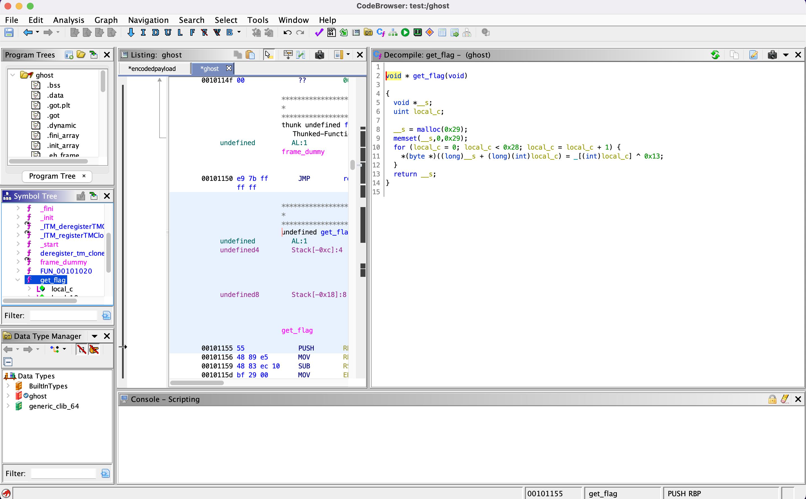
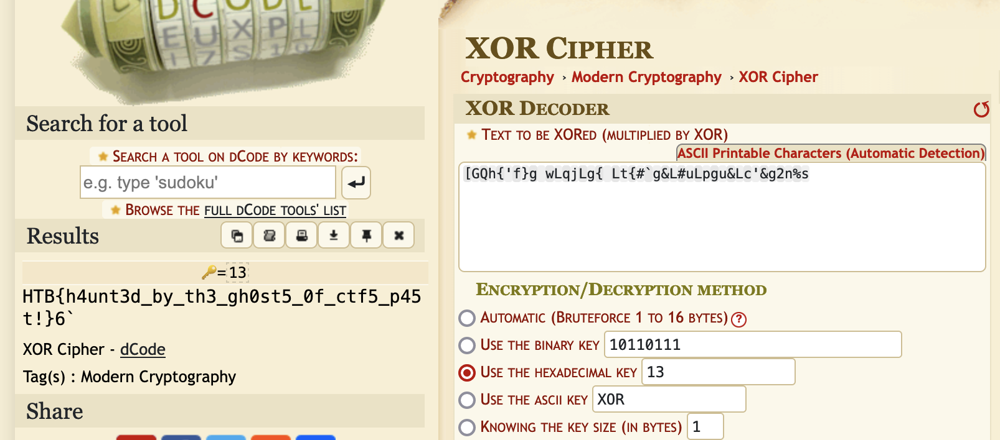

# [Reverse] Ghost Wrangler

Again, a binary is provided. Running `strings` against it reveals an magled string.

```bash
$ strings ghost
[...]
[GQh{'f}g wLqjLg{ Lt{#`g&L#uLpgu&Lc'&g2n%s
[4m%*.c
[24m| I've managed to trap the flag ghost in this box, but it's turned invisible!
Can you figure out how to reveal them?
```

Using Ghidra to inspect the `get_flag` function, we notice that a XOR (`^`) is used, and that the key is `0x13`.



We can thus use the XOR encrypted string and the key to recover the flag, for instance using [DCode](https://www.dcode.fr/xor-cipher)


