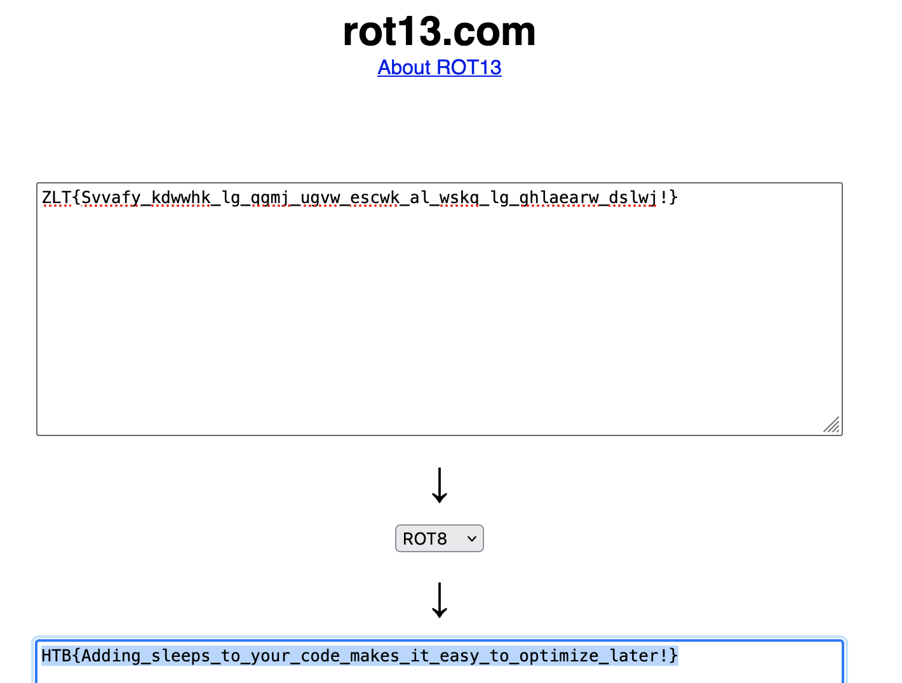

# [Reverse] Ouija

As usual, we start with a binary. Running `strings` against it, we can see the encoded flag

```bash
$ strings ouija
ZLT{Svvafy_kdwwhk_lg_qgmj_ugvw_escwk_al_wskq_lg_ghlaearw_dslwj!}
Retrieving key.

 done!
Hmm, I don't like that one. Let's pick a new one.
Yes, 18 will do nicely.
Let's get ready to start. This might take a while!
This one's a lowercase letter
```

The structure of the flag is noticeable. `ZLT{` corresponds to `HTB{`. This means a [Caesar cipher](https://en.wikipedia.org/wiki/Caesar_cipher) (with a key different than 13 here) was used.

Using [Rot13](https://rot13.com/), we can decode the flag with the key `8`


