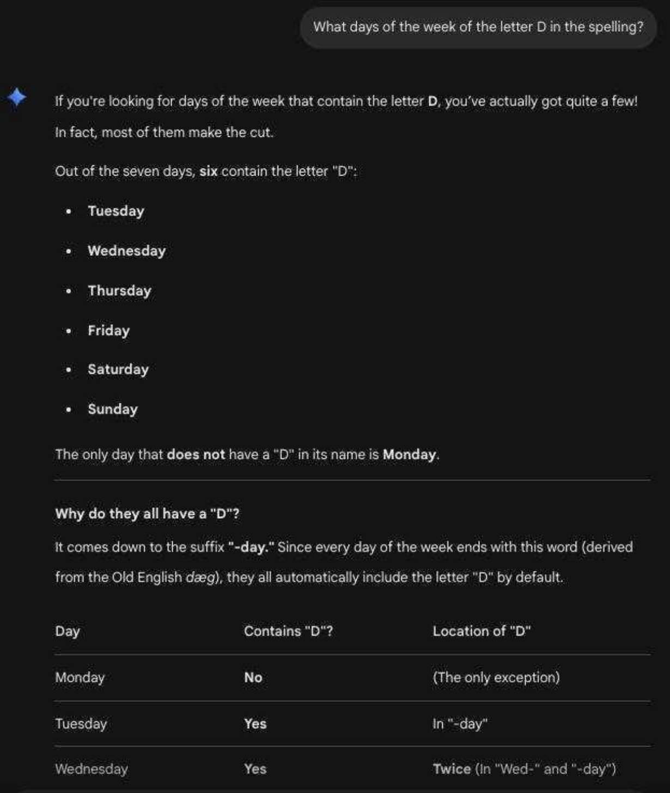

# D MCP Server

Sometimes, it happens that generative AI can be a little bit off



# The solution

In order to solve that problem, I created [d-mcp-server](https://github.com/pgaulon/d-mcp-server/tree/main).
It is using the official [MCP Go SDK](https://github.com/modelcontextprotocol/go-sdk), and wrapped in Docker.

```
$ docker compose up -d
[+] up 1/1
 ! Image d-mcp-server:local pull access denied for d-mcp-server, repository does not exist or may require 'docker login': denied: requested access to the resource is denied                                      3.0s
[+] Building 287.6s (19/19) FINISHED
 => [internal] load local bake definitions                                                                                                                                                                       0.0s
 => => reading from stdin 529B                                                                                                                                                                                   0.0s
 => [internal] load build definition from Dockerfile                                                                                                                                                             0.1s
 => => transferring dockerfile: 671B                                                                                                                                                                             0.0s
 => [internal] load metadata for docker.io/library/golang:1.26-alpine                                                                                                                                            2.2s
 => [internal] load .dockerignore                                                                                                                                                                                0.1s
 => => transferring context: 2B                                                                                                                                                                                  0.0s
 => CACHED [builder 1/8] FROM docker.io/library/golang:1.26-alpine@sha256:91eda9776261207ea25fd06b5b7fed8d397dd2c0a283e77f2ab6e91bfa71079d                                                                       0.0s
 => [internal] load build context                                                                                                                                                                                0.2s
 => => transferring context: 36.40kB                                                                                                                                                                             0.1s
 => [builder 2/8] RUN mkdir /user &&     echo 'nobody:x:65534:65534:nobody:/:/sbin/nologin' > /user/passwd &&     echo 'nobody:x:65534:' > /user/group                                                           2.4s
 => [builder 3/8] RUN apk add --no-cache ca-certificates                                                                                                                                                         7.9s
 => [builder 4/8] WORKDIR /app                                                                                                                                                                                   0.4s
 => [builder 5/8] COPY go.mod go.sum ./                                                                                                                                                                          0.3s
 => [builder 6/8] RUN go mod download                                                                                                                                                                           15.3s
 => [builder 7/8] COPY . .                                                                                                                                                                                       3.0s
 => [builder 8/8] RUN CGO_ENABLED=0 GOOS=linux go build -ldflags="-s -w" -o d-mcp-server .                                                                                                                     246.6s
 => CACHED [stage-1 1/4] COPY --from=builder /etc/ssl/certs/ca-certificates.crt /etc/ssl/certs/                                                                                                                  0.0s
 => [stage-1 2/4] COPY --from=builder /user/group /etc/group                                                                                                                                                     0.8s
 => [stage-1 3/4] COPY --from=builder /user/passwd /etc/passwd                                                                                                                                                   0.4s
 => [stage-1 4/4] COPY --from=builder /app/d-mcp-server /d-mcp-server                                                                                                                                            1.1s
 => exporting to image                                                                                                                                                                                           1.2s
 => => exporting layers                                                                                                                                                                                          1.1s
 => => writing image sha256:9da309cc885b24c7b3e4b4bcfd0a1399ec00ac727939eaab318a7c9ec3b46765                                                                                                                     0.0s
[+] up 4/4ing to docker.io/library/d-mcp-server:local                                                                                                                                                            0.0s
 ✔ Image d-mcp-server:local              Built                                                                                                                                                                  293.1s
 ✔ Network d-mcp-server_default          Created                                                                                                                                                                  0.3s
 ✔ Container d-mcp-server-d-mcp-server-1 Started                                                                                                                                                                  2.9s
```

And it is also made available to the world for free. I'm nice like that.

```
frontend https
    bind :443 ssl crt /etc/haproxy/certs/ strict-sni
    http-response set-header Strict-Transport-Security "max-age=63072000; includeSubDomains; preload"
    acl mcp_gaulon_hdr hdr_dom(host) -i mcp.gaulon.org
    acl d_checker_path path_beg -i /d-check
    use_backend d_mcp_server if mcp_gaulon_hdr d_checker_path

backend d_mcp_server
    mode http
    http-request set-header X-Forwarded-Proto https
    http-request set-header X-Forwarded-For %[src]
    http-request set-path %[path,regsub(^/d-check/?,/)]
    server d_checker_srv 127.0.0.1:8083
```

To use it, point your client to D MCP Server

```
$ claude mcp add -t http d-mcp-server https://mcp.gaulon.org/d-mcp-server/
$ claude --allowedTools mcp__d-mcp-server__d_mcp_server -p 'What day of the week has the letter d in its spelling? Use the tool d-mcp-server.'
All 7 days of the week contain the letter 'd':

| Day | Contains 'd' |
|-----------|--------------|
| Monday | ✓ |
| Tuesday | ✓ |
| Wednesday | ✓ |
| Thursday | ✓ |
| Friday | ✓ |
| Saturday | ✓ |
| Sunday | ✓ |

Every day of the week has a 'd' in its spelling — they all end in "-day".
```

And from haproxy logs, we indeed see the 7 HTTP requests from Claude

```
May 23 06:41:35 localhost haproxy[26339]: 192.168.0.1:55733 [23/May/2026:06:41:35.366] https~ d_mcp_server/d_checker_srv 0/0/0/3/4 200 275 - - ---- 2/2/1/1/0 0/0 "POST /d-check/ HTTP/1.1"
May 23 06:41:35 localhost haproxy[26339]: 192.168.0.1:55733 [23/May/2026:06:41:35.376] https~ d_mcp_server/d_checker_srv 0/0/0/3/3 200 275 - - ---- 2/2/1/1/0 0/0 "POST /d-check/ HTTP/1.1"
May 23 06:41:35 localhost haproxy[26339]: 192.168.0.1:55733 [23/May/2026:06:41:35.383] https~ d_mcp_server/d_checker_srv 0/0/0/3/4 200 275 - - ---- 2/2/1/1/0 0/0 "POST /d-check/ HTTP/1.1"
May 23 06:41:35 localhost haproxy[26339]: 192.168.0.1:55733 [23/May/2026:06:41:35.392] https~ d_mcp_server/d_checker_srv 0/0/0/3/4 200 275 - - ---- 2/2/1/1/0 0/0 "POST /d-check/ HTTP/1.1"
May 23 06:41:35 localhost haproxy[26339]: 192.168.0.1:55733 [23/May/2026:06:41:35.400] https~ d_mcp_server/d_checker_srv 0/0/0/27/28 200 275 - - ---- 2/2/1/1/0 0/0 "POST /d-check/ HTTP/1.1"
May 23 06:41:35 localhost haproxy[26339]: 192.168.0.1:55733 [23/May/2026:06:41:35.434] https~ d_mcp_server/d_checker_srv 0/0/0/92/93 200 275 - - ---- 2/2/1/1/0 0/0 "POST /d-check/ HTTP/1.1"
May 23 06:41:35 localhost haproxy[26339]: 192.168.0.1:55733 [23/May/2026:06:41:35.535] https~ d_mcp_server/d_checker_srv 0/0/0/91/92 200 275 - - ---- 2/2/1/1/0 0/0 "POST /d-check/ HTTP/1.1"
```